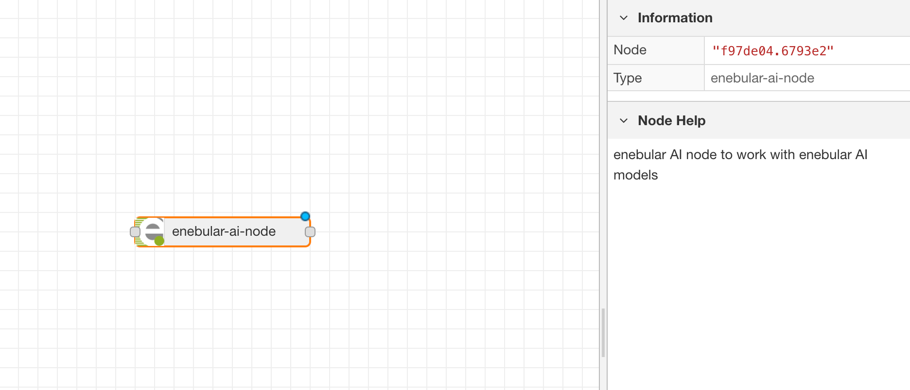
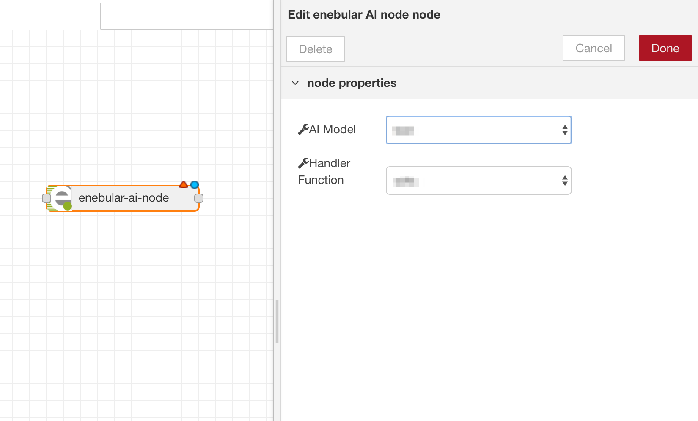
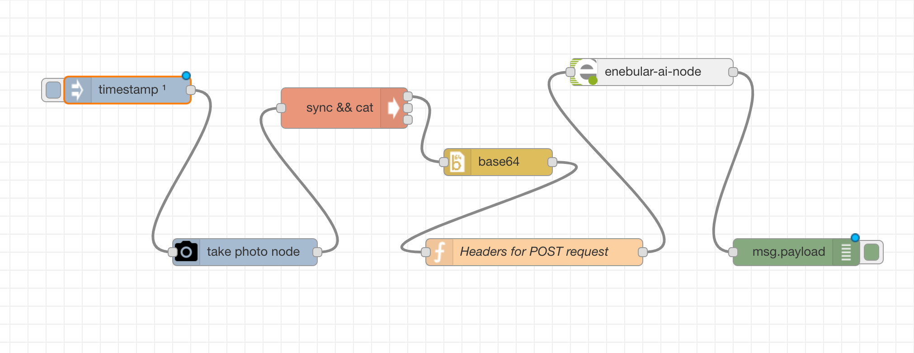
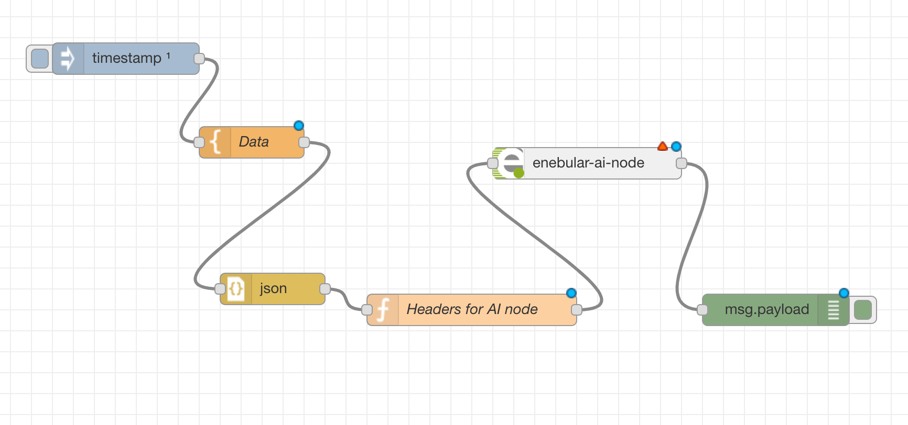
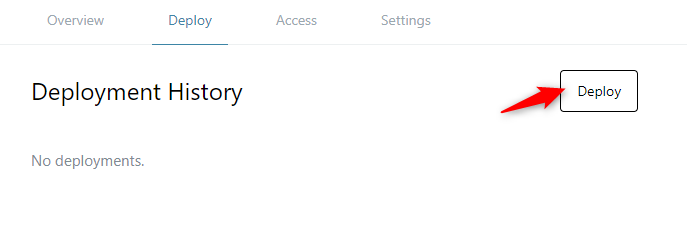
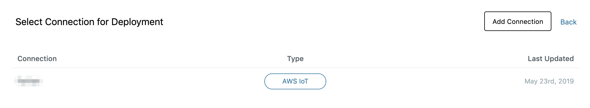
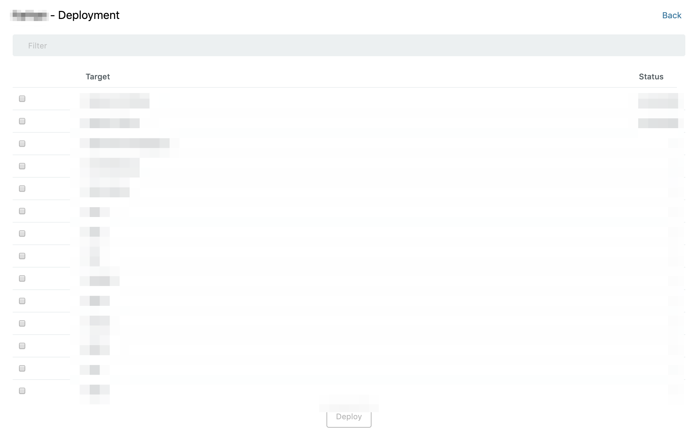

# Accessing model From Flows {#Accessing model From Flows}

Models that have been deployed to a device can be accessed from a flow on the same device by including enebular AI node in the flow. The following explains how to access any model from a flow.

# enebular AI node {#enebular AI node}

In the node panel of enebular flow, under Functions node section, a node with the name **enebular-ai-node** is there. This node is for communicating to the model already deployed on the device.

**enebular-ai-node** uses http protocol to communicate to the model.



when there is at least one AI Model in the user's project, the user can select it from the properties of the node. Click on the node and it will open nodes properties as shown in picture below,



There are two things which needs to be selected, AI Model and Handler function.

Choose the corresponding model and the handler function and click on `Done` button.

# Flow with enebular AI node {#Flow with enebular AI node}

In enebular AI Model two data types(data type of input which model is using for inferencing) are supported, image data type and json data type. For each of these data types the flow will be different.

## Flow for image data type {#Flow for image data type}

A typical flow with image data type looks like below picture,



Apart from the node which is getting the image in the flow, user must include two other nodes along with enebular-ai-node. These nodes are,

1. base64 node: For encoding the image data into base64 format.
2. Function node: For setting headers for enebular-ai-node.

Function inside the function node is,
```
msg.headers = {};
msg.headers['content-type'] = 'image/jpeg';
return msg;
```
Once these nodes are properly set, click on the enebular-ai-node and select the model and its handler function.

## Flow for json data type {#Flow for json data type}

A typical flow with json data type looks like below picture,


Similar to the flow with `image` data type user must include two other nodes along with enebular-ai-node. These nodes are,

1. json node: For converting the data into json format.
2. Function node: For setting headers for enebular-ai-node.

Function inside the function node is,
```
msg.headers = {};
msg.headers['content-type'] = 'application/json';
return msg;
```
Once these nodes are properly set, click on the enebular-ai-node and select the model and its handler function.


# Deploying flow with enebular AI node {#Deploying flow with enebular AI node}

Deploying a flow with enebular-ai-node is same as deploying any normal flow. Below steps explains how to deploy a flow with enebular-ai-node.

Click on the `Deploy` button,


A dialogue box will appear asking for selecting connection for device to deploy the flow.


Select the appropriate connection and then the device on which AI model is running. The AI Model must be already deployed and running on the device. The status of the model can be checked from enebular by selecting the device from the device list and going to manage model section.


Click on `Deploy`. This will starts deploying the flow.

Once the deploy process completes successfully, **Deployed** is displayed in the **Deploy Status** column.