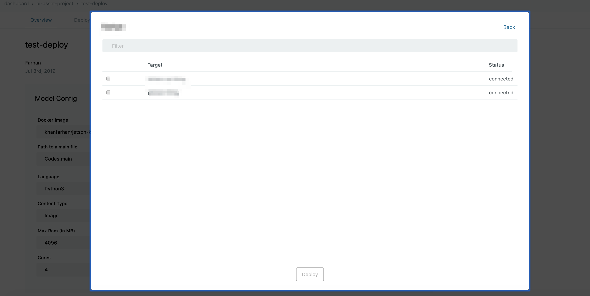
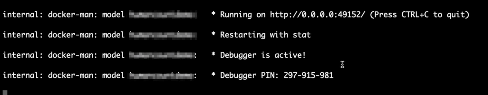

# Deploying AI models {#Deploying AI models}

Models that have been registered as assets under AI Models on enebular can be deployed to 'paid' devices. The following procedure explains how to deploy any AI model.

First, select **AI Models** from the asset menu to display the registered models list.

Select the model to deploy from the list. This will open the model's **Overview** section.

In the **Overview** click the **Deploy** button and a device connection list will be displayed. Select the connection of the device on which the model needs to be deployed. If the connection hasn't been registered yet, add it by referring to the explanation in [flow deploys](../Deploy/index.md).

After choosing a connection from the list, a list of the connection's devices will be displayed. Select the devices to deploy to and click the `Deploy` button.

The deploy process then starts and the models's **Deployment History** is displayed. On the device side a log similar to the one shown in the picture can be seen,

Once the model is completely downloaded, the enebular agent shows the following log,

This shows that the model is successfully running.

Once the deploy process completes successfully, ** Deployed ** is displayed in the ** Deploy Status ** column.
