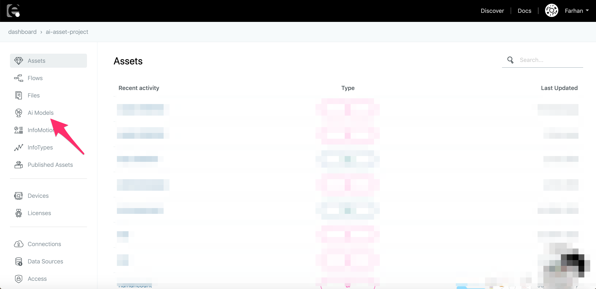
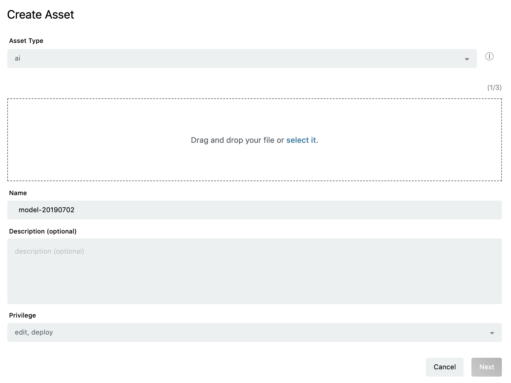
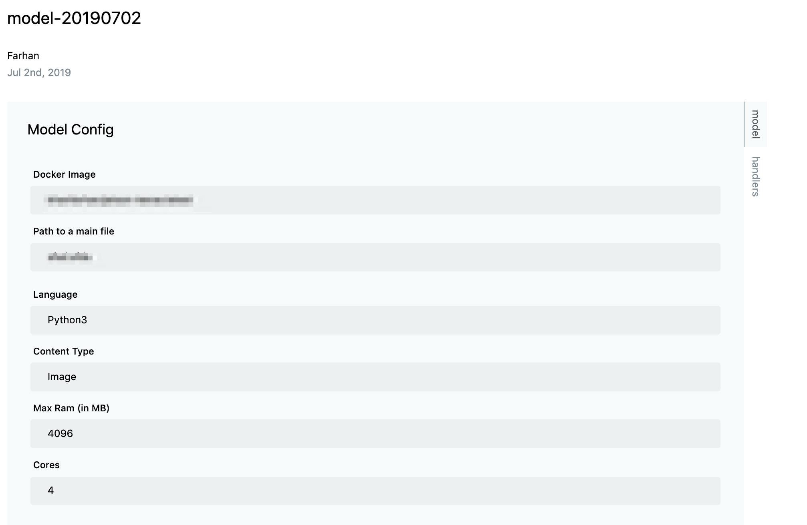
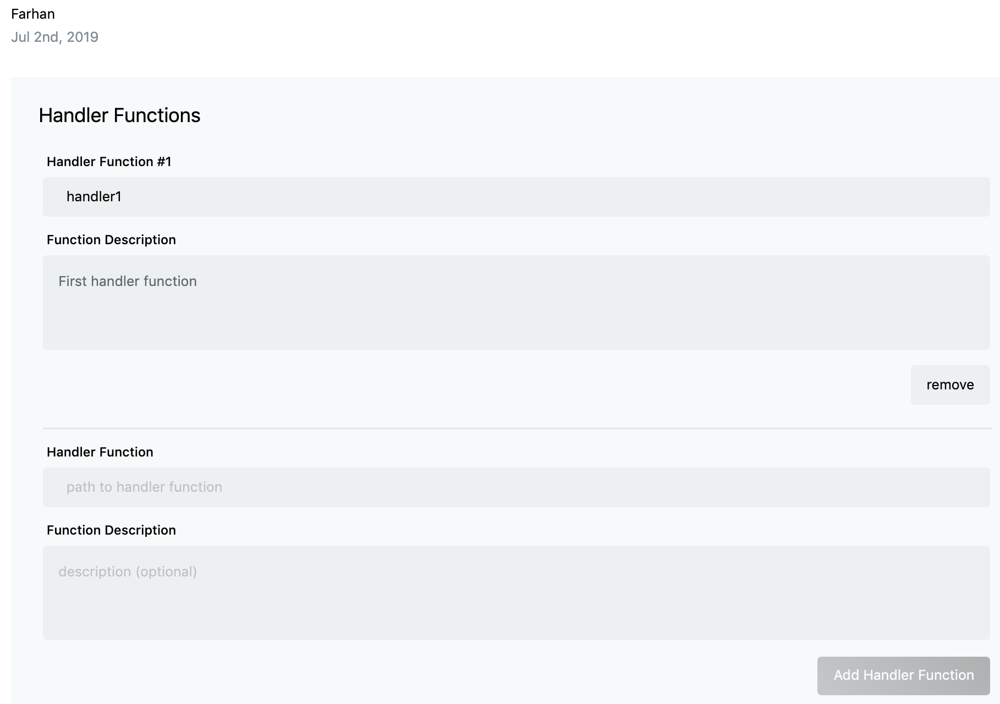

# Registering AI models {#Registering AI models}

For deploying any Machine learning/Deep learning model on a device from enebular, it must first be registered as an asset under **AI Models**. The following procedure explains how to register any AI model.

If the project is a paid project then one can see an asset named **"AI Models”**.



For creating a new asset go to this section and click on **+** icon at bottom right.

After clicking on **+** icon, a form will appear which looks like below picture,



This form asks to upload the AI project directory in .zip file format(up to 3GB), give a name and description to the asset.

Once done with this step, click on next.

Next form will appear which looks like below picture,


This form asks to fill in the details related to the execution environment of AI model. The description of each is as follows:

1. Docker image:
   Docker image of the framework used while creating AI model.
   E.g. Tensorflow, Keras, Mxnet etc.

    There are some already tested and ready to use docker images which are provided by enebular. The user can select these from drop down menu.

    However, there is an option of using custom docker images also. These docker images must have the following dependencies installed.

    ```
    Flask==1.0.3
    Pillow==6.1.0
    scipy==0.17.0
    ```

    These dependencies can be easily installed by running below command,

    ```
    pip install Flask==1.0.3, Pillow==6.1.0, scipy==0.17.0
    ```
    
2. Path to main file:
   Path to the script which is calling the AI model. The path is from AI project directory.
   E.g. FaceRecognition.Codes.recognize_svm, where FaceRecognition is the AI project directory and recognize_svm is the script which is calling the AI model and doing AI inferencing.

3. Language:
   Programming language in which AI model is written.
   E.g. Python3, Python2

4. Input Type:
   Data type of input which the AI model is using for inferencing.
   E.g : image, json

5. Max RAM(in MB):
   Maximum amount of RAM which the AI model can use.

6. Cores:
   Number of Cpu cores which the AI model can use.

Once all these details are filled, click on next.

Next form will appear which looks like below picture,


This form asks to fill in the name of that function in the main script which user wants to execute. A typical handler function looks like below,

```
def handler(img):
        (lStart, lEnd) = face_utils.FACIAL_LANDMARKS_IDXS["left_eye"]
        (rStart, rEnd) = face_utils.FACIAL_LANDMARKS_IDXS["right_eye"]
        img_rgb = cv2.cvtColor(img, cv2.COLOR_BGR2RGB)
        gray = cv2.cvtColor(img, cv2.COLOR_BGR2GRAY)
        subjects = detector(gray, 0)
        predicted = []

        for subject in subjects:
            shape = predictor(gray, subject)
            shape = face_utils.shape_to_np(shape)  # converting to NumPy Array
            leftEye = shape[lStart:lEnd]
            rightEye = shape[rStart:rEnd]
            leftEyeHull = cv2.convexHull(leftEye)
            rightEyeHull = cv2.convexHull(rightEye)
            cv2.drawContours(img, [leftEyeHull], -1, (0, 255, 0), 1)
            cv2.drawContours(img, [rightEyeHull], -1, (0, 255, 0), 1)
            predicted.append(extract_face_info(img, img_rgb))

        return predicted
```

This form also asks for giving description of the handler function. This will appear on the AI node which will get auto generated after creating the asset.

Once done with this, click on `Add Handler Function` button. One can also add multiple handler functions if he/she has those in the main script.

Finally click on upload button to submit asset form. This will start uploading the AI model along with the form details.


Once upload is done a summary page will appear which will show all the details which have been filled in while creating the asset.




If multiple handlers were filled in then,



If one has made any mistake in the previous forms, they can edit it by clicking on the `Edit` button shown on the same page.

From the same page one can deploy the asset to the device. For more details on AI Model deployement refer to [Deploying AI Models](DeployAiModel.md).
