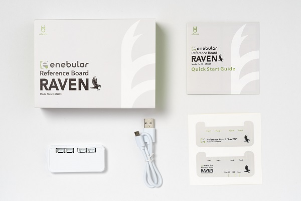
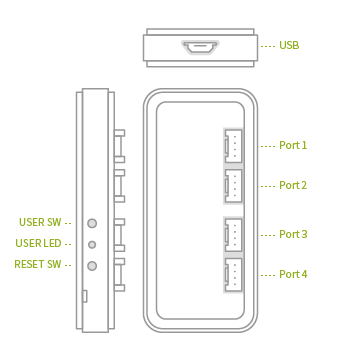

# RAVEN

RAVEN is the enebular-edge-agent reference board.

Mounted network function and four I/O connecters on small body. And easy to connect to `enebular`.

You can use various functions such as execution of flow by `enebular-edge-agent`. Learn more ->  [Introduction](./../EnebularEdgeAgent/introduction.md).

### Table of Contents

1. [Contents](#contents)
1. [Description of each part](#parts)
1. [Prepsration](#preparation)
1. [Initial settings](#initialsetting)
1. [Disclaimer](#disclaimer)

## Contents{#contents}

Contents are as follows.

- RAVEN body
- USB cable
- Quick Start Guide
- Sticker

## Parts{#parts}

- USB ... USB microB connection terminal
- USER SW ... Switch that can be set with flow
- USER LED ... LED that can be set with flow
- RESET SW ... Reset switch
- Port 1 to 4 ... Grove connector

Learn more about hard ware refer to [TechnicalDetail](./../Other/HWSpec-RAVEN.md).

## Preparation{#preparation}

In order to use RAVEN, the following preparation is necessary.

* A PC with one or more USB-A terminals or an AC adapter
    * Supplies 5V / 0.5A or more
* A network module
    * Use 2.4GHz band
    * IEEE 802.11 b/g/n
* Sensors and actuator you want to connect to Port
    * Commercially available sensors and actuators can be used
    * 3.3V, ADC/UART/I2C/PWM/GPIO interface (Supports up to 200 mA total for 4 ports) *1
    * For an example of the sensor please see [here](http://wiki.seeedstudio.com/Grove_System/) 
    * There are restrictions on the combination of available interfaces. 

\*1 The interfaces that can be set from the node in flow editor are limited to ADC / GPIO and part I2C. For details, please see the explanation of each node.

## Initial Settings(#initialsetting)

It is the procedure of network setting.

* Activate RAVEN in `SettingMode`.
    1. Power on RAVEN
    1. Press and hold `USER SW` and push `RESET SW`
    1. Hold `USER SW` until `USER LED` light red
    1. Even after released from `USER SW`, confirm to remain lit `USER LED` in red
    1. RAVEN is started with `SettingMode`
* Use **enebular Reference Board Configuration Tool** to set up SSID and password. Refer to** [Configuration](./../EnebularEdgeAgent/Configuration.md).
* Please restart after setting.

## Disclaimer and Indemnification{#disclaimer}

This product has been developed for the purpose of use and evaluation by customers. As such, this product is offered as-is, with no warranty, explicit or implicit, for any operation,  malfunction, etc. of the customers’ applications that occur during use of this product. This document does not provide guarantee for the product. For inquiries concerning guarantees, please contact the store where the product was purchased. 

### Cautions

- To reduce the risk of malfunction, fire and electric shock, please do not store or use the 
product in direct sunlight or in places with high moisture and humidity.
- To prevent malfunction and breakdown do subject the product to strong impact or pressure, such as dropping or stacking heavy items on top of the product. 
- Keep out of reach of small children to avoid accidental swallowing and injury.
- Do not use on unstable surfaces. Injury or damage to the product could result from the product falling. 
- To avoid causing instrument malfunctions, do not use in areas where use of wireless devices is restricted (healthcare facilities, inside airplanes, etc.) 
- To reduce the risk of fire and smoke, do not leave the product covered in paper, 
cloth, blankets, etc. 
- To avoid malfunction, do not insert foreign objects into the connection terminal 
or the casing. 
- To avoid electrocution, do not touch the product with wet hands. 
- To reduce risk of malfunction, do not insert or remove sensor connectors while the product is in operation. 
- Do not erase, remove or damage the markings attached to this product.
- For other subjects not described in this document, please follow the terms of use.
