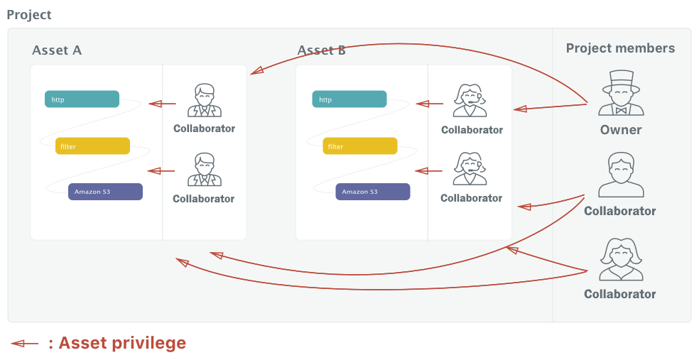
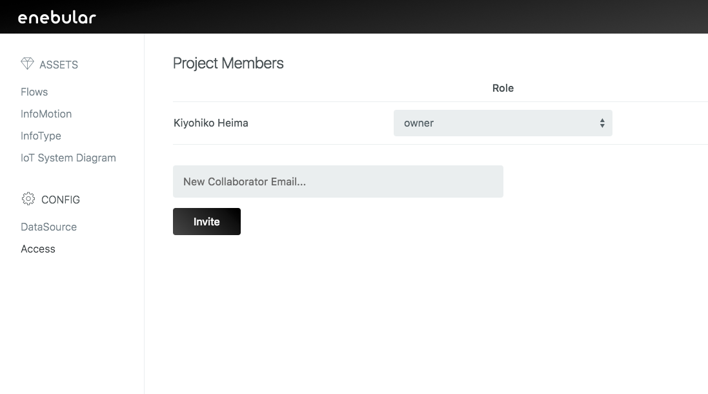

# Editing Access Permissions

The following covers enebular's project and asset access permissions.

## User Types

First, let's go over the user types. There are the following three types of users.

- Project Owner
- Project Admin
- Project Collaborator
- Outside Collaborator

The **Project Owner** is the project manager. They can edit project members and manage access to all of the assets in a project.

The **Project Admin** can invite other collaborators into the project. A Project Admin is automatically admin for all of the assets in a project.

A **Project Collaborator** is a project member. They can access all of the assets in a project.

An **Outside Collaborator** is a member linked to one asset. They can access that one particular asset.

The creator of a project automatically becomes the project owner.

Project collaborators can be invited from the "Access" page which can be navigated to from "Access" in the project sidebar (You can only invite those who are signed up to enebular).

Outside collaborators can be invited from the "Access" page which can be navigated to from the "Access" tab in the flow details screen (You can only invite those who are signed up to enebular).

## About Asset Privileges

Next, permissions called "Asset privileges" can be configured for each of the assets of the three user types.

- owner: view / edit / deploy / delete / add or delete Outside collaborators / change privilege of project collaborator
- admin: view / edit / deploy / delete / add or delete Outside collaborators / change privilege of project collaborator
- superdev: view / edit / deploy
- developer: view / edit
- operator: view / deploy
- user: view

Asset privileges can be set on the "Access" page which can be navigated to from the "Access" tab in the flow details screen.

The permissions can be changes by selecting the "Role" for the member.

The "default privilege" is that automatically assigned to members when invited as a project collaborator.

Outside collaborators are assigned `user` by default regardless of the "default privilege".
