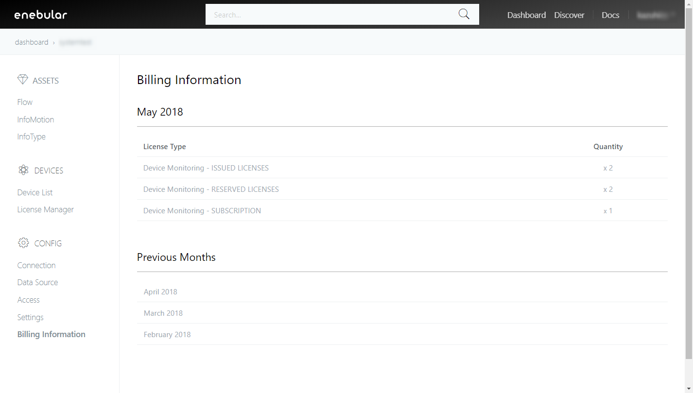
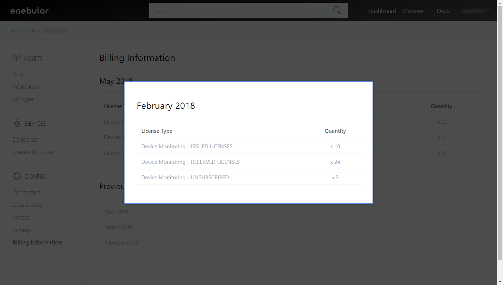

# Billing Information {#Billing Information}

You can view license information purchased at License Manager. 
This feature is currently only supported in the enterprise plan.
If you need further information please contact **support@enebular.com**.

From the Billing Information page you can view current and past billing information. 

## Current Month {#Current Month}

The top section displays the current month's billing. 

License Type are as follows.
* Device Monitoring
  * ISSUED LICENSES
  * RESERVED LICENSES
  * SUBSCRIPTION ・・・ refers to the registered license

* Refer to [License Manager](../Device/LicenseManager.md) for more details.

## Previous Months {#Previous Months}

The bottom section of Billing Information displays previous month's billing. Selecting a month will display that months billing.

