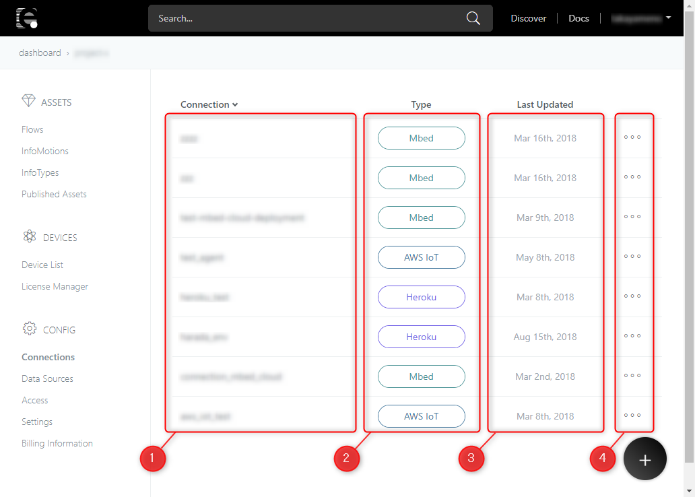
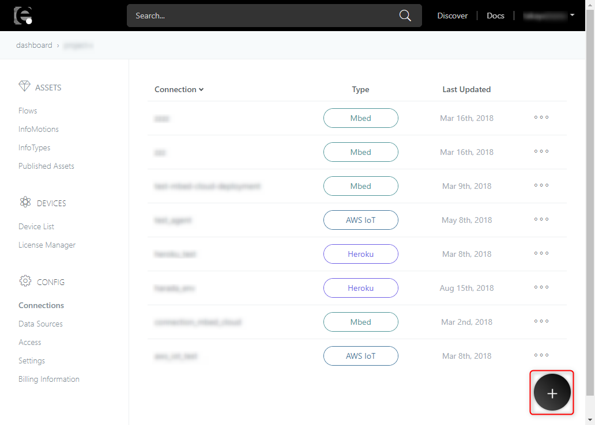
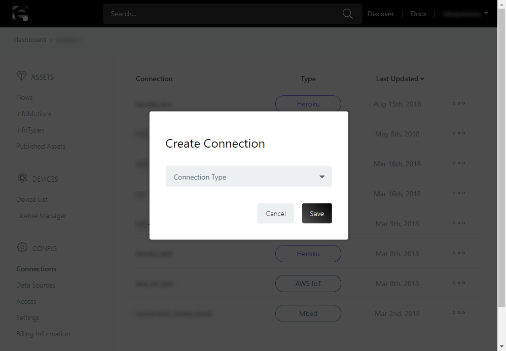
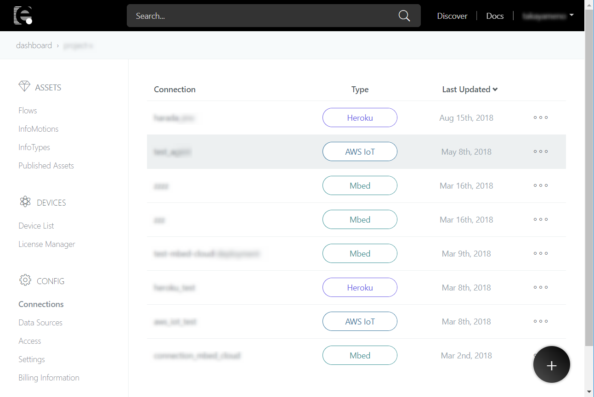
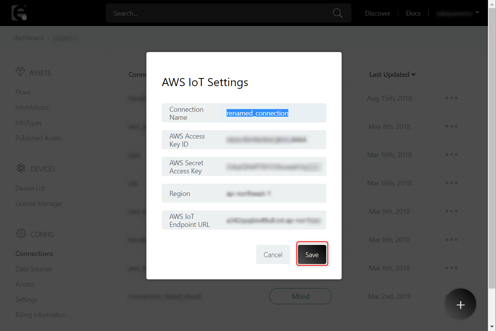
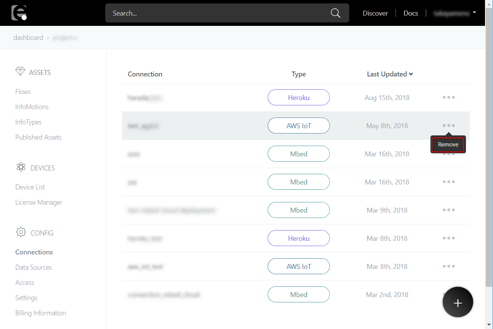
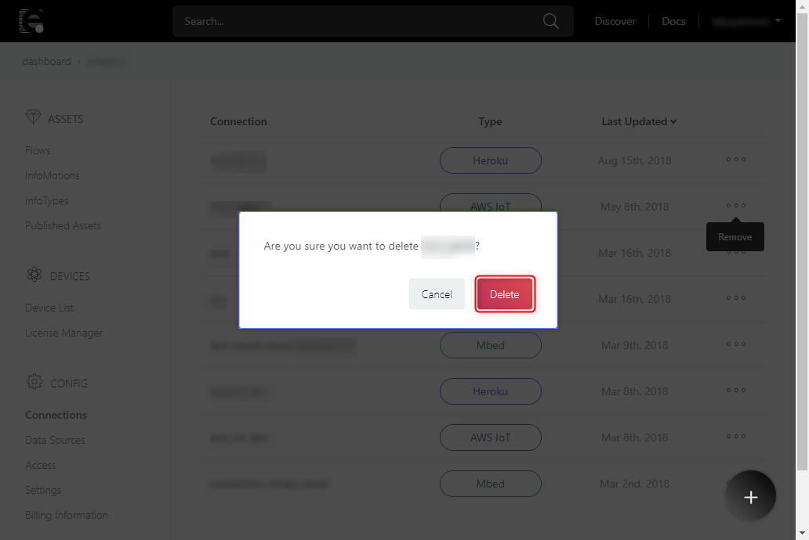

# Connections

This feature allows you to manage connections to external services. You can view, add, edit and delete the connections.

Connections can be used to assets deployment. See [Deploy](../Deploy/index.md) for further information.

## List

You can view the list of the all connections your project have. Items descriptions are follows:

| # | Item | Description |
| --- | --- | --- |
| 1 | Connection | The name of the connections |
| 2 | Type | Which external services are connected to |
| 3 | Last Updated | The date connection last updated |
| 4 | Remove | Deleting connections |

## Add

You can add new connections.

Click on "+" button.

Shown pop-up, choose "Connection Type" which you want to associate with.

Settings are different each Connection Type you selected. See [Deploy](../Deploy/index.md) for further information.

## Edit

You can edit connections registered.

Click on a connection you want to edit. 

Shown pop-up, edit items and click on the Save button.

## Remove

You can delete connections registered.

Click on the Remove button.

Shown pop-up if it's fine to delete connection, click on the Delete button.