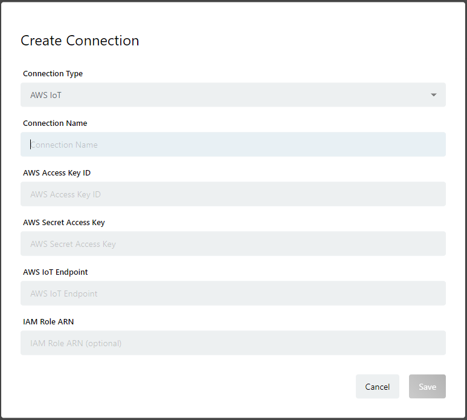

# Creating an AWS IoT {#make aws iot connection}

## Overview {#InTheBeginning}

In enebular, flows and files can be deployed to Devices connected to AWS IoT. The device status can also be confirmed. In order for enebular to be able to interact with your AWS IoT device, an AWS IoT connection needs to be created first.

- Connection Type: Select `AWS IoT`
- Connection Name
- AWS Access Key ID (Note 1)
- AWS Secret Access Key (Note 1)
- AWS IoT Endpoint: The AWS IoT endpoint required to interact with the AWS IoT device
- IAM Role ARN: Required to execute Rules from AWS IoT

Note 1: The AWS Access Key ID and AWS Secret Access Key can be found in [enebular-agent installation](../../../EnebularAgent/Installation.md). For security reasons it is recommended to use separate keys for creating a connection and installation.

It is recommended to create and use different AWS users for enebular-agent installation and AWS IoT Connection creation. 

## Precautions

The credentials from a single AWS account should be used to create a single connection **only**. If multiple connections are created based on credentials from the same AWS account can cause problems with the way enebular communicates with AWS IoT.

When creating a connection, the AWS IoT Rule will automatically create an AWS SNS Topic. Please do not edit or delete the SNS topic.

- AWS IoT - `enebular_shadow_update`
- AWS IoT - `enebular_status_push_rule`
- AWS IoT - `enebular_devicestate_push_rule`
- Amazon SNS - `enebular_status_push_sns`
- Amazon SNS - `enebular_devicestate_push_sns`

## Setting up AWS Credentials {#PrepareConnectionInformation}

A description on how to get the following credentials will be explained below.

- AWS Access Key ID
- AWS Secret Access Key
- AWS IoT Endpoint
- IAM Role ARN

`AWS Access Key ID` and `AWS Secret Access Key` allows enebular to interact with AWS IoT and AWS SNS.
Behind the scenes, it creates an AWS IoT rule that detects when there is a change in status to an AWS IoT device. A SNS Topic is also created to allow the status to be reported to enebular. AWS IoT needs certain policies to be able to execute the AWS IoT rule. Having the correct `IAM Role ARN`, can give AWS IoT those policies.

### Creating an IAM Role ARN {#MakeIAMRoleARN}

1. From the AWS Management Console, under `Find a Service` , go to IAM > Roles > Create Role

1. Under `Choose the service that will use this role`, choose `IoT` and under `Select your use case` choose `IoT` and click on `Next: Permissions`

1. Leave `Attached permissions policies` as is and click on `Next: Tags`

1. Leave `Add Tags` as is and click on `Next:Review`

1. For `Role name`, enter `enebular_status_push_role` and select `Create role`

1. The role created will be added to the list of Roles. Select the role created, which in this example's case is `enebular_status_push_role`

1. The following policies should be the default for the role.

   - AWSIoTThingsRegistration
   - AWSIoTLogging
   - AWSIoTRuleActions

   We want to create a custom policy so detach all the current policies by clicking on [×] to reset the policy state.

1. Click on `Attach policies` and attach the following policies

   - AmazonSNSFullAccess
   - AWSIoTDataAccess

Your Role now has the necessary policies for enebular to interact properly with AWS IoT. Copy `Role ARN` and paste it in the `IAM Role ARN` section in the Connection creation screen in enebular.(**Connection Info 1**)

### AWS User {#MakeAWSUser}

#### Creating a PassRole Policy {#MakePassRolePolicy}

Before creating a user in AWS, first create a PassRole policy. The PassRole policy is attached to an AWS user. It is required to pass Roles specified from an IAM Role ARN.

1. From the AWS Management Console, under `Find a Service` , go to IAM > Policies > Create Policy

1. Click on `Choose a service` and select `IAM`

1. From `Actions`, search for `PassRole` and check it

1. Continue searching for `GetRole` and check it

1. Continue searching for `ListAttachedRolePolicies` and check itt

1. From `Resources`, click on `Add ARN`. For `Account`, enter your `AWS Account ID`. For `Role name with path` enter the Role created earlier in our case `enebular_status_push_role`

1. Click on `Review policy`

1. For `Name`, enter `EnebularPassRole` and click on `Create Policy`

Now we have our policy and we just need to attach it a User.

#### Creating an AWS User {#Makeuser}

1. From the AWS Management Console, under `Find a Service` , go to IAM > Users > Add User

1. For `User name`, enter a username. We will call it `enebular-conn-user` for example purposes.

1. For `Access Type`, check `Programmatic access` and click on `Next:Permissions`

1. Click on `Attach existing policies directly` and add the following 3 policies:

   - AWSIoTFullAccess
   - AmazonSNSFullAccess
   - EnebularPassRole(Explained in `Creating a PassRole Policy`)

1. Click on `Next: Tags` and `Next: Review`.

1. Review that all 3 policies have been set and click on `Create User`

1. Save a copy of `User`, `Access Key ID`, `Secret Access Key`. `Access Key ID` and `Secret Access Key` are credentials needed when creating an AWS IoT connection in enebular. (**Connection Info 2**)

#### AWS IoT Endpoint {#ReferenceOfAWSIoTEndpoint}

1. From the AWS Management Console, under `Find a Service` , go to IoT Core > Settings

1. The endpoint under `Custom Endpoint` is the `AWS IoT Endpoint` needed when creating an AWS IoT connection in enebular. The endpoint will change based on the selected AWS Region. (**Connection Info 3**)

## Creating a Connection in enebular {#MakeConnectionOnEnebular}

From enebular, select a `Project` and click on `Connections` from the left side bar. Click on the + button on the bottom right of the page and the following modal will appear.

Fill in the following details and click on `Save`.

- Connection Type: AWS IoT
- Connection Name: A name
- AWS Access Key ID: Refer to **Connection Info 2**
- AWS Secret Access Key: Refer to **Connection Info 2**
- AWS IoT Endpoint: Refer to **Connection Info 3**
- IAM Role ARN: Refer to **Connection Info 1**

Once a Connection is created, only the Connection Name can be updated. If you want to change other fields, please delete the Connection and create a new one.

## Migration for Connections created below enebular version 2.9.0 {#Correspondence of enebular 2.9.0 AWS IoT Connection}

For Connections created below enebular 2.9.0, a migration is required to view the Device Status for Devices subscribed to Licenses.

1. Adding IAM Role ARN
   Refer to [Creating an IAM Role ARN](#MakeIAMRoleARN) on how to create one, and update your existing AWS IoT Connection to include it.

2. Refer to [Creating a PassRole Policy](#MakePassRolePolicy) for adding 3 policies support for AWS Access Key ID / AWS Secret Access Key

- AWSIoTFullAccess
- AmazonSNSFullAccess
- EnebularPassRole

## Restrictions

Let's say we have an AWS Account A. Once an AWS Connection is created from a specified region from AWS Account A, you cannot create a new AWS Connection using the same region from AWS Account A even if the provided Access Keys / Credentials are different. It would count as a duplicate connection and not be recognized. You can however create a new connection by specifying a different AWS Region.

When using enebular-agent version 2.5.0 or above, please make sure to set a `IAM Role ARN` in your connection.
