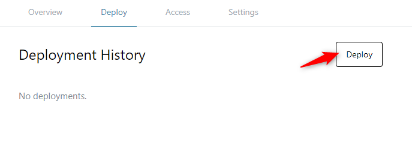
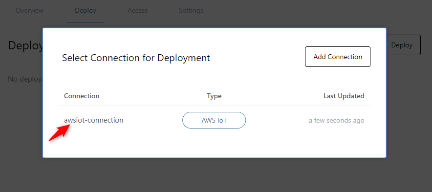
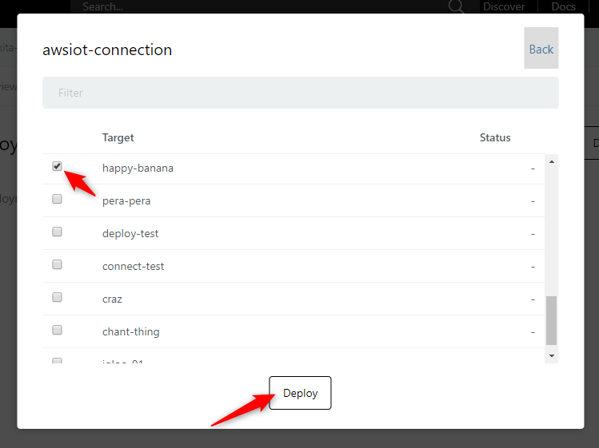
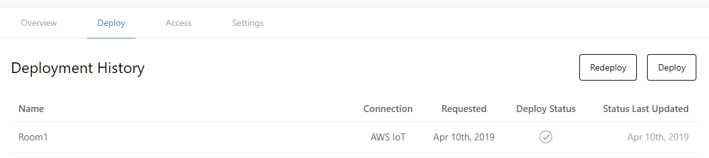

# Deploying to AWS IoT {#DeployingToAWSIoT}

Flows created on enebular can be deployed to AWS IoT.

To deploy, please confirm the following

- You have an AWS Account
- The deploy target has `enebular-agent` installed
- The deploy target is registered as a `thing` on AWS IoT
- A connection is created for AWS IoT on enebular.

Please refer to [EnebularAgent Installation](../../../EnebularAgent/Installation.md) for how to install `enebular-agent` and to register `thing` with AWS IoT.

To create a `Connection`, please refer to [Create an AWS IoT Connection](MakeAWSIoTConnection.md).

## Creating a Flow {#CreatingFlow}

For this example, make a flow like the following.

Once the flow is ready, deploy it to save it.

## Deploying the Flow {#DeployingFlow}

We will deploy the Flow you created to a device connected to AWS IoT.

Click on the Deploy Button.

From `Select Connection for Deployment`, select the AWS IoT Connection created.

The deploy targets associated with the connection will show up.

When you select the check-box on the left and press "Deploy" the deploy will complete. If the "Deploy Status" has tick mark in the deploy history, then it has succeeded.

You'll also be able to see the device side log updating.

While `unauthenticated` will be displayed, this is just because a license hasn't been purchased. Purchasing a license is not required for the flow to run, but by purchasing a license status and log monitoring becomes available.

When running the agent core you can specify various configuration options. For the AWS IoT port, this can be seen in the `ports/awsiot/src/index.js` source code. For all of the configuration options that the agent core supports, refer to the `agent/src/index.js` source code file.
