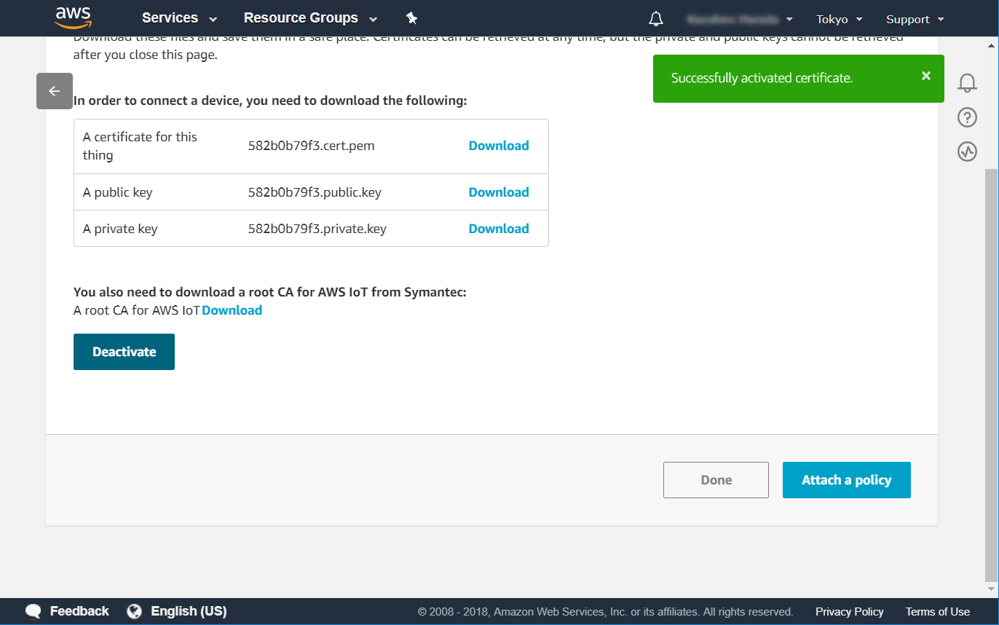
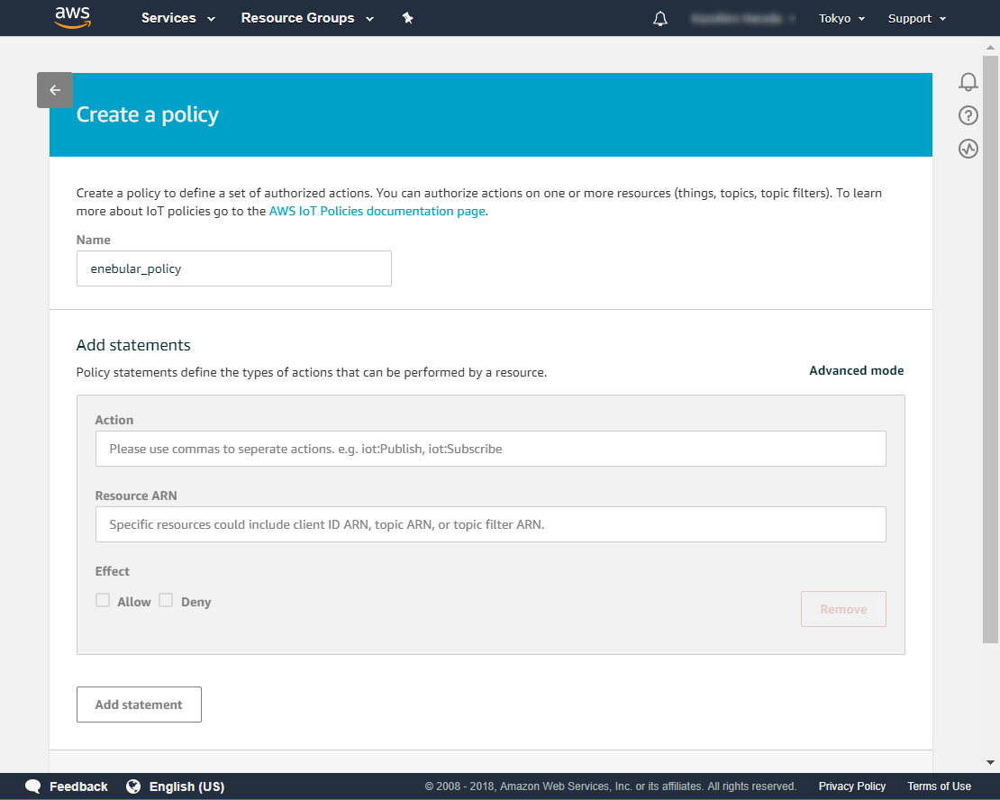

# Deploying to AWS IoT

Flows created on enebular can be deployed to AWS IoT.

## Creating a Flow

For this example, make a flow like the following.


Once the flow is ready, deploy it to save it.


Once it has been saved, press "Deploy" on the flow's "Deploy" tab.


This will take you do the "Deploy Flow" screen. Choose `AWS IoT` for "Select Connection Type" and wait.


## Creating the Configuration on AWS IoT

We'll create a configuration on AWS IoT to use this time.

### Creating a Thing

Select "Manage > Things" from the menu and press "Register a thing".


Press "Create a single thing".


Give it an appropriate name and move to the next step.


### Creating the Certificates

Press the "Create certificate" of One-click certificate creation.


Download all of the files and activate it.


The activation will complete.



### Creating the New Policies

Select "Secure > Policies" from the menu and press "Create a policy".


Specify an easy to understand name.


Next we add a statement.



Specify the policy statements as shown below.

* Action
    * iot:*
* Resource ARN
    * *


This policy statement configuration provides a wide degree of access to allow for the tests here. Once you're ready, please fine tune the policy.

Press the create button to save the policy.


## Attaching the Policy to the Certificates

As things are now the policy and certificates are not tied together, so we will attached them here. Move to the details screen of the thing you created just before, and select the certificate from the security section in the menu.


Select "Attach policy" from the "Actions" menu at the top right.


Attach the policy you created just before.


Once that completes, you can confirm that the certificate is tied to the policy and thing.


## Creating an IAM User for AWS IoT

In order to use AWS IoT from enebular, create an Access Key ID and Secret Access Key.

In the "Users" section of the IAM menu, press "Add user".


In the details section, set an easy to understand name and enable "Programmatic access".


For the permissions, select "Attach existing policies directly", then select the "AWSIoTFullAccess" policy and move to the next step.


Finally confirm there are no mistakes.


Once completed, download the CSV file that contains the Access Key ID and Secret Access Key (note that this is the only chance to download it).


## Update the Flow with the AWS IoT Settings

We return to the AWS IoT settings screen from before and update the AWS IoT settings.


Press "New" to the right of "Select Connection". Enter the required information and create the connection.


* Connection Name
    * Any alphameric characters
* AWS Access Key ID
    * Copy from the downloaded CSV file
* AWS Secret Access Key
    * Copy from the downloaded CSV file
* Region
    * The part before the `amazonaws.com` section of the AWS IoT Endpoint URL (below)
* AWS IoT Endpoint URL
    *  This can be seen in the "Interact" section of the thing menu (refer to the image below)


When you select the created connection the registered things are displayed.


The thing will still be disconnected. Here, 'disconnected' means that the AWS IoT thing hasn't been deployed to yet or it is actually disconnected.

Let's now leave the enebular side and prepare a device setup on a PC.

## Device (Agent) Setup

Here we set up a device. Note that the wrapper device code base that receives commands from the device manager and carries out the appropriate operations is referred to the **agent** here.

The agent can be downloaded from <a href="https://github.com/enebular/enebular-runtime-agent" target="_blank">GitHub</a>.

** Before proceed next step, your Node.js version set to 8.9.0 with npm module [n](https://github.com/tj/n).

Build the core enebular-agent module.

```
cd agent
npm install
npm run build
```

Install the Node-RED instance.

```
cd ../node-red
npm install
```

Install the AWS IoT port's modules and build it.

```
cd ../ports/awsiot
npm install
npm run build
```

There is an 'example' module under the AWS IoT port's directory that is just a simple wrapper of the actual AWS IoT port module. Go to its directory and install its modules. If you check the example's `package.json` file, you can see that it is setting the environment variable that specifies the Node-RED directory.

```
cd example
npm install
```

Copy the AWS IoT Thing certificate files you downloaded just before to the `certs` directory in the example folder.


Update the example's `config.json` file with the connection details (including the correct paths of the certificate files).

```json
{
  "host": "<THING SHADOW REST API ENDPOINT>",
  "port": 8883,
  "clientId": "<THING NAME>",
  "thingName": "<THING NAME>",
  "caCert": "./certs/VeriSign-Class 3-Public-Primary-Certification-Authority-G5.pem",
  "clientCert": "./certs/<THING CERT>",
  "privateKey": "./certs/<THING PRIVATE KEY>",
  "topic": "aws/things/<THING NAME>/shadow/update"
}
```
* `<THING CERT>` ･･･ `xxxxxx-certificate.pem.crt`
* `<THING PRIVATE KEY>` … `xxxxxx-private.pem.key`

You can confirm `<THING SHADOW REST API ENDPOINT>`, `<THING NAME>` in the "Interact" section of the thing menu AWS IoT.
(refer to the image below)


### Running

Once the above setup has been completed, enebular-agent can be started from the example directory with the `npm run start` command.

By default enebular-agent will not log to the console, however this can be enabled by setting the `DEBUG` environment variable to either `info` or `debug`.

```
DEBUG=info npm run start
```

Log messages similar to the following should be displayed.


If enebular-agent successfully starts and connects to AWS IoT, it will display the following log message.

```
internal: aws-iot: Connected to AWS IoT
```

Once that message is displayed, the device can be used with enebular.

## Deploying the Flow

We're now ready to deploy the flow. Move back to the screen below.


When you select the check-box on the left and press "Deploy" the deploy will complete. If the "Deploy Status" has tick mark in the deploy history, then it has succeeded.


You'll also be able to see the device side log updating.


While `unauthenticated` will be displayed, this is just because a license hasn't been purchased. Purchasing a license is not required for the flow to run, but by purchasing a license status and log monitoring becomes available.

When running the agent core you can specify various configuration options. For the AWS IoT port, this can be seen in the `ports/awsiot/src/index.js` source code. For all of the configuration options that the agent core supports, refer to the `agent/src/index.js` source code file.
