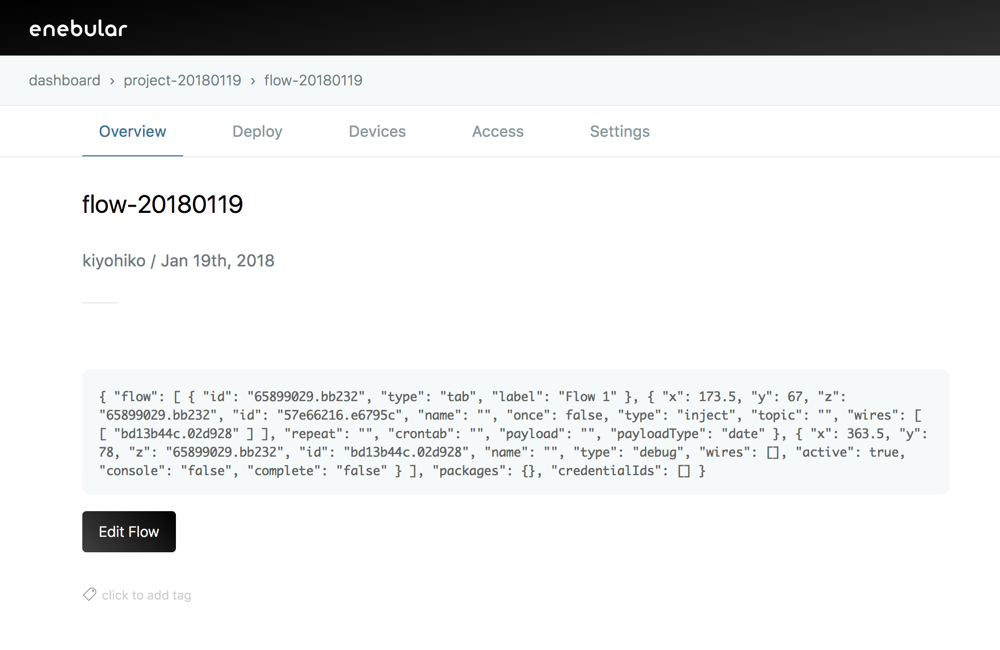
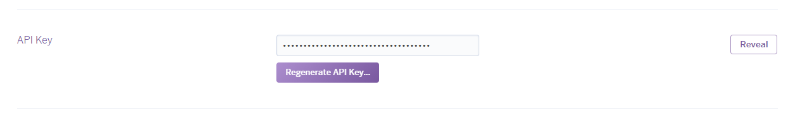
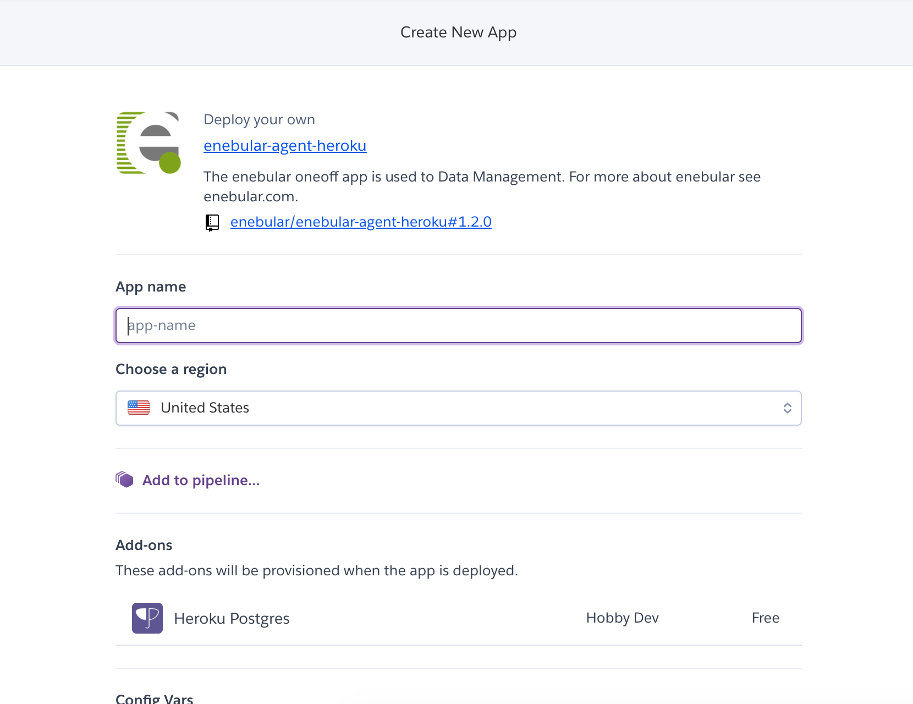
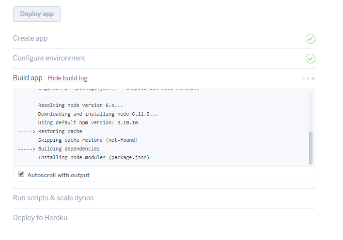
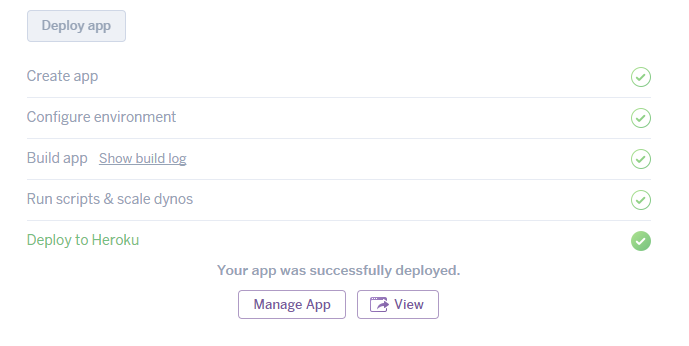

# Deploying to Heroku {#Deploying to Heroku}

This page covers Heroku deploys. A Heroku deploy is the ability to deploy a flow created in enebular to an enebular Node-RED on Heroku.

## Creating the Flow to Send to Heroku {#Creating the Flow to Send to Heroku}

First, create a new flow from "Assets".

Create the flow you want to send to Heroku, and then deploy it to save it.

## Deploy Settings {#Deploy Settings}

Configure your flow deployment by clicking on Deploy.

Click on the "Add Connection".

Select "Heroku" for "Select Connection Type".

Input a "Connection Name". Get the "Heroku API Token" from the Heroku settings screen.

## Creating an app with the Heroku Button {#Creating an app with the Heroku Button}

Go to "Account" on the "Manage Account" page.

Go to the API Key section and display the API Key with "Reveal".

Copy the API Key into "Heroku API Token" and click "Save".

Click created connection.

We can create a Heroku app from the "Deploy to Heroku" button on the bottom.

## Creating an app with the Heroku Button {#Creating an app with the Heroku Button}

Use the Heroku button to create the app. This step can be skipped for those who have already created one.

After clicking on the Heroku button, if not logged in, log in with the Heroku login screen that appears.

Heroku The Heroku app settings will be displayed.

## Deploy Settings {#Deploy Settings}

Set the USERNAME and PASSWORD to be used for login after the enebular Node-RED has been created.

After confirming the settings press the "Deploy" button. ¥

After confirming the settings click the "Deploy" button. If you haven't added your credit card information to heroku before, the following modal will show up.
Using the Enebular app is free so one needs to not worry about Enebular charging.

After registering the credit card, heroku will start setting up the app.

The app is being created...

Once it has been created click the "View" button to check it.

You'll be asked to provide the USERNAME and PASSWORD to log into the enebular Node-RED, so enter those that you set above.

## Deploying {#Deploying}

With the connection saved and Heroku selected as a "Connection Type", a list of the apps on the Heroku account should be displayed. From here, select the Heroku application you just created and press "Deploy".

Wait a moment for the "Deploy Added" to be displayed to confirm the app has been deployed.

If you check the Heroku app you will be able to see that the flow has been deployed.

Check the Heroku app to see if the flow has been deployed.

