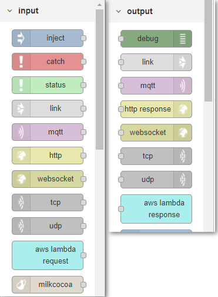

# AWS Lambda deployment

Deploying a flow from Enebular directly is only temporarily.
For constant deployment AWS lambda can be used.

## Creating a new flow

First we create a new flow.

Create a flow and click on [Edit Flow] to launched the Node-RED edit screen.

Edit the data flow on this edit screen and create a flow.

## Edit data flow

To confirm the operation, create a flow that returns a Lambda Request to a Lambda Response.

In the left palette, Lambda Request is in the input group and Lambda Response is in the output group.

Click on [Deploy] in the upper right of the window to save.

## Deploying to AWS Lambda  {#Deploying to AWS Lambda}

When saving is completed, go to the [Deploy] page from the flow menu.

Click on [Deploy] to view the deploy screen.

Select Lambda.

Press [New] to open the [Create Connection] modal.
From here move to the AWS console to setup connection settings.

### Create an IAM user to use AWS Lambda from enebular

Create an Access Key ID, Secret Access Key for accessing AWS Lambda from enebular.

Go to IAM in AWS and click on Users.

Go to the [Add User] screen.
Create a name and check [Programmatic access] for [Access type].

On the access authority screen, select [Attach existing policy directly], select the policy named [AWSLambdaFullAccess] then go to [Next:Review].

Check the confirmation screen for any mistakes and Click on [Create user].

Once complete, download the CSV file containing the access key ID and secret access key (note that it can only be downloaded at this moment).

### Create ARN role used by AWS Lambda

Create an ARN role for flows deployed in Lambda.

To access a IAM go to [role] in menu.

Go to [Create Role] and Select Lambda for AWS service and continue to [Next:Permissions].

Click on [AWSLambdaFullAccess] to set up access privileges.

Finally, give it a name and click [Create role].

Now you can enter the necessary information in enebular to create a connection.

- Connection Name
  - A simple name
- AWS Access Key ID
  - Copied from downloaded CSV file
- AWS Secret Access Key
  - Copied from downloaded CSV file
- Region
  - ap-northeast-1 (depending on your location)
- IAM Role ARN
  - Confirmation ARN of the created role
    - 

Once saved, a form appears in which you enter the information of the Lambda function as follows.

- Function Name
  - An easy-to-understand name (hyphens can not be used)
- Timeout
  - 60
- Memory Size
  - 128

Enter the above values ​​and click [Deploy] to deploy.

Please wait her for a while as it may take upto 1 to 2 minutes.

Once deployment is complete, you can see what was deployed with Deployment History.

## Confirmation by AWS Lambda console

Check the Lambda page in AWS to confirm deployment.
There should be a function name with a new time of deployment.
Try testing it by clicking on [Test].

An Event setting screen will appear click on [Create]

At the following screen click test to start the test.

If you can see the following screen the test was correct.

