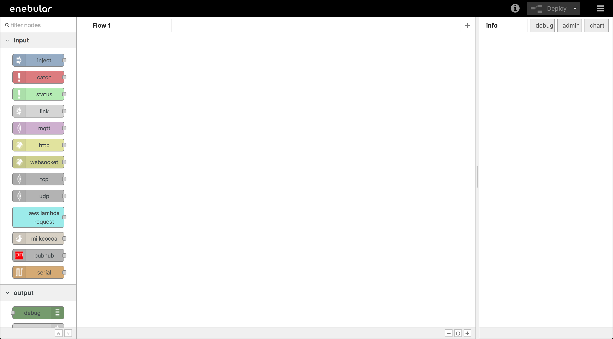
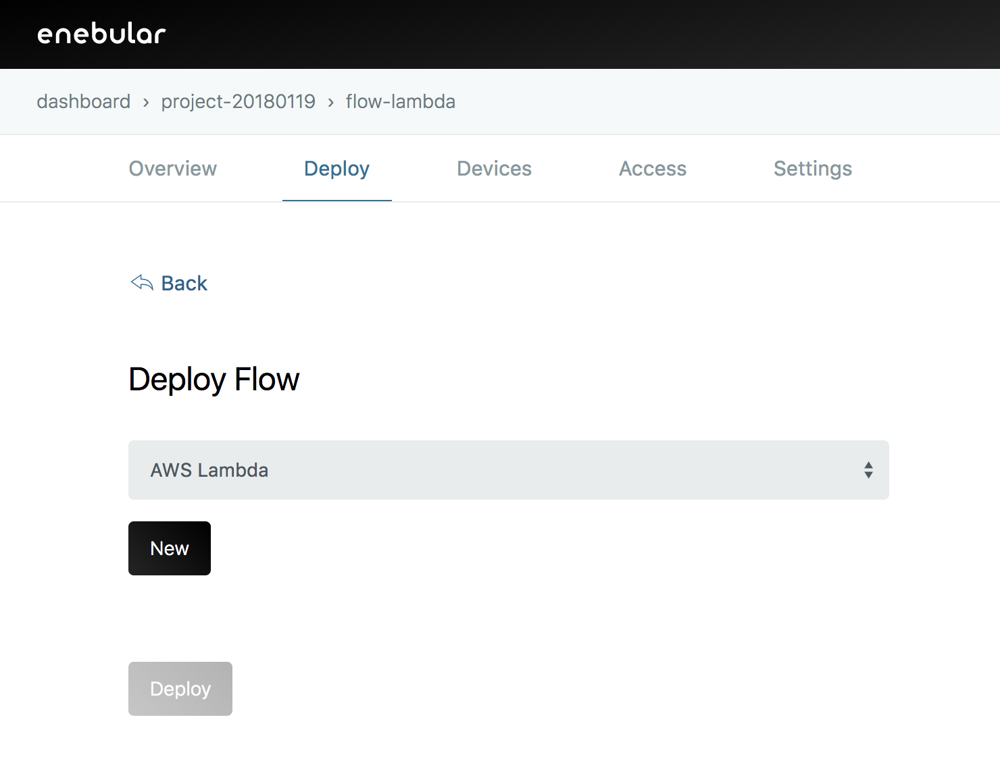
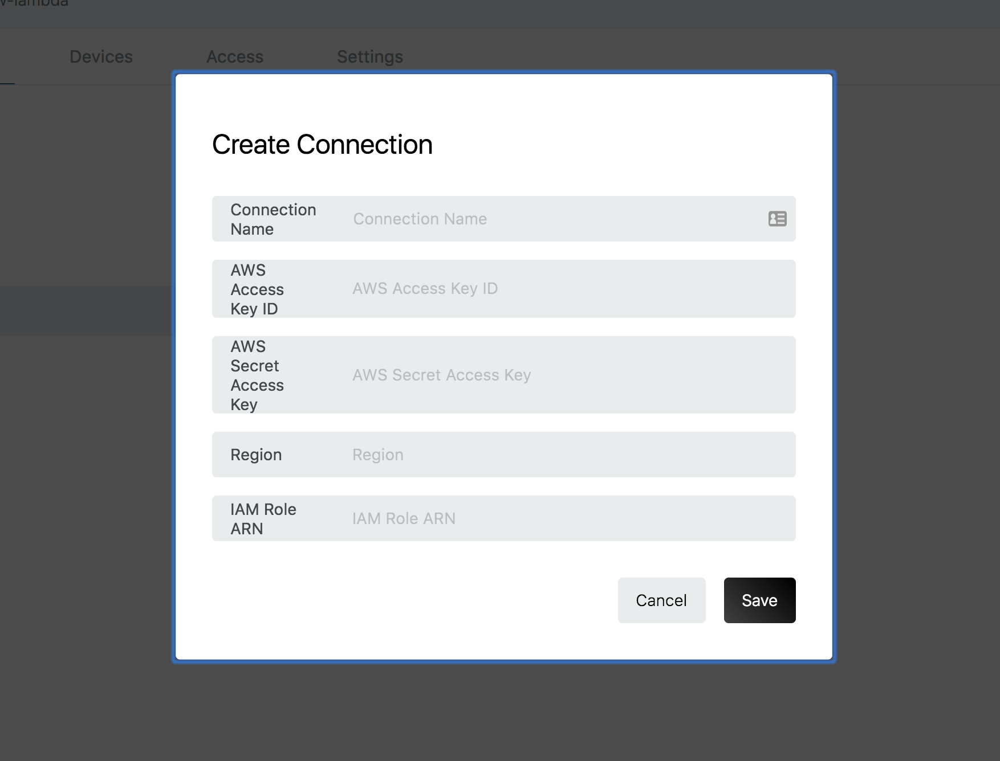

# AWS Lambda deployment {#AWS Lambda deployment}

Deploying a flow from Enebular directly is only temporarily.
For constant deployment AWS lambda can be used.

## Creating a new flow {#Creating a new flow}

First we create a new flow.

Create a flow and click on [Edit Flow] to launched the Node-RED edit screen.

Edit the data flow on this edit screen and create a flow.

## Edit data flow {#Edit data flow}

To confirm the operation, create a flow that returns a Lambda Request to a Lambda Response.

In the left palette, Lambda Request is in the input group and Lambda Response is in the output group.

Click on [Deploy] in the upper right of the window to save.

## Deploying to AWS Lambda  {#Deploying to AWS Lambda }

When saving is completed, go to the [Deploy] page from the flow menu.

Click on [Deploy] to view the deploy screen.

Select Lambda.

Press [New] to open the [Create Connection] modal.
From here move to the AWS console to setup connection settings.

### Create an IAM user to use AWS Lambda from enebular {#Create an IAM user to use AWS Lambda from enebular}

Create an Access Key ID, Secret Access Key for accessing AWS Lambda from enebular.

Go to IAM in AWS and click on Users.

Go to the [Add User] screen.
Create a name and check [Programmatic access] for [Access type].

On the access authority screen, select [Attach existing policy directly], select the policy named [AWSLambdaFullAccess] then go to [Next:Review].

Check the confirmation screen for any mistakes and Click on [Create user].

Once complete, download the CSV file containing the access key ID and secret access key (note that it can only be downloaded at this moment).

### Create ARN role used by AWS Lambda {#Create ARN role used by AWS Lambda}

Create an ARN role for flows deployed in Lambda.

To access a IAM go to [role] in menu.

Go to [Create Role] and Select Lambda for AWS service and continue to [Next:Permissions].

Click on [AWSLambdaFullAccess] to set up access privileges.

Finally, give it a name and click [Create role].

Now you can enter the necessary information in enebular to create a connection.

- Connection Name
  - A simple name
- AWS Access Key ID
  - Copied from downloaded CSV file
- AWS Secret Access Key
  - Copied from downloaded CSV file
- Region
  - ap-northeast-1 (depending on your location)
- IAM Role ARN
  - Confirmation ARN of the created role
        - 

Once saved, a form appears in which you enter the information of the Lambda function as follows.

- Function Name
  - An easy-to-understand name (hyphens can not be used)
- Timeout
  - 60
- Memory Size
  - 128

Enter the above values ​​and click [Deploy] to deploy.

Please wait her for a while as it may take upto 1 to 2 minutes.

Once deployment is complete, you can see what was deployed with Deployment History.

## Confirmation by AWS Lambda console {#Confirmation by AWS Lambda console}

Check the Lambda page in AWS to confirm deployment.
There should be a function name with a new time of deployment.
Try testing it by clicking on [Test].

An Event setting screen will appear click on [Create]

At the following screen click test to start the test.

If you can see the following screen the test was correct.

