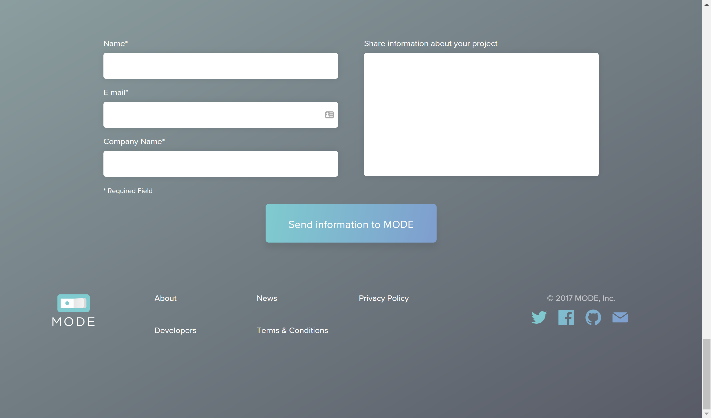
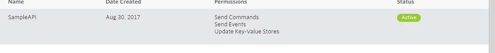
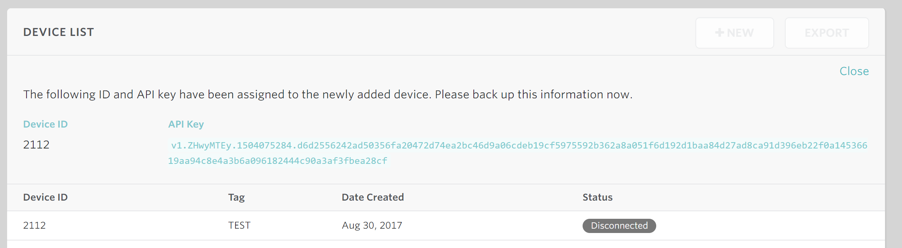
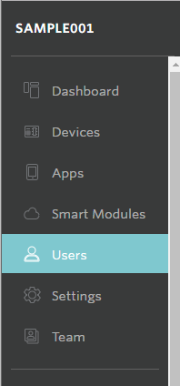
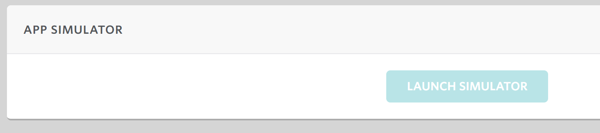
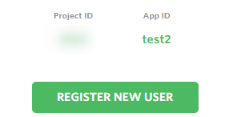
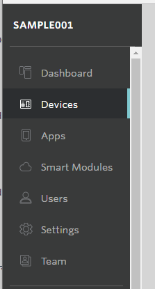
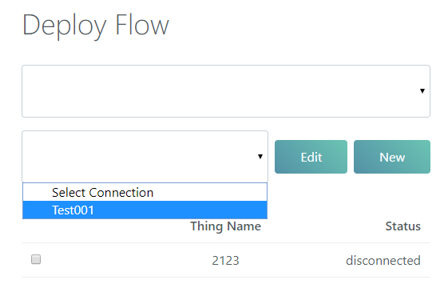

# Mode デプロイ用の設定 {#Mode デプロイ用の設定}

Mode へデプロイする際に必要な設定の方法です。

## 事前準備 {#事前準備}

enebular MODE deployの内容を把握しておきましょう。

「Export to Other Services」でDeployの設定に行きます。

Modeを選択します。

Createを押します。

* Connection Name
* MODE Project ID
* MODE Project API Key
* MODE Home ID

Connection Nameは自由な名前をつけて良いです。MODE Project ID・MODE Project API Key・MODE Home IDの3つの設定をMODE作成して帰ってきましょう。

* Connection Name
    * 自由な名前
* MODE Project ID
    * （設定待ち）
* MODE Project API Key
    * （設定待ち）
* MODE Home ID
    * （設定待ち）

## アカウント作成 {#アカウント作成}

MODE – Make IoT a reality for your business
http://www.tinkermode.com/

こちらにアクセスします。

最下部のフッターにあるDevelopersを押しましょう。

Developersページに遷移します。

右上のGO TO CONSOLEボタンを押します。

LOGINページに移動します。

Sign up!でユーザー登録をしましょう。

メールが届くのでアクティベーションしましょう。

## MODE Project ID Projectの作成 {#MODE Project ID Projectの作成}

MyProjectページがトップページです。

右上のNewボタンからプロジェクトを作成します。

User Accountsは「Your users will log in with their email addresses.」にします。

プロジェクト設定画面に移動するのでプロジェクトをわかりやすい名前で設定しましょう。

作成すると、Project Dashboardに移動します。

Project IDをメモしておきましょう。

* Connection Name
    * 自由な名前
* MODE Project ID
    * 000
* MODE Project API Key
    * （設定待ち）
* MODE Home ID
    * （設定待ち）

## Project API Key {#Project API Key}

つづいてSettingページに移動します。

API KEYSに移動して New ボタンを押してAPI Keyを作成します。

API KEYできました。

詳細をクリックして見に行きます。

v1ではじまるAPI KEYがあるのでこれをMODE Project API Keyとしてメモしておきます。

* Connection Name
    * 自由な名前
* MODE Project ID
    * 000
* MODE Project API Key
    * vi.XXXXXXXXXXXXXXXXXXXXXXXXXXXXXXXXXXXXXXXXXXXXXXXXXXXXXXXXXXXXX
* MODE Home ID
    * （設定待ち）

## デバイス作成 {#デバイス作成}

HomeIDをつくるためにデバイスとAPPが必要です。まずデバイスを作成します。

Deviceに移動します。

DEVICE CLASSESのところでNewを押します。

適当な名前で作成します。

デバイスが出来たら、クリックしてデバイス詳細に移動します。

DIVICE LISTがまだ No Device Yet !なのでNewボタンを押して作成します。

TAGは適当でOKです。

デバイスの作成完了です。

## APPS作成 {#APPS作成}

APPを作成します。

Appページに移動します。

Newボタンを押して新規作成します。

適当な名前で作成します。

## ユーザーの作成 {#ユーザーの作成}

ユーザーメニューに移動します。

まだ作成されていないので作成します。

### アプリシミュレーターでユーザーを登録する {#アプリシミュレーターでユーザーを登録する}

接続したいアプリをに移動します。

アプリシミュレーターを起動します。

アプリシミュレーター画面です。

アプリシミュレータで、アカウントも認証します。Register New Userをクリックします。

Sign Upページに移動するので、各項目を入力しましてRegister しましょう。

メールが送られるので認証しましょう。

認証しました。

認証されたので、IM Verifiedを押します。

これでユーザーの登録が完了です。

### ホーム画面の作成 {#ホーム画面の作成}

まだホーム画面が作成されていないの作成します。

Newボタンを押します。

適当な名前をつけます。

ホーム画面の作成完了です。

### ホーム画面のデバイスの関連付け {#ホーム画面のデバイスの関連付け}

上部のアラートを見ましょう

hereをクリックします。右メニューのDevicesで移動してもOKです。

Devices画面に移動します。

Newボタンを押します。

Newボタンを押すとCLAIM CODEというコードが聞かれるのでそのままにします。

### デバイスシミュレータを起動する {#デバイスシミュレータを起動する}

CLAIM CODEはデバイスシミュレータで取得します。

デバイスシミュレータを起動します。

デバイスページに移動します。

接続したいデバイスをクリックします。

デバイスシミュレータがあるのでボタンを押します。

デバイスシミュレータが起動します。

Claim Codeをメモします。

CLAIM MODEボタンを押します。

カウントダウンが始まります。

アプリシミュレーターに戻ってCodeを入力します。ADDを押します。

登録されました。

ホーム画面の右メニューからSettings画面に移動します。

Home IDがあるのでメモします。

* Connection Name
    * 自由な名前
* MODE Project ID
    * 000
* MODE Project API Key
    * vi.XXXXXXXXXXXXXXXXXXXXXXXXXXXXXXXXXXXXXXXXXXXXXXXXXXXXXXXXXXXXX
* MODE Home ID
    * 000

## 反映 {#反映}

enebularのDeploy画面に戻り反映します。

反映後みてみましょう。connectedになったら成功です。

Deployを押すと反映されます。

Devicesのログにも無事残りました。

### disconnectになっていたら {#disconnectになっていたら}

disconnectになっていたら

デバイスシミュレーションをONにして接続状態にして再度選択し直して見てみましょう。

おつかれさまでした。
