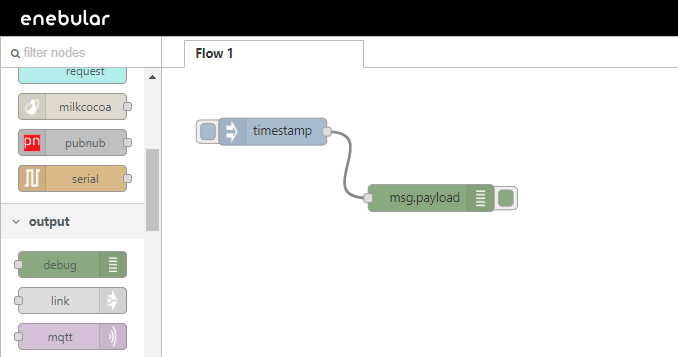
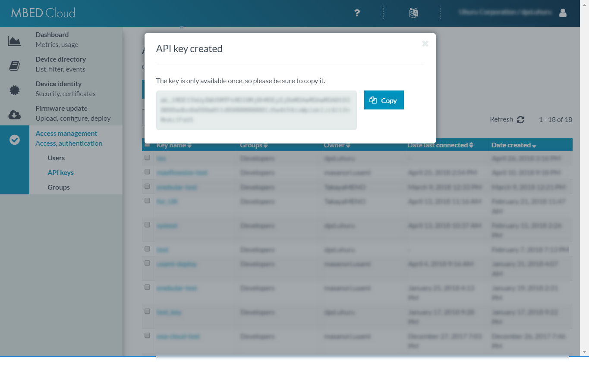

# Deploying to Mbed Cloud

In terms of the flow's deploy destination, if you press the deploy button it will just be deployed to the server that enebular is using. The Mbed Cloud deploy feature allows flows to be deployed to registered devices via Mbed Cloud.

For supported devices, please see [Supported Environments](../../../Other/Support.md).

This page covers the steps required to deploy flows to devices via Mbed Cloud.

## Creating a New Flow

First we'll create a flow to deploy to the device (we assume that the project has already been created).


After creating the flow and pressing "Edit Flow" the Node-RED editor will start up.


We'll create the flow by editing it in the editor.

## Editing the Data Flow

### When Deploying to Raspberry Pi

Start the Raspberry Pi's Node-RED and leave it on standby.

We'll now edit the flow that we'll deploy to the Raspberry Pi. Create it as shown below.



Press the red "Deploy" button at the top right to save it.


### When Deploying to enebular edge agent

Turn on the device to be used for the deploy in advance.

For the deploy to the enebular edge agent we'll use the flow below. First, copy the JSON data from below.

```
[{"id":"165c03e8.b6cbdc","type":"inject","z":"ebd56ac3.b5f1d8","name":"","topic":"","payload":"","payloadType":"date","repeat":"5","crontab":"","once":false,"x":110,"y":100,"wires":[["c82f1f55.78329"]]},{"id":"c82f1f55.78329","type":"switch","z":"ebd56ac3.b5f1d8","name":"","property":"led","propertyType":"flow","rules":[{"t":"eq","v":"1","vt":"num"},{"t":"else"}],"checkall":"true","outputs":2,"x":170,"y":180,"wires":[["31c8aef7.fda952"],["cf93bcf1.04a5"]]},{"id":"31c8aef7.fda952","type":"digitalout","z":"ebd56ac3.b5f1d8","pinName":"LED2","value":"true","signalInversion":true,"name":"","x":340,"y":140,"wires":[["6d2afea9.fd836"]]},{"id":"cf93bcf1.04a5","type":"digitalout","z":"ebd56ac3.b5f1d8","pinName":"LED2","value":"false","signalInversion":true,"name":"","x":340,"y":240,"wires":[["f8f4c712.0302c8"]]},{"id":"6d2afea9.fd836","type":"change","z":"ebd56ac3.b5f1d8","name":"","rules":[{"p":"led","t":"set","pt":"flow","to":"0","tot":"num"}],"action":"","property":"","from":"","to":"","reg":false,"x":530,"y":140,"wires":[[]]},{"id":"f8f4c712.0302c8","type":"change","z":"ebd56ac3.b5f1d8","name":"","rules":[{"p":"led","t":"set","pt":"flow","to":"1","tot":"num"}],"action":"","property":"","from":"","to":"","reg":false,"x":530,"y":240,"wires":[[]]}]
```

From the top right menu button select "Import" > "Clipboard".


Paste in the flow from above and press "Import".


This will produce a flow like the one below.


Press the red "Deploy" button at the top right to save it.


## Deploying

Select "Export to Other Services" from the down arrow to the right of "Deploy".


A new window will open and a form like that below will be shown.

Select "MBED" from "Select Connection Type".


Press "New" to the right of the "Select Connection" field.


The "Create Connection" screen will open.


* Connection Name
    * An easy to understand name
* MBED API Key
    * This can be found in the Mbed Cloud Portal

The MBED API Key can be obtained from the [Mbed Cloud Portal](https://portal.us-east-1.mbedcloud.com/).

Select "Create new API key" from the Access management's API keys page on the Mbed Cloud Portal.


Enter an API Key name and select a group according to the constraints. The settings here can be altered afterwards.


Select "Create API Key" and enter your login password. Then select "Enter".


The API Key will be displayed. This can only be seen once, so take care.



Once you've entered the MBED API Key in the "Create Connection" screen save it with "Save".

You'll now be able to select the connection you just created, so go ahead and do so.

A list of the registered devices will be displayed.

The "Status" of the device that was powered on in advance will be "connected", so select it and deploy with "Deploy".


## Confirmation

### When Deploying to Raspberry Pi

Check that the flow has been updated in the log messages.


### When Deploying to enebular edge agent

Check that the green LED on the K64F is blinking.
