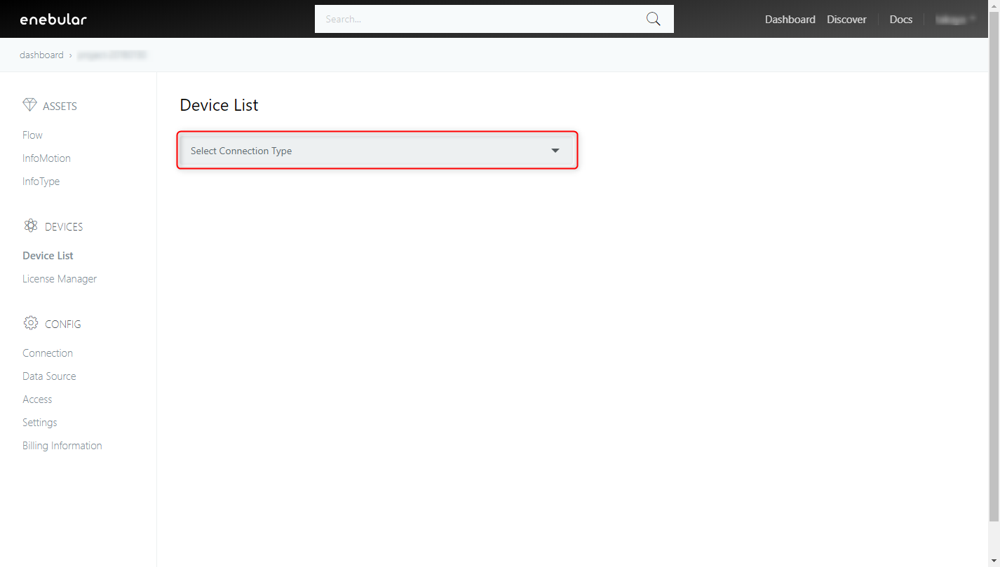
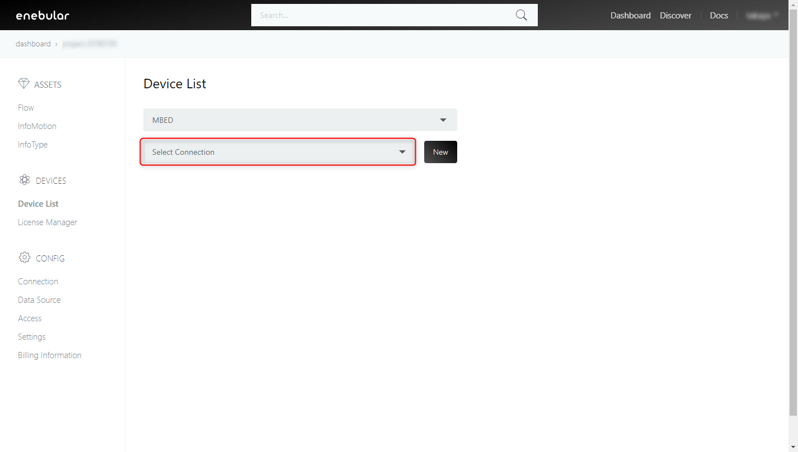
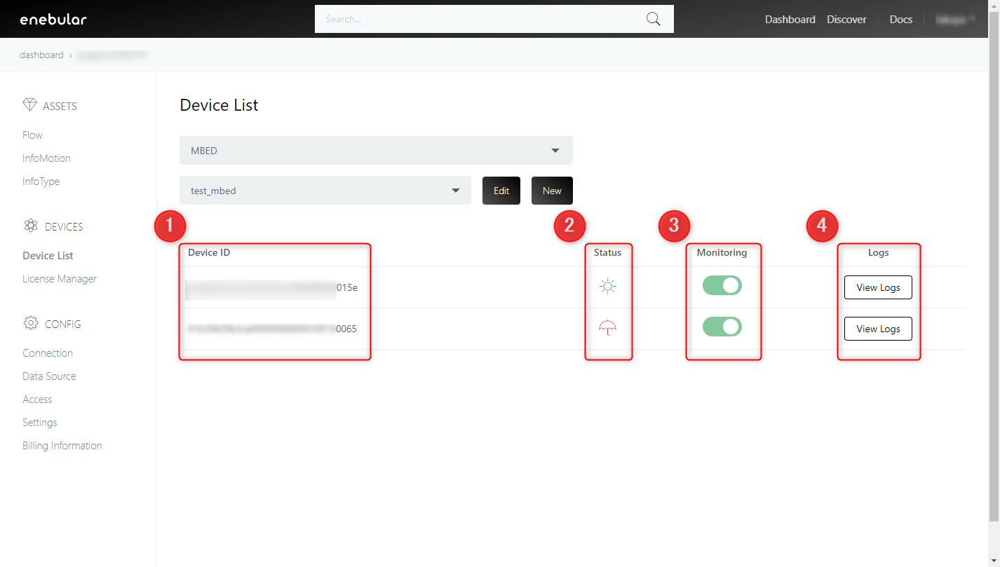

# Device List

The Device List displays the status and log of licensed devices (see [License Manager](./LicenseManager.md)).
This feature is currently only supported in the enterprise plan. For further information please contact support@enebular.com. 

## Select Connection Type 

Select the connection that your device is connected to. 
Current available connections are AWS IoT and MBED. 

## Select Connection 

Select a registered connection. If the connection has not been registered, click on New to create the connection.
For details on how to create a connection, see [Example: AWS IoT](../Deploy/DeployFlow/AWSIoT/index.md) or [Example: Pelion Device Management](../Deploy/DeployFlow/mbed/index.md)

## Device List

When you select a connection, a list of devices associated with the connection is displayed.
The items 1 to 4 are explained below.

**1. Device ID**

A list of licensed devices is displayed.

**2. Status**

** Status ** of the device is displayed as an icon.
The icons and descriptions displayed are as follows.

| Icon | Status | Description |
| :-: |:-: | :-: |
|   | **connected** | When the device is connected to enebular |
|  | **disconnected** | When the device is not connected to enebular|

**3. Monitoring** 

Switching the Monitoring on (green) or off (gray) will enable/disable viewing of status and logs of the device. 
If disabled ** Status ** will be ** disconnected ** and new ** logs **  from the device will not be displayed. Previous logs can still be displayed. 

**4. Logs** 

Displays the log of the device. For details, please refer to [Logs](./Logs.md) 