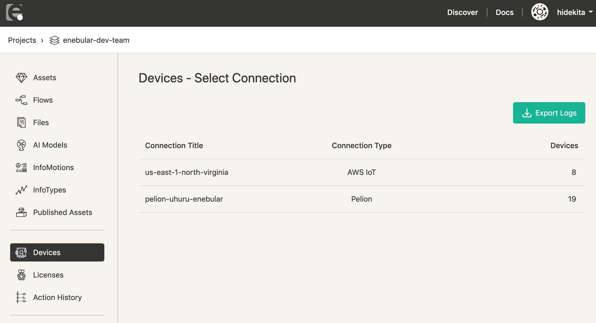
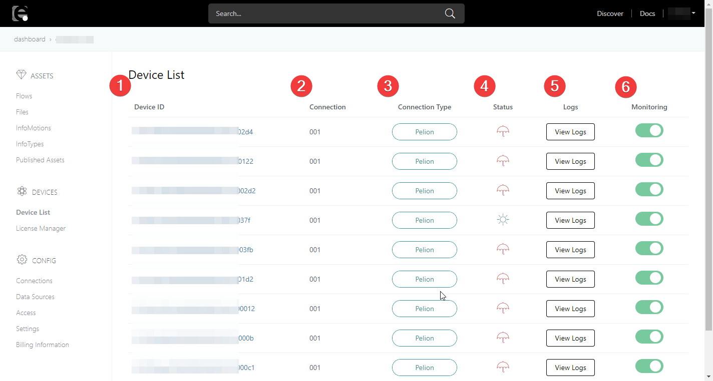
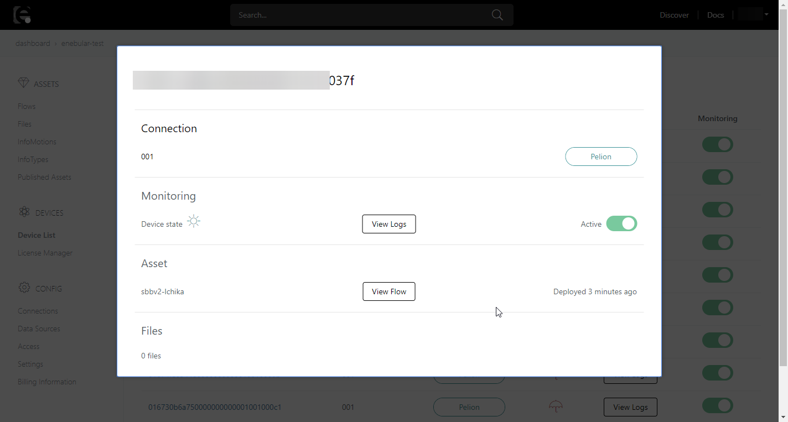
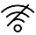
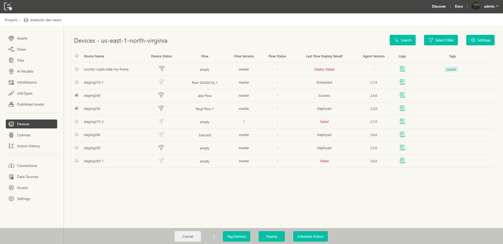

# Devices {#Devices}

## Overview

The Device List displays the **status** and **log** of licensed devices (see [License Manager](./LicenseManager.md)).
This feature is currently only supported in the enterprise plan. For further information please contact **support@enebular.com**.

## Device List {#DeviceList}

When you click on **Devices**, a list of connections that have devices with _registered_ licenses associated with it can be selected.

Selecting a connection will display a list of devices with _registered_ licenses associated with the said connection.

| Name                    | Description                                                                                                                   |
| ----------------------- | ----------------------------------------------------------------------------------------------------------------------------- |
| Device Name             | Displays the name of the device. Click to see device information.                                                             |
| Device Status           | `Device Status` of the device                                                                                                 |
| Flow                    | The name of the Flow deployed to the device is displayed (note 1)                                                             |
| Flow Version            | The version of the Flow deployed to the device is displayed (note 1)                                                     |
| Flow Status             | The status about the running Flow (running, stopped) is displayed                                                             |
| Last Flow Deploy Result | The result of the last Flow deployment is displayed. Allows checking if the Flow has been successfully deployed to the device |
| Agent Version           | Display agent version on the device                                                                                           |
| Logs                    | Displays the log of the device. For details, please refer to [Logs](./Logs.md)                                                |
| Tags                    | Tags associated with the device                                                                                               |

- Note 1: When deploying a flow in remote mode of the enebular editor to enebular-agent v2.12.0 and earlier, it will not be reflected in Flow and Flow Version.

After selecting Device Name, you can see Device Info, Connection, Monitoring, Deployed Flow, Flow Deployment History, Files, AI Models, Remote Maintenance.

In the top right, there is a **Sync** button available for AWS IoT and Pelion devices. When the shown **status** seems to be incorrect, the **Sync** button can help update your status to the latest state.

### Device Info {#DeviceInfo}

The name of the device is displayed.

### Connection {#Connection}

The name and the type of connection associated with the device are displayed.

### Monitoring {#Monitoring}

Device status (is a device connected), the button for displaying logs, and the monitoring switch are displayed.

#### Device Status {#DeviceStatus}

The icons and descriptions displayed are as follows.

|                                  Icon                                  |      Status      |                          Description                           |
| :--------------------------------------------------------------------: | :--------------: | :------------------------------------------------------------: |
|        |  **connected**   |                  When the device is connected                  |
|  | **disconnected** |                When the device is disconnected                 |
|            |   **unknown**    | When the device's status cannot be retrieved (note 1) (note 2) |

- Note 1: enebular can fail to obtain Device Status if the Connection settings are invalid.
- Note 2: If IAM Role is not configured on the Connections created before enebular v2.10.0, or if multiple Connections are configured to one AWS account, enebular may fail to obtain Device Status under those circumstances.

#### Logs {#Logs}

Clicking the `Logs` button transfers to screen allowing to view device logs.

### Monitoring Switch {#MonitoringSW}

Switching the Monitoring on (green) or off (gray) will enable/disable viewing of status and logs of the device.
If disabled **Status** will be **disconnected** and new **logs** from the device will not be displayed. Previous logs can still be displayed.

### Deployed Flow {#DeployedFlow}

Flow Name, Version, Flow Status, Last Updated are displayed.
`Flow` represents the name of the deployed flow and `Version` its version.
Pressing the `View Flow` button would navigate to the `Flow Overview` screen.
`Flow status` shows whether the deployed Flow is running or stopped and this can be switched by using toggle switch next to it.
`Last Updated` is the time of the last successful Flow deployment.

> **Note** this information displayed only for enebular agent of version 2.5.0 or higher

### Flow Deployment History  {#FlowDeploymentHistory}

The total number of Flows deployed to the device and its results are displayed here.
Clicking the `View` button displays the list with the following information.

| Item                | Description                               |
| ------------------- | ----------------------------------------- |
| Flow                | Name of the deployed Flow                 |
| Version             | Version of the deployed Flow              |
| Deploy Status       | Status (result) of the Flow deployment    |
| Status Last Updated | Last update time of the deployment status |

Only the latest 20 items will be displayed.

### Files {#Files}

You can check and delete deployed Files here.
On the Device Detail screen, you can check the number and total size of deployed files.
Pressing the `Manage Files` button displays the list of deployed Files.
Asset name, Filename, Version, Size, State (deployment result), and the `x` button used to delete the File as information for each file.
Pressing the `x` button will delete the corresponding File from the device.

### AI Models {#AIModels}

You can check and delete deployed AI Models here.
On the Device Detail screen, you can check the number of deployed AI Models.
Pressing the `Manage AI Models` button displays the list of deployed Files.
Asset name, handler function name, Version, State (deployment result), Status (running, stopped), and the `trash` button used to delete the AI Model are displayed as information for each file.
Pressing the `trash` button will delete the corresponding AI Model from the device.

### Remote Maintenance {#RemoteMaintenance}

Enables SSH login to the device. For further details, please refer to [Remote Maintenance](./RemoteMaintenance.md).

## Selecting Devices {#SelectingDevices}

You can select devices by clicking on the checkbox to the left of **Device Name**.

It allows you to do the following:

- Tag Devices
- Deploy
- Schedule Action

### Tag Devices {#TagDevices}

It allows multiple devices to be tagged simultaneously.

### Deploy {#Deploy}

For deploying a **Flow**, **File** or **AI Model** to selected devices.

### Scheduling an Action {#ScheduleAction}

You can schedule an Action to be performed on a device.

The currently supported Actions are the following

- Flow Deploy
- File Deploy
- AI-Model Deploy
- Flow Start
- Flow Stop

The schedulable time frame for a Scheduled Action is between now and 30 days and is selectable at 5-minute intervals.
For example, if the current time is 2:54 PM, the earliest time slot that can be scheduled is 3:00 PM. If the current time is 2:56 PM, the earliest time slot that can be scheduled is 3:05 PM.

> **Note** Depending on the Scheduled Action, the minimum version of the enebular-agent required is different. Please keep in mind that this is specific to Scheduling Actions.

| Scheduled Action | Minimum Required enebular agent version |
| ---------------- | --------------------------------------- |
| Flow Deploy      | 2.5                                     |
| File Deploy      | 2.3                                     |
| AI-Model Deploy  | 2.7                                     |
| Flow Start       | 2.8                                     |
| Flow Stop        | 2.8                                     |

1. Click on Schedule Action
2. Select an Action Type and click on `Next`
3. Select an Asset (Only for Deploy related actions) and click on `Next: Select version`
4. Select an Asset Version (Only for Deploy related actions) and click on `Next: Schedule`
5. Select a Date and click on `Next: Confirm`
6. Confirm the details and click on `Confirm Scheduled Actions`

You will be redirected to the Scheduled Actions page.

If an Asset to be deployed is deleted before the scheduled time, the Scheduled Action would result in an error.  
You can see error details in Action History and Action Details pages.

> **Note** The execution of a scheduled action may be delayed by up to approximately one minute after the configured time.
