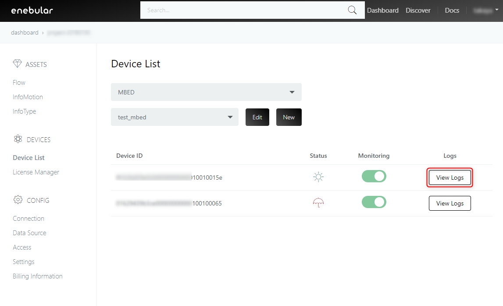
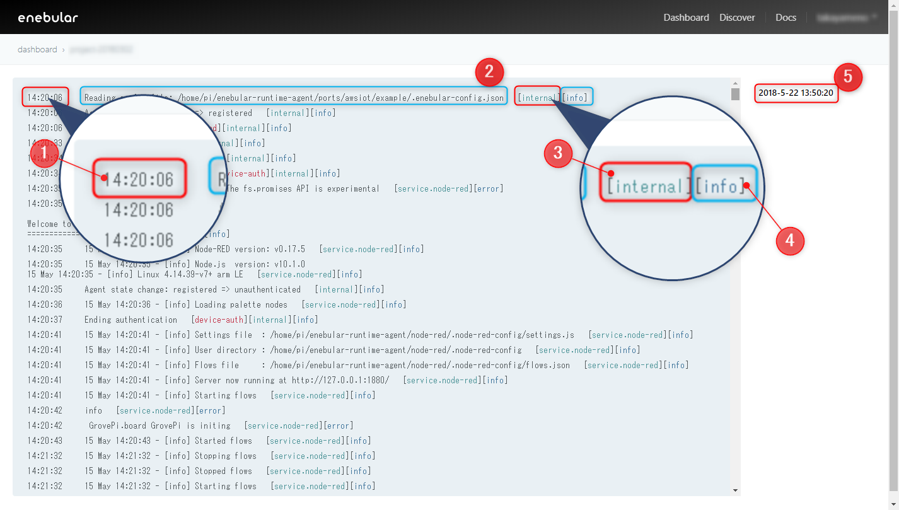
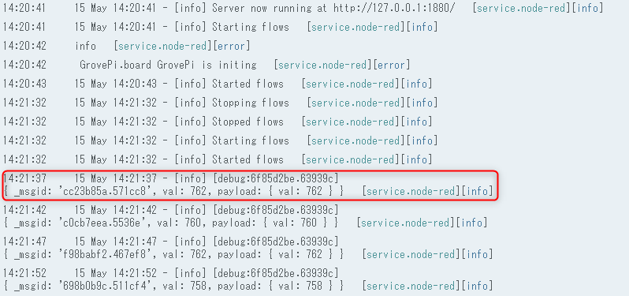

# Logs {#Logs}

In enebular, you can check the logging of a paid device by
turning on the monitoring setting of the device.
* For the monitoring settings, refer to [Device List](./DeviceList.md).

The specifications of the log output by enebular agent and enebular edge agent are different.

To view the log, please click [View Logs] in the right part of the target device.

## enebular agent log {#enebular agent log}

The enebular agent sends the log output to the console (stdout / stderr) to enebular.
By default, only logs of `info` level are output. You can change the output setting to the `debug` level with the environment variable DEBUG.

The enebuar agent also captures all logs that Node-RED outputs to the console. All log contents captured from Node-RED will be logged as the log level of `info`.

After startup, logs are sent every 30 seconds for 3 minutes after flow deployment, then every 5 minutes thereafter. Logs are also sent when the system shuts down. 

### Node-RED log {#Node-RED log}

The log output by Node-RED depends on Node-RED setting and node setting.
For details, please refer to [Node-RED Documentation](https://nodered.org/).

If you want to output the log of the Debug node, output to the console is enabled by setting the Debug node to `debug tab and console`.

### How to read the log screen {#How to read the log screen}

This is an example of the enebular agent's log screen.

1. Timestamp of log output
2. Log
3. The service that outputs logs * Internal refers to enebular agent
4. Log Level
5. Timestamp when enebular received the log * By clicking the timestamp, you can select the time of the log to be viewed

The log output from the Debug node is displayed as follows.

## enebular edge agent log {#enebular edge agent log}

Enebular Edge Agent sends operation logs and error logs to enebular.
Logs are sent 30 seconds after booting the device, thereafter every 5 minutes.

### How to read the log screen {#How to read the log screen}

This is an example of the enebular edge agent log screen.

1. Log 
2. Function name that output log 
3. Log Level 
4. Timestamp when enebular received the log 

By clicking the timestamp, you can select the time of the log to be viewed

### enebular edge agent log list {#enebular edge agent log list}

Below are the operation logs and error logs of the enebular edge agent. 
For further information please contact ** support@enebular.com**.

#### operation log

| Log | 
| :--- | 
| main start | 
| thread boot | 
| wifi connected | 
| device manager initialized |
| flow def manager initialized | 
| uhuru red initialized | 
| SD initialized | 
| flow deployed | 
| flow executing |
| flow executed | 
| flash updated: device bandle | 
| flash updated: flow define | 

#### error log

| Log |
| :--- | 
| flow URL connect timeout |
| flow download failed | 
| flow data error | 
| flow size over | 
| writing flow failed | 
| reading flow failed | 
| flow URL size over | 
| mbed cloud factory configurator client error |
| flow runtime not found | 
| flow file not found | 
| js interpreter error |
| js flow json parse error |
| js node initialize error | 
| js flow stopped error | 
| js flow execute error | 
| device auth none license |
| device auth https error |
| device auth invalid | 
| token https error | 
| activate device https error | 