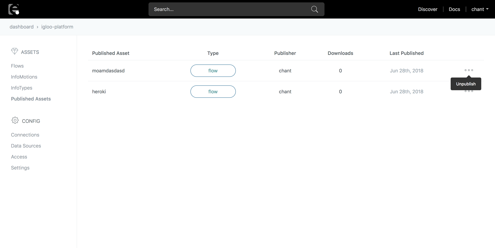

# Unpublishing Assets

You can unpublish your assets in **Discover** by going to **Published Assets** inside your **Projects**. The list of your **Published Assets** can be viewed. To the right of an asset, select `...` and click on _Unpublish_ to remove it from **Discover**.

