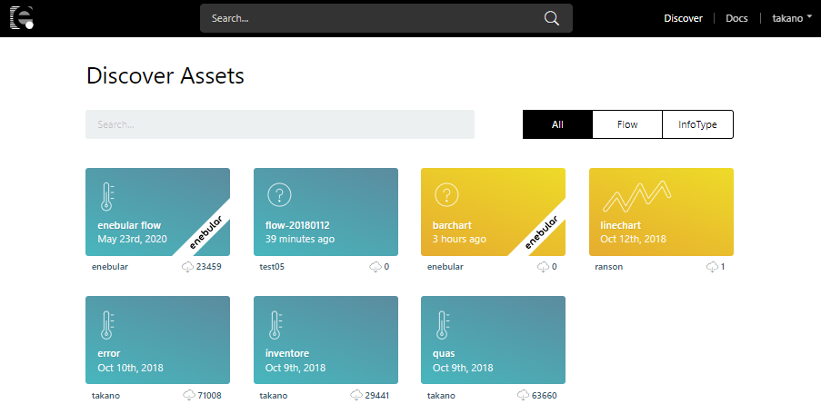

# Searching Other User's Assets

You can allow other users to use your assets by publishing them on enebular.com.

Assets published by other users can be imported into your own project from "Discover".

Import the asset you like into your project by selecting the asset and pressing "Import".

Select the project you'd like to import to and the default permissions, and then press "Import" to complete the import.

