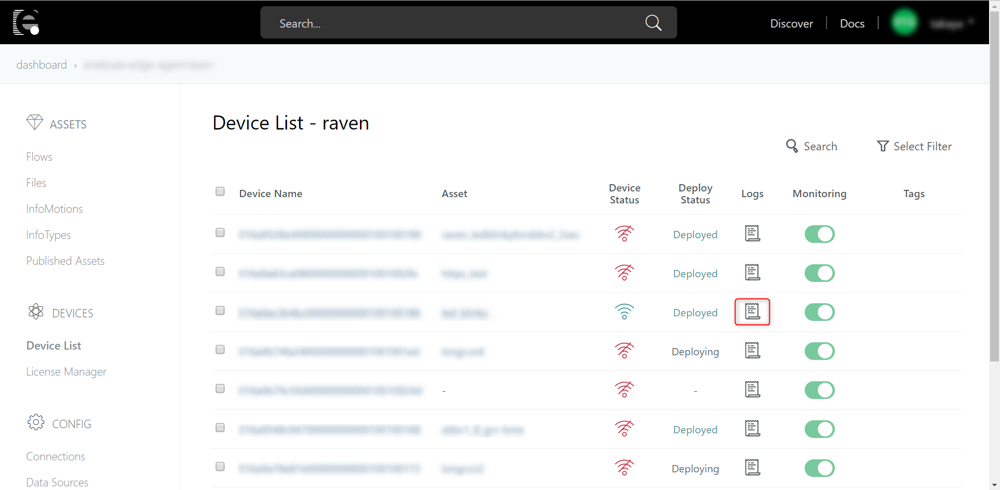
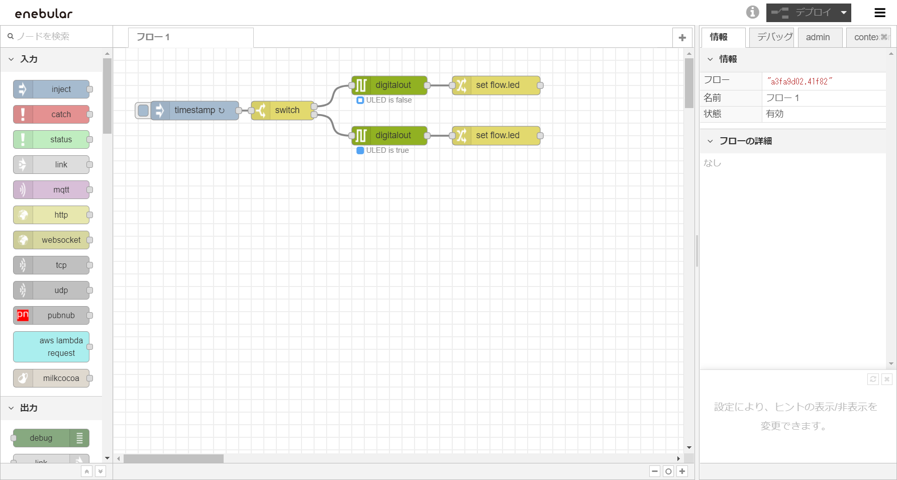
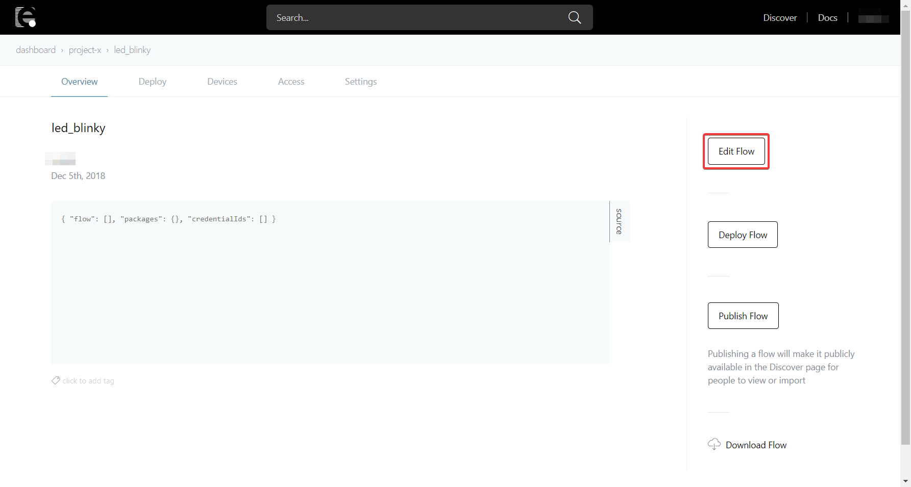
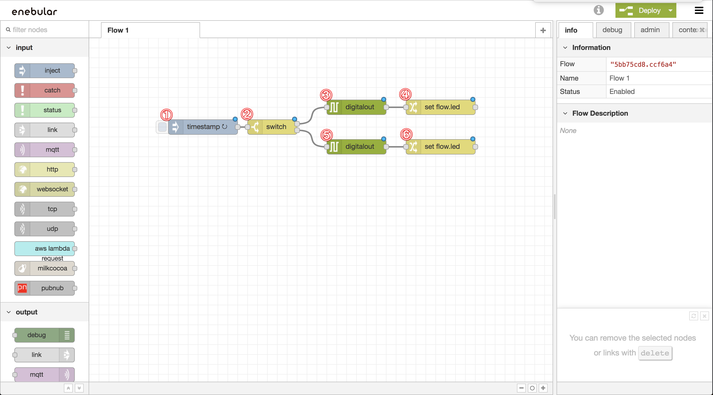
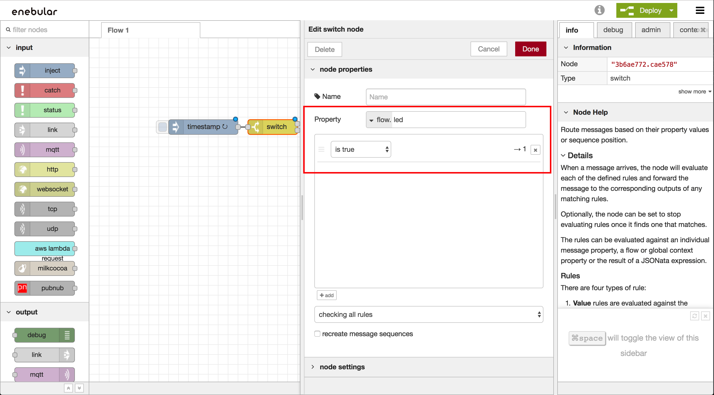
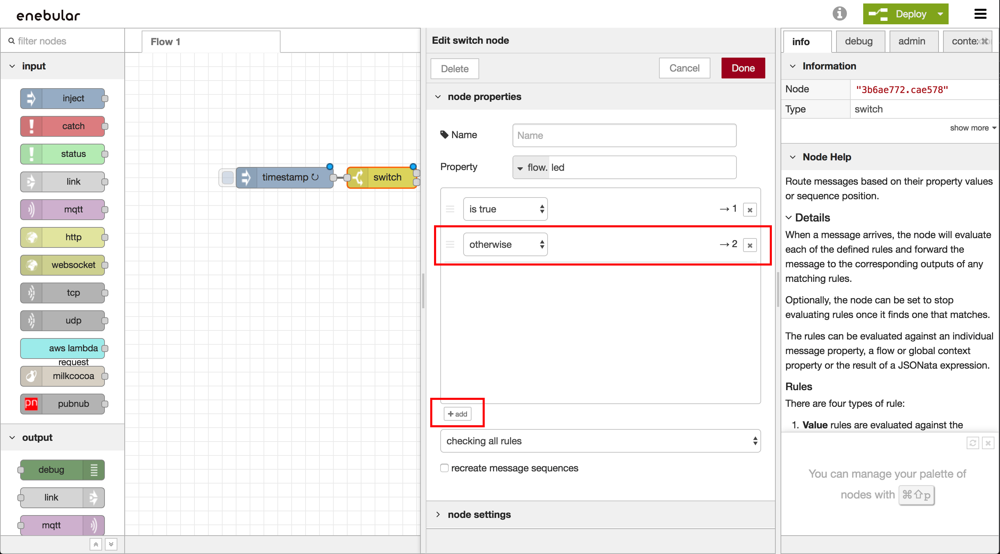
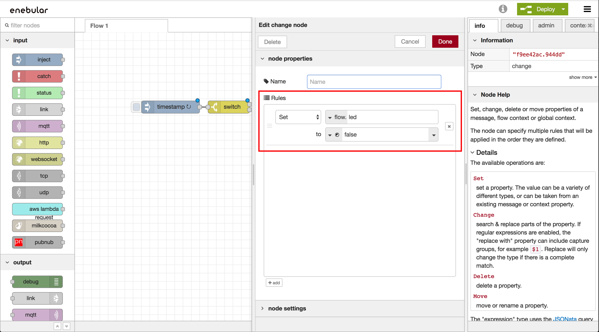
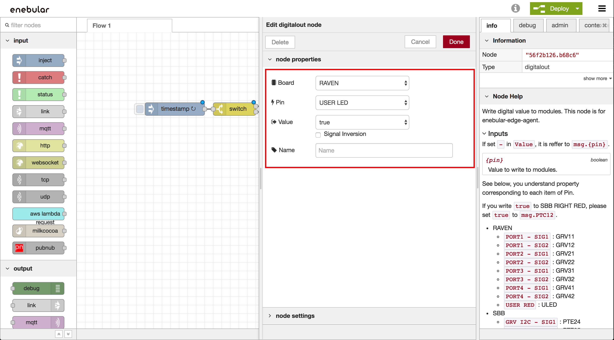

# Getting Started

enebular gives users the option to deploy flows to enebular edge agents.

This tutorial will run a flow that switches an LED light off and on.
The devices log will be displayed on enebular.
(Required time 30 minutes)

Please prepare accounts and projects in enebular in advance. (This flow is described in detail in GettingStarted> [Introduction](./../GetStarted/Introduction.md))

**\*Network setting is currently available only from windows OS.**

### Table of Contents

1. [Network Settings](#network)
1. [Import Flow](#import)
1. [Deploy Flow](#deployFlow)
1. [Check execution log](#logs)

## Setting up the network {#network}

1. 1. Connect to the PC's USB port using the enclosed USB cable.
1. **enebular Reference Board Configuration Tool**（**eRB Config. Tool**）click [Here](https://download.enebular.com/eRB-Config-Tool/eRBConfigTool.msi) to download and install.
1. Start the device in `configuration mode`.
   - Case RAVEN ... Press RESET SW and hold the USER SW after rebooting, it will be in 'settings mode'. Make sure the USER LED is lit in red.
1. **Configure the network with eRB Config. Tool**. For details, see the [Configuration](./Configuration.md) page.
1. When settings is completed, restart the device.

### Import Flow{#import}

Within your current enebualr project
Copy the JSON data below and import it to your flow.

- If you want to create a flow from 0 without importing the flow, please refer to [Create flow](#createFlow) in the Appendix of under this page.

1. Please copy the JSON data from the following and save it on the clipboard.

```json
[{"id":"5c08cdab.fe76c4","type":"inject","z":"90d9de00.d40e1","name":"","topic":"","payload":"","payloadType":"date","repeat":"3","crontab":"","once":false,"onceDelay":0.1,"x":110,"y":100,"wires":[["4c620395.fa935c"]]},{"id":"4c620395.fa935c","type":"switch","z":"90d9de00.d40e1","name":"","property":"led","propertyType":"flow","rules":[{"t":"true"},{"t":"else"}],"checkall":"true","repair":false,"outputs":2,"x":250,"y":100,"wires":[["9610c50d.5df558"],["36f9ebd9.df86c4"]]},{"id":"9610c50d.5df558","type":"digitalout","z":"90d9de00.d40e1","board":"RAVEN","pin":"ULED","value":"false","si":false,"name":"","x":420,"y":60,"wires":[["730feba8.5a1a24"]]},{"id":"36f9ebd9.df86c4","type":"digitalout","z":"90d9de00.d40e1","board":"RAVEN","pin":"ULED","value":"true","si":false,"name":"","x":420,"y":140,"wires":[["39806cf9.b31c54"]]},{"id":"730feba8.5a1a24","type":"change","z":"90d9de00.d40e1","name":"","rules":[{"t":"set","p":"led","pt":"flow","to":"false","tot":"bool"}],"action":"","property":"","from":"","to":"","reg":false,"x":590,"y":60,"wires":[[]]},{"id":"39806cf9.b31c54","type":"change","z":"90d9de00.d40e1","name":"","rules":[{"t":"set","p":"led","pt":"flow","to":"true","tot":"bool"}],"action":"","property":"","from":"","to":"","reg":false,"x":590,"y":140,"wires":[[]]}]
```

1. Create a new asset with `type: flow`.
      ! [GettingStarted-create-asset](./../../img/EnebularEdgeAgent/GettingStarted-create-asset.png)

1. Press Edit Flow to open the Flow Editor.
      ! [GettingStarted-create-editFlow](./../../img/EnebularEdgeAgent/GettingStarted-create-editFlow.png)

1. Open the menu from "Ξ" in the upper right and select "Import" > "Clipboard".
      ! [GettingStarted-import-menu](./../../img/EnebularEdgeAgent/GettingStarted-import-menu.png)

1. A text box will appear displaying flow data. Paste the previous JSON data then Press the "Load" button.
      ! [GettingStarted-import-paste](./../../img/EnebularEdgeAgent/GettingStarted-import-paste.png)

1. Since the flow is loaded, please click on the desired position and place the flow. Press Deploy at the top right.
      ! [GettingStarted-import-done](./../../img/EnebularEdgeAgent/GettingStarted-import-done.png)

The flow in the editor is only a dummy and can't test the actual LED light.

- If you want to know flow's detail, please refer to [Flow Detail](#expalainFlow) in the Appendix of under this page.

## Deploy flow {#deployFlow}

Before continuing, turn on the device on.

1. Go to your flow overview screen and press "DeployFlow". (If a preview is not displayed, please reload the page.)
      

1. Select the `Type: Pelion` Connection
      

1. Mark the checkbox with the Status "Connected".
      \* If there are other connected devices, check the device ID from [Device ID Confirmation Method](#deviceID).
      

1. Scroll down and press Deploy.
      

1. The deployment is complete and the USER LED should start blinking.
      ! [GettingStarted-deploy-done] (./../../ img / EnebularEdgeAgent / GettingStarted-deploy-done.png)

### How to check the device ID {#deviceID}

The device ID can be checked from the arm Pelion portal.

1. Check serial number of seal on device. Please look at nine digits and later.
1. Log in to arm Pelion.
1. Move to Device Directory's page.
1. Device ID is End Point Name.Search for the corresponding device ID.

## Confirmation of execution log {#logs}

You can check enebular eedge agent's execution log from enebular.com
The log is transmitted first in 30 seconds after device startup, and then every 5 minutes thereafter.

1. Select "Device List" from the Project screen.
      

1. The Device List will be displayed. Press "View Logs" of the device whose log you want to view.
      

1. The execution log is displayed.
      

For more information, see [Logs](./../Device/Logs.md#enebular-edge-agent).

## Well Done!

You can now deploy LED blinking flow to enebular edge agent and check log from enebular.

By combining the enebular edge agent with a commercially available Grove sensor, anyone can make simple IoT devices.
Since there are restrictions on the nodes that can be used, please refer to the page of [Nodes] (./ Nodes.md) and create a flow.

## Appendix

### FlowDetail{#explainFlow}



This flow executes in 5 second cycle.

In `Digitalout Node`, it cannot see state of LED.
So, this node uses `Flow Context` in `cCange Node`.
`Flow Context` is different from `msg`. This value remains after flow executing.

`Digitalout Node` lights up LED and `Change Node` saves state of LED. 
When flow execute next time, it changes flow operation by state of LED

### Create a Flow {#createFlow}

This section assumes that the project has already been created in enebular.

- This tutorial introduces the procedure of creating flows used in import.

1.  Create a new asset with `type: flow`.
    

1.  Press Edit Flow to open the Flow Editor.
    

1.  Refer to the image below for node placement.
    
    The following nodes are used. The digitalout node is in the EEA category.

        	- inject
        	- switch
        	- digitalout 2
        	- change 2

1) Make inject node ① "repeat" the `specified time interval` and set the 'time interval' to `3 seconds` and press "Finish". 

1) Switch node ② sets "property" to `flow.led` and condition 1 to`is true`.
   

1) Press the lower left corner! [+ Add](./../../img/EnebularEdgeAgent/GettingStarted-create-add.png) to add the condition. Please set condition 2 to `other` and press "Finish".
   

1) Set digitalout node ③ to `RAVEN`, set 'Pin' to`USER LED` and 'Value' to `false` and press "Finish".
   

1. Change node ④ should be set to substitute 'false' for `flow.led`. Press "Finish".
   

1. Set digitalout node ⑤ to 'RAVEN`for' Board ', set`Pin' to`USER LED` and 'Value' to `true` then press "Finish".
   

1. Change node ⑥ should be set to substitute "false"> `false` for`flow.led` then press "Finish".
   

1. Since one mouth has been added to the right side of the switch node ②, change the link of the digitalout node ⑤ there and press Deploy on the upper right.
   

We have created a flow to complete the enebular edge agent. Continue the tutorial from [Deploy Flow](#deployFlow).
The editor contains a dummy flow therefore can not check the blinking of the LED.
