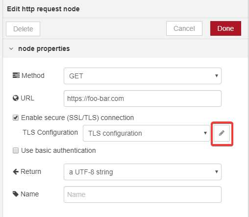
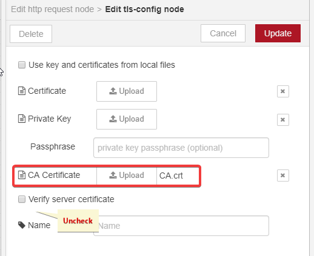
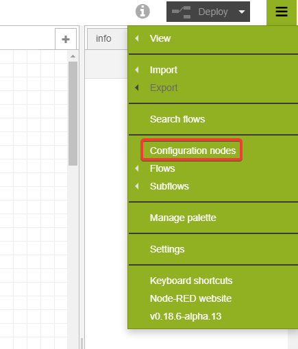
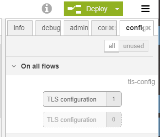
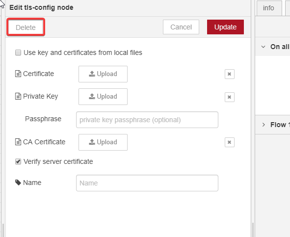

# Nodes

enebular-edge-agent can execute flows created by enebular.
There are restrictions on available nodes.

### Table of Contents

-   [Node List](#nodeList)
    -   [EEA category node](#EEACategory)
    -   [Node Description](#Details)
    -   [Restrictions](#Restrictions)
    -   [Configure TLS on the http request node](#howToTLS)

## Node List{#nodeList}

Below are the nodes that run on enebular-edge-agent.
enebular-edge-agent nodes are categorised as `EEA`.

-   input
    -   inject
-   output
    -   debug
-   function
    -   http request
    -   switch
    -   change
    -   range
-   EEA
    -   TSL2561
    -   BME280
    -   digitalout
    -   analogin
    -   interruptin

\* Only the above nodes can be used with enebular-edge-agent. You can not use comment nodes etc.
If you deploy a flow that includes nodes other than the above, the flow will not be executed.

### EEA category node {#EEACategory}

A node in the EEA category is a node created for enebular-edge-agent, and outputs a dummy values on the editor.
Deploying to enebular-edge-agent performs behaviors specific to edge devices.
For details, refer to the help of each node.

### Node Description{#Details}

| Classification | Node         | Overview                                                                                      | Remarks                                                               |
| -------------- | ------------ | --------------------------------------------------------------------------------------------- | --------------------------------------------------------------------- |
| input          | inject       | Start flow at regular intervals                                                               | There are multiple restrictions \*1                                   |
| output         | debug        | Output debug messages                                                                         | Can not output to the console                                         |
| function       | http request | make a http request                                                                           | There are multiple restrictions \*2                                   |
| function       | change       | Convert and delete msg properties                                                             | -                                                                     |
| function       | switch       | Set conditional branch                                                                        | -                                                                     |
| function       | range        | Convert value of `msg.payload` by setting                                                     | -                                                                     |
| EEA            | TSL2561      | Acquire illuminance value from TSL 2561 or TSL 2581                                           | -                                                                     |
| EEA            | BME280       | The values ​​of temperature, humidity, and atmospheric pressure are acquired from the BME 280 | -                                                                     |
| EEA            | digitalout   | Perform digital output                                                                        | It is for LED and so on.                                              |
| EEA            | analogin     | Acquire the input value from the A / D converter                                              | It is for moisture sensor, volume bar and so on.                      |
| EEA            | interruptin  | Detect rising edge or falling edge of digital input and perform interrupt input               | It is for Switch type module. The maximum simultaneous use limit is 5 |

#### Restrictions{#Restrictions}

Be careful. Common restrictions are as follows. 

-   Does not support `Global Context`, `Sequence rules` and `type: binary`
-   Can not be used that depends on npm module (JSONata,mustache and so on)

\* 1 **inject node** has the following restrictions.

-   Support only `repeat`
-   Only timestamp is output

\* 2 **http request node** has the following restrictions.

-   The maximum number of http request nodes that can be used simultaneously is 5
-   Only supports `GET`,`POST` methods
-   If 256 bytes are the upper limit of the response, `size over` is substituted into`msg.payload`
-   Incompatible with basic authentication

** http request node ** supports TLS communication under the following restrictions. If you violate the following restrictions in the setting items of the tls-config dialog, an error will occur when initializing the flow (you can check it as `js node initialize error` in the enebular log).

-   Supports only file attachment of CA certificate (do not attach certificate or private key)
-   One TLS setting in the same flow (one setting can be used by multiple http request nodes)
 -   Once set, settings will remain in the flow. Please select "node setting" from ** Ξ ** in the upper right of the flow editing screen and delete unused settings.
-   Not using the local file (don't put a check in the check box)
-   Maximum size of CA certificate is ** 2KB **
-   Non-compliant with passphrase of private key (do not enter a string)
-   Do not support confirmation of server certificate (don't put a check in the check box)

##### Configure TLS on the http request node{#howToTLS}

Describes TLS configuration example under the above conditions and how to delete the TLS configuration once it has been configured.

**Settings Example**

You can add TLS settings by checking "Enable SSL / TLS connection" in the http request node settings dialog. Please click the pencil mark displayed.

It changes to the setting screen of tls-config node. Please attach only the CA certificate and remove the check from "Confirm server certificate".

Now that the TLS configuration is complete, complete and deploy the flow.

※ When you copy and paste the flow, TLS settings may be reset, so please attach again.

**How to delete unnecessary TLS settings**

Click ** Ξ ** at the top right of the flow editing screen to open the menu. Click on "Node settings".

A list of node settings not displayed in the flow is displayed. Those that are translucent are those that are not used in the flow. Please click the translucent one.

It changes to the setting screen of tls-config node, so please push the delete button on the upper left.

Removal of unnecessary TLS settings is complete.
