# Sample Flows

Sample flows for enebular-edge-agent there are.

These flows are desined for [RAVEN](./../Board/RAVEN.md).  
If you use other kind of IoT devices, you can easy to make it applicable by changing node settings for your device.

This section is for advanced learners, since you will use sensors, actuators and extarnal web services on the market. 
Before your challenging, we reccomend you try enebular's [GettingStarted](./../GetStarted/index.md) and enebular-edge-agent's [GettingStarted](./GettingStarted.md).

### Table of Contents  
- [Flow in which LED flashes using switch](#switchLchika)
- [Flow to operate LEDs remotely from browser](#cloudLchika)
  - Use heroku's environment.
- [Flow to put sensor data in cloud storage](#sensorData)
  - Use heroku's environment.
  - Use Firebase.

## Switch cotrolling LED Flow {#switchLchika}

You can control the USER LED by pressing USER SW.
The USER SW functions as a toggle switch, pressing the USER SW switches the USER LED lights on or off.  
- See [here](./../Board/RAVEN.md#parts) more infomation about RAVEN parts 

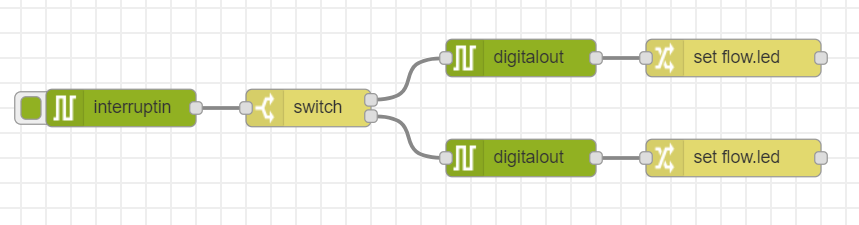

```json
[{"id":"35aa62d8.b7976e","type":"digitalout","z":"90d9de00.d40e1","board":"RAVEN","pin":"ULED","value":"false","si":false,"name":"","x":440,"y":60,"wires":[["fd60c779.49cf98"]]},{"id":"74691d65.fe28d4","type":"digitalout","z":"90d9de00.d40e1","board":"RAVEN","pin":"ULED","value":"true","si":false,"name":"","x":440,"y":140,"wires":[["3dd5ff6a.7aed9"]]},{"id":"fd60c779.49cf98","type":"change","z":"90d9de00.d40e1","name":"","rules":[{"t":"set","p":"led","pt":"flow","to":"false","tot":"bool"}],"action":"","property":"","from":"","to":"","reg":false,"x":610,"y":60,"wires":[[]]},{"id":"3dd5ff6a.7aed9","type":"change","z":"90d9de00.d40e1","name":"","rules":[{"t":"set","p":"led","pt":"flow","to":"true","tot":"bool"}],"action":"","property":"","from":"","to":"","reg":false,"x":610,"y":140,"wires":[[]]},{"id":"4cd3cf19.805ae","type":"interruptin","z":"90d9de00.d40e1","board":"RAVEN","pin":"USWITCH","mode":3,"trigger":"rise","name":"","x":120,"y":100,"wires":[["917d7fc1.6570c"]]},{"id":"917d7fc1.6570c","type":"switch","z":"90d9de00.d40e1","name":"","property":"led","propertyType":"flow","rules":[{"t":"true"},{"t":"else"}],"checkall":"true","repair":false,"outputs":2,"x":270,"y":100,"wires":[["35aa62d8.b7976e"],["74691d65.fe28d4"]]}]
```
<!--
[こちら]()からimportできます。
-->

### Plus One

You can easily change input and output by using commercially available sensor or actuator modules.

- When using switch type module as input, change the Port of the interruptIn node to the corresponding value.
    - Example of switch type module : http://wiki.seeedstudio.com/Grove-Button/

- When using modules similar to LED as output, change the port of the digitalOut node to the corresponding value.
    - Example of LED module : http://wiki.seeedstudio.com/Grove-Red_LED/

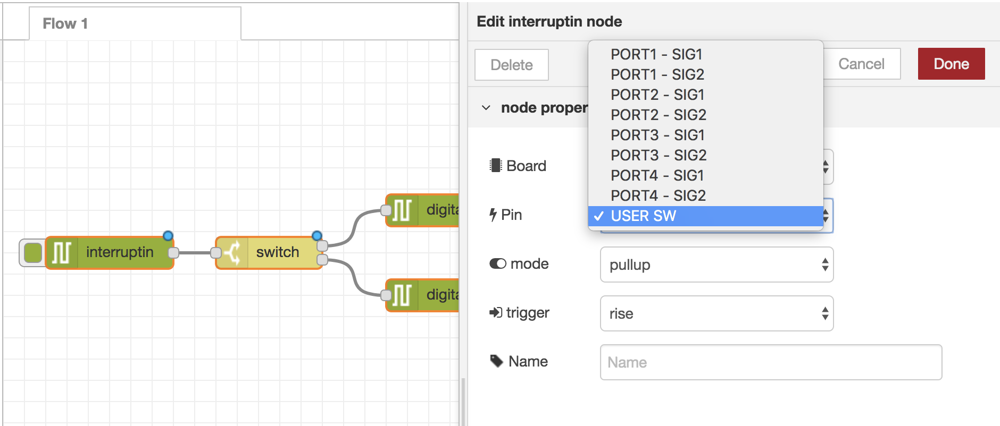
※Image of interruptIn node

<!--あとで例示イラストを追加する-->

## Flow to operate LEDs remotely from browser {#cloudLchika}

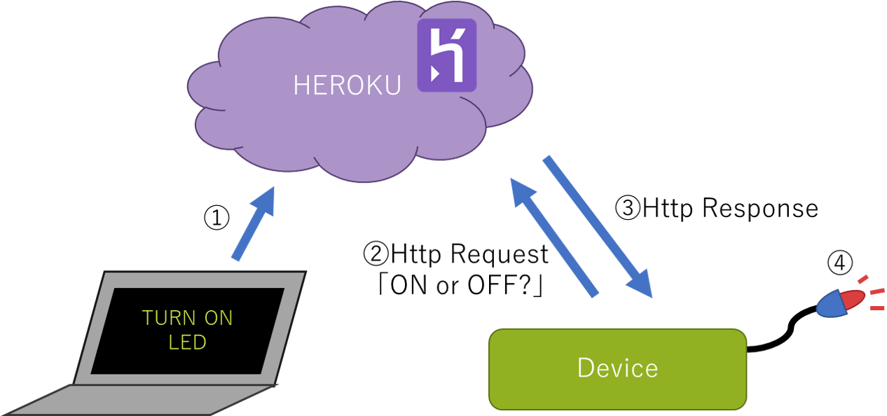

Building an app on heroku that manages the device.
The flow changes the state of the LED through the browser.

heroku's parameters are editable from browsers.

### Flow on heroku

Using an app that connects to the device.

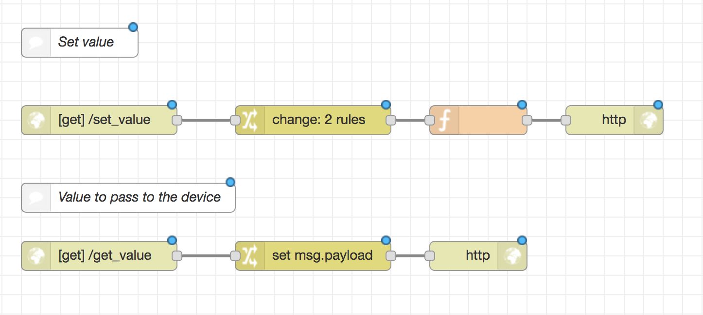

```json
[{"id":"66eb935a.f88e7c","type":"http in","z":"1fd4c161.fd62af","name":"","url":"/set_value","method":"get","upload":false,"swaggerDoc":"","x":120,"y":120,"wires":[["8034fd7c.f4426"]]},{"id":"2a5cadf0.9d0fb2","type":"http response","z":"1fd4c161.fd62af","name":"","statusCode":"","headers":{},"x":650,"y":120,"wires":[]},{"id":"ae07f97e.2de818","type":"http in","z":"1fd4c161.fd62af","name":"","url":"/get_value","method":"get","upload":false,"swaggerDoc":"","x":120,"y":260,"wires":[["b7ce1491.6abf18"]]},{"id":"b7ce1491.6abf18","type":"change","z":"1fd4c161.fd62af","name":"","rules":[{"t":"set","p":"payload","pt":"msg","to":"value","tot":"flow"}],"action":"","property":"","from":"","to":"","reg":false,"x":340,"y":260,"wires":[["9ebfe90a.806638"]]},{"id":"9ebfe90a.806638","type":"http response","z":"1fd4c161.fd62af","name":"","statusCode":"","headers":{},"x":510,"y":260,"wires":[]},{"id":"8034fd7c.f4426","type":"change","z":"1fd4c161.fd62af","name":"","rules":[{"t":"set","p":"value","pt":"flow","to":"payload.v","tot":"msg"},{"t":"set","p":"value","pt":"msg","to":"value","tot":"flow"}],"action":"","property":"","from":"","to":"","reg":false,"x":340,"y":120,"wires":[["29e97041.36b48"]]},{"id":"bbda544.15caea8","type":"comment","z":"1fd4c161.fd62af","name":"デバイスに渡すvalue","info":"","x":140,"y":200,"wires":[]},{"id":"5121db03.1ed064","type":"comment","z":"1fd4c161.fd62af","name":"valueをsetされる","info":"","x":120,"y":40,"wires":[]},{"id":"29e97041.36b48","type":"function","z":"1fd4c161.fd62af","name":"","func":"msg.payload = \"set value! -> [\" + msg.value + \"]\";\nreturn msg;","outputs":1,"noerr":0,"x":510,"y":120,"wires":[["2a5cadf0.9d0fb2"]]}]
```

<!-- jsonata使えるなら
```json
[{"id":"66eb935a.f88e7c","type":"http in","z":"1fd4c161.fd62af","name":"","url":"/set_value","method":"get","upload":false,"swaggerDoc":"","x":120,"y":120,"wires":[["8034fd7c.f4426"]]},{"id":"2a5cadf0.9d0fb2","type":"http response","z":"1fd4c161.fd62af","name":"","statusCode":"","headers":{},"x":510,"y":120,"wires":[]},{"id":"ae07f97e.2de818","type":"http in","z":"1fd4c161.fd62af","name":"","url":"get_value","method":"get","upload":false,"swaggerDoc":"","x":120,"y":260,"wires":[["b7ce1491.6abf18"]]},{"id":"b7ce1491.6abf18","type":"change","z":"1fd4c161.fd62af","name":"","rules":[{"t":"set","p":"payload","pt":"msg","to":"value","tot":"flow"}],"action":"","property":"","from":"","to":"","reg":false,"x":340,"y":260,"wires":[["9ebfe90a.806638"]]},{"id":"9ebfe90a.806638","type":"http response","z":"1fd4c161.fd62af","name":"","statusCode":"","headers":{},"x":510,"y":260,"wires":[]},{"id":"8034fd7c.f4426","type":"change","z":"1fd4c161.fd62af","name":"","rules":[{"t":"set","p":"value","pt":"flow","to":"payload.v","tot":"msg"},{"t":"set","p":"payload","pt":"msg","to":"\"set value! -> [\" & msg.payload.v & \"]\"","tot":"jsonata"}],"action":"","property":"","from":"","to":"","reg":false,"x":320,"y":120,"wires":[["2a5cadf0.9d0fb2"]]},{"id":"bbda544.15caea8","type":"comment","z":"1fd4c161.fd62af","name":"デバイスに渡すvalue","info":"","x":140,"y":200,"wires":[]},{"id":"5121db03.1ed064","type":"comment","z":"1fd4c161.fd62af","name":"valueをsetされる","info":"","x":120,"y":40,"wires":[]}]
```
-->

<!--
[こちら]()からimportできます。
-->

`https://[your-heroku-app].herokuapp.com/set_value?v=[value]`
You can pass the value controlling the device by accessing it from the browser.

[your-heroku-app] contains the ID of the deployed heroku app. You can check it on heroku screen or enebular deployment screen.

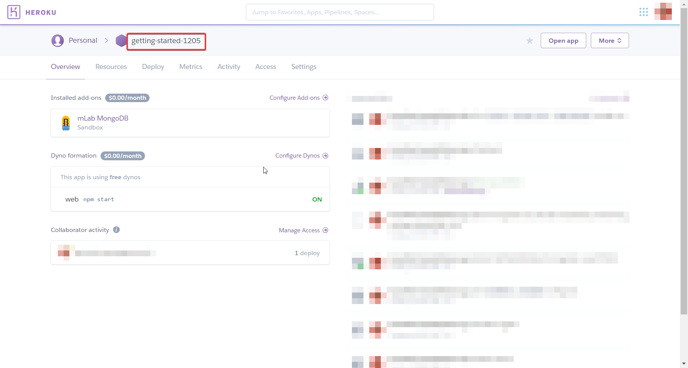
Confirmed from heroku

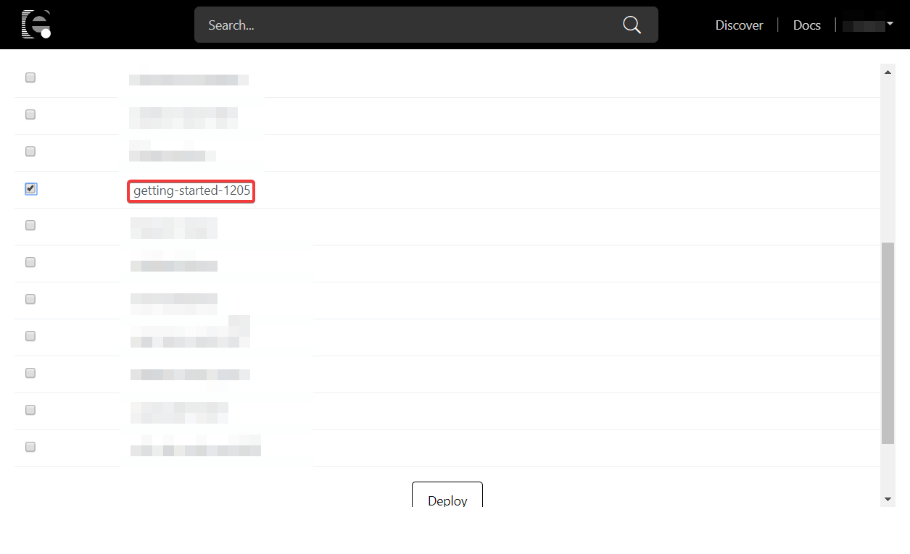
Check from deploy list

When accessing「**set value! -> [value]**」is displayed.

### Flow on RAVEN

Access the app in 5 second intervals to get the status.

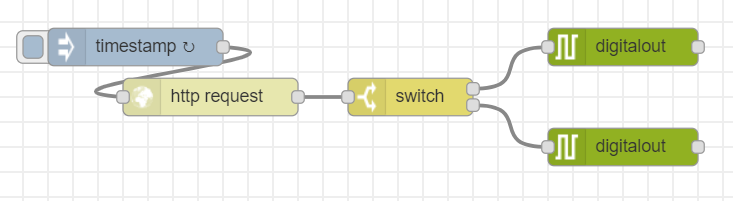

```json
[{"id":"15336f68.1058a1","type":"digitalout","z":"ac70de44.7f659","board":"RAVEN","pin":"ULED","value":"true","si":true,"name":"","x":520,"y":60,"wires":[[]]},{"id":"c570eb4.6d5de18","type":"digitalout","z":"ac70de44.7f659","board":"RAVEN","pin":"ULED","value":"false","si":true,"name":"","x":520,"y":140,"wires":[[]]},{"id":"a574145b.221c18","type":"switch","z":"ac70de44.7f659","name":"","property":"payload","propertyType":"msg","rules":[{"t":"eq","v":"true","vt":"str"},{"t":"else"}],"checkall":"true","repair":false,"outputs":2,"x":350,"y":100,"wires":[["15336f68.1058a1"],["c570eb4.6d5de18"]]},{"id":"f9c4432c.5ab6b","type":"inject","z":"ac70de44.7f659","name":"","topic":"","payload":"","payloadType":"date","repeat":"5","crontab":"","once":false,"onceDelay":0.1,"x":130,"y":60,"wires":[["f7104fc7.71c32"]]},{"id":"f7104fc7.71c32","type":"http request","z":"ac70de44.7f659","name":"","method":"GET","ret":"txt","url":"http://[your-heroku-app].herokuapp.com/get_value","tls":"","x":190,"y":100,"wires":[["a574145b.221c18"]]}]
```

<!--
[こちら]()からimportできます。
-->

After importing the JSON data, open the http request node and rewrite it to the ID of the created heroku app.

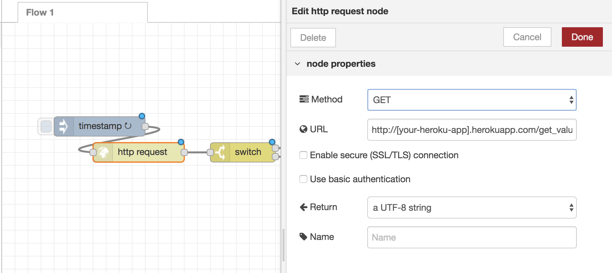

After deploying to the device, accessiing
`https://[your-heroku-app].herokuapp.com/set_value?V=true`
from the browser will light up the LED.
Accessing `https://[your-heroku-app].herokuapp.com/set_value?V=false`
from the browser switches the LED off.

### Plus One

SlackBot allows direct access from slack.

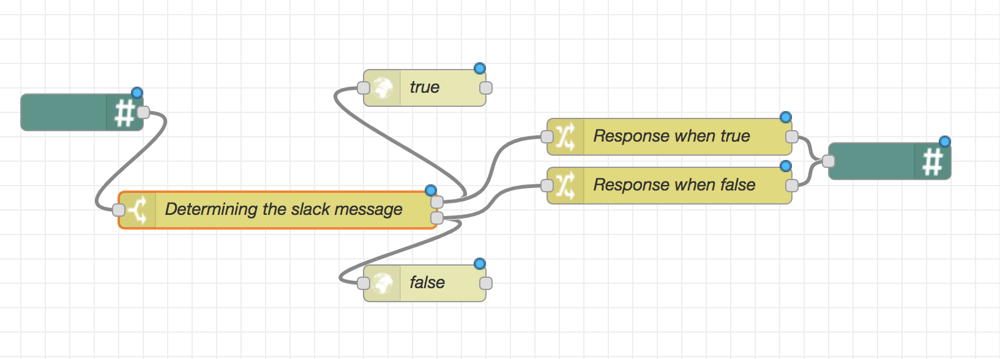

#### Flow on heroku

Add your slack api token and URL to the slack node to set the request.

```json
[{"id":"6a043d73.71fb34","type":"Slack Bot In","z":"5ef52760.a57b98","name":"","apiToken":"your-token","channel":"","x":130,"y":420,"wires":[["35fc80e5.e8837"]]},{"id":"35fc80e5.e8837","type":"switch","z":"5ef52760.a57b98","name":"Determining slack message","property":"payload","propertyType":"msg","rules":[{"t":"cont","v":"ON","vt":"str"},{"t":"cont","v":"OFF","vt":"str"}],"checkall":"true","repair":false,"outputs":2,"x":310,"y":420,"wires":[["fb6b878c.a9d5c8","a1c86211.ea134"],["a73149fb.7dd0c8","4e877426.6ca12c"]]},{"id":"9cf15b86.76a268","type":"Slack Bot Out","z":"5ef52760.a57b98","name":"","apiToken":"your-token","channel":"","x":790,"y":420,"wires":[]},{"id":"a1c86211.ea134","type":"change","z":"5ef52760.a57b98","name":"Response when true","rules":[{"t":"set","p":"payload","pt":"msg","to":"I got it!","tot":"str"}],"action":"","property":"","from":"","to":"","reg":false,"x":610,"y":400,"wires":[["9cf15b86.76a268"]]},{"id":"fb6b878c.a9d5c8","type":"http request","z":"5ef52760.a57b98","name":"true","method":"GET","ret":"txt","url":"https://[your-heroku-app].herokuapp.com/set_value?v=true","tls":"","x":410,"y":360,"wires":[[]]},{"id":"a73149fb.7dd0c8","type":"http request","z":"5ef52760.a57b98","name":"false","method":"GET","ret":"txt","url":"https://[your-heroku-app].herokuapp.com/set_value?v=false","tls":"","x":410,"y":480,"wires":[[]]},{"id":"4e877426.6ca12c","type":"change","z":"5ef52760.a57b98","name":"Response when false","rules":[{"t":"set","p":"payload","pt":"msg","to":"I lost it.","tot":"str"}],"action":"","property":"","from":"","to":"","reg":false,"x":610,"y":440,"wires":[["9cf15b86.76a268"]]}]
```

<!--
[こちら]()からimportできます。
-->

Slack example.

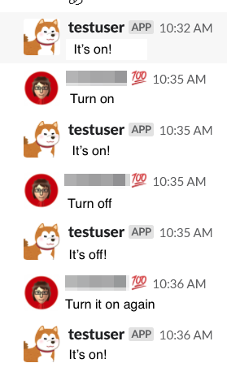

## Sending data to the cloud {#sensorData}

>### Notice {#Notice202004}
>The flow described in this tutorial will not function properly since ‘node-red-contrib-firebase’ is no longer maintenanced and it is no longer compatible with the current Firebase. A new tutorial will be provided shortly.

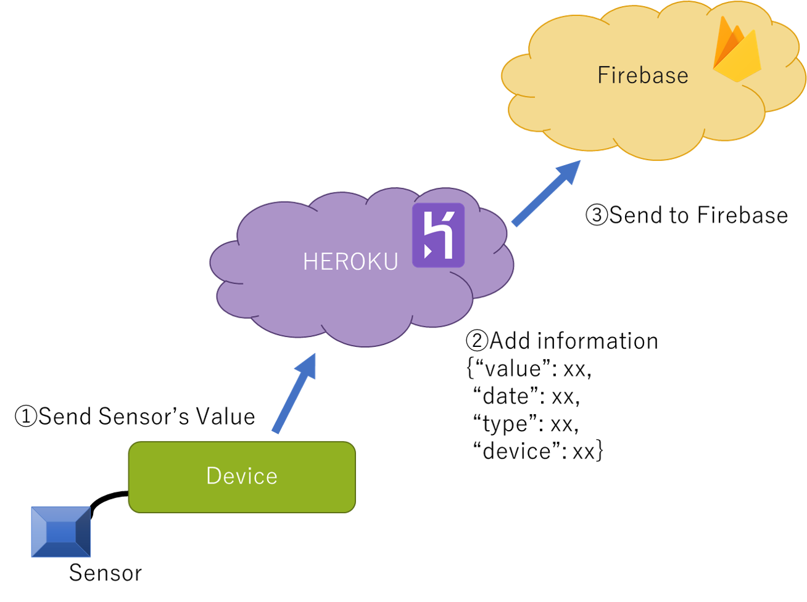

<!--あとで差し替え-->

This application receives data from the sensor then
stores the data in firebase.
This Sample Flow uses the analog sensor module.
- Example of module : http://wiki.seeedstudio.com/Grove-Slide_Potentiometer/

## Flow on heroku

Prepare the app to be connected to the device on heroku.
Put data into Firebase via heroku.

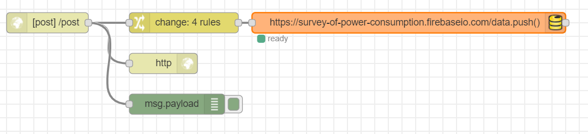

```json
[{"id":"4dc6b3f0.a52e7c","type":"http response","z":"5ef52760.a57b98","name":"","x":290,"y":1120,"wires":[]},{"id":"3612e41b.11c83c","type":"http in","z":"5ef52760.a57b98","name":"","url":"/post","method":"post","upload":false,"swaggerDoc":"","x":120,"y":1060,"wires":[["4dc6b3f0.a52e7c","f40de51f.bf1028","2f21b3db.4e861c"]]},{"id":"f40de51f.bf1028","type":"change","z":"5ef52760.a57b98","name":"","rules":[{"t":"move","p":"payload","pt":"msg","to":"payload.value.analog","tot":"msg"},{"t":"set","p":"payload.timestamp","pt":"msg","to":"","tot":"date"},{"t":"set","p":"payload.value.created","pt":"msg","to":"","tot":"date"},{"t":"set","p":"payload.value.label","pt":"msg","to":"analog","tot":"str"}],"action":"","property":"","from":"","to":"","reg":false,"x":320,"y":1060,"wires":[["39af87c5.cdc9a8"]]},{"id":"2f21b3db.4e861c","type":"debug","z":"5ef52760.a57b98","name":"","active":true,"tosidebar":true,"console":false,"tostatus":false,"complete":"false","x":310,"y":1180,"wires":[]},{"id":"39af87c5.cdc9a8","type":"firebase modify","z":"5ef52760.a57b98","name":"","firebaseconfig":"","childpath":"data","method":"push","value":"msg.payload","priority":"msg.priority","x":650,"y":1060,"wires":[[]]}]
```

<!--
[こちら]()からimportできます。
-->

After importing, please change the settings of the Firebase node.

1. Open the Firebase node and click the pencil mark to edit.
   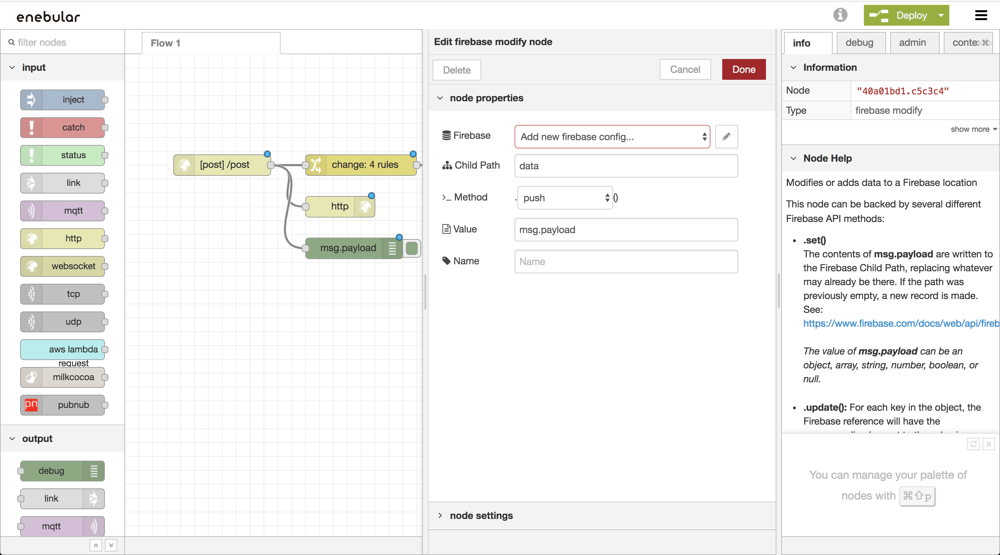

1. Enter your Firebase's appid and Set Auth Type to "None".
   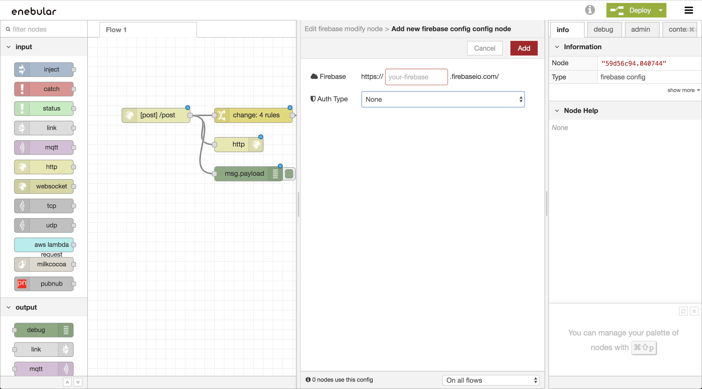

## Flow on RAVEN

Send port 4 data of the Grove module at 5 second intervals.
Use an analog sensor with the Grove module.

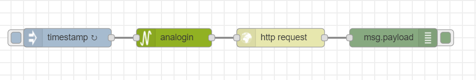

Change the "URL" of http request to your "URL".

```json
[{"id":"ab0558c5.282628","type":"http response","z":"3cc43a63.b4e246","name":"","x":250,"y":100,"wires":[]},{"id":"2a7bcb1.c56e634","type":"http in","z":"3cc43a63.b4e246","name":"","url":"/post","method":"post","upload":false,"swaggerDoc":"","x":80,"y":40,"wires":[["ab0558c5.282628","21fd8a4.1252576","bd28eaee.6430c8"]]},{"id":"21fd8a4.1252576","type":"change","z":"3cc43a63.b4e246","name":"","rules":[{"t":"move","p":"payload","pt":"msg","to":"payload.value.analog","tot":"msg"},{"t":"set","p":"payload.timestamp","pt":"msg","to":"","tot":"date"},{"t":"set","p":"payload.value.created","pt":"msg","to":"","tot":"date"},{"t":"set","p":"payload.value.label","pt":"msg","to":"analog","tot":"str"}],"action":"","property":"","from":"","to":"","reg":false,"x":280,"y":40,"wires":[["4d11ca47.3d6dd4"]]},{"id":"bd28eaee.6430c8","type":"debug","z":"3cc43a63.b4e246","name":"","active":true,"tosidebar":true,"console":false,"tostatus":false,"complete":"false","x":270,"y":160,"wires":[]},{"id":"4d11ca47.3d6dd4","type":"firebase modify","z":"3cc43a63.b4e246","name":"","firebaseconfig":"","childpath":"data","method":"push","value":"msg.payload","priority":"msg.priority","x":610,"y":40,"wires":[[]]}]
```

<!--
[こちら]()からimportできます。
-->

## Plus One

Register a Firebase data store to visualize your data with InfoMotion.

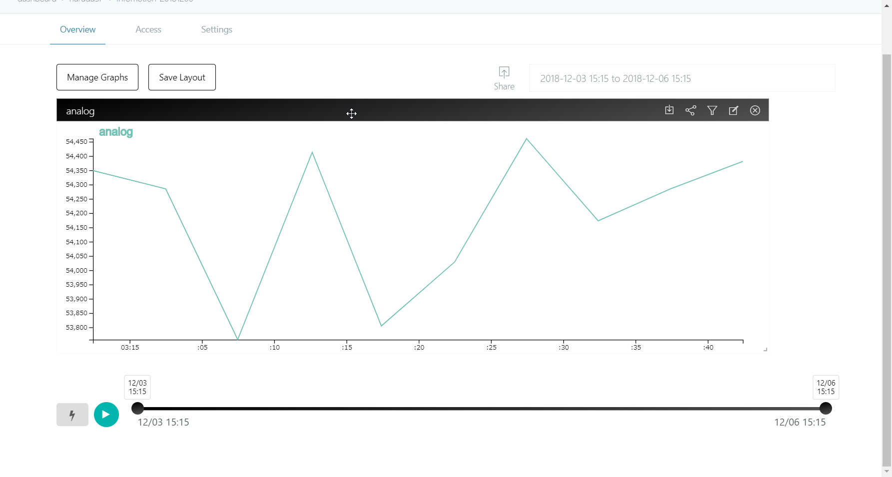

For detailed instructions on Data Visualisation see GetStarted > [DataVisualization](./../GetStarted/DataVisualization.md)
