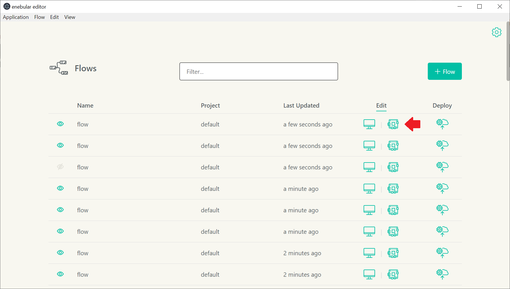
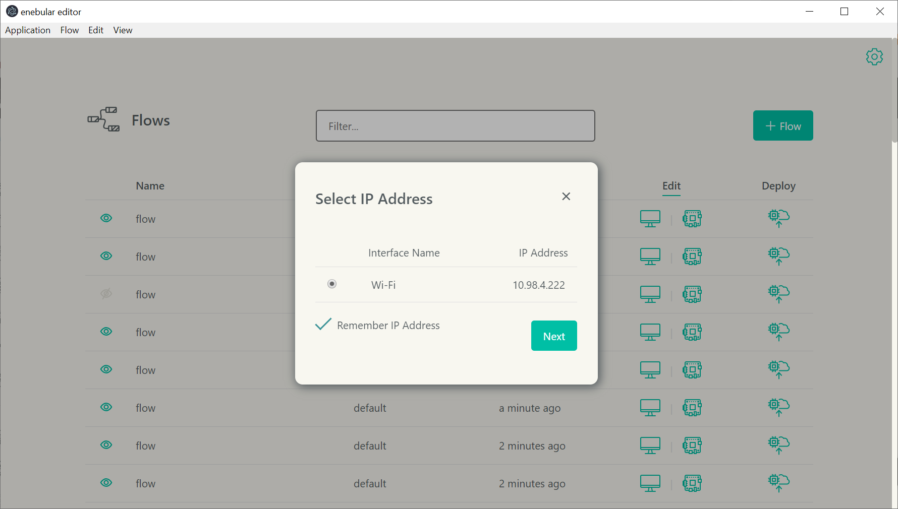
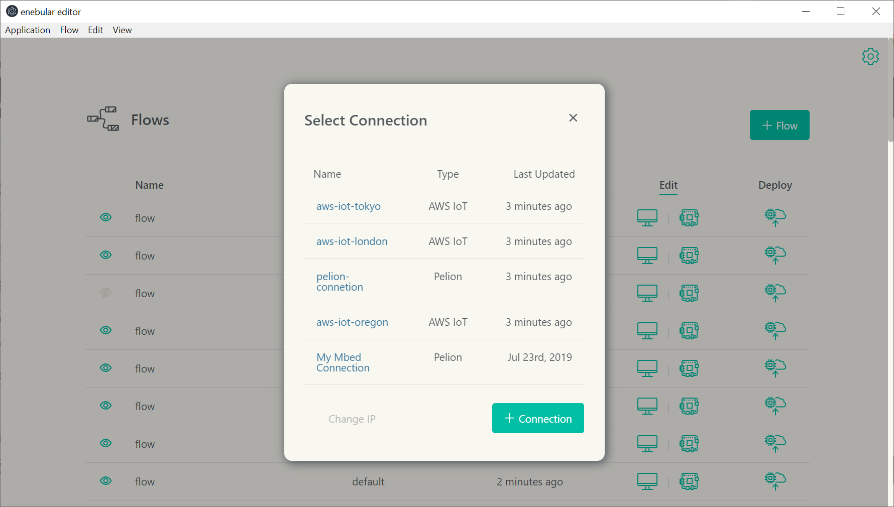
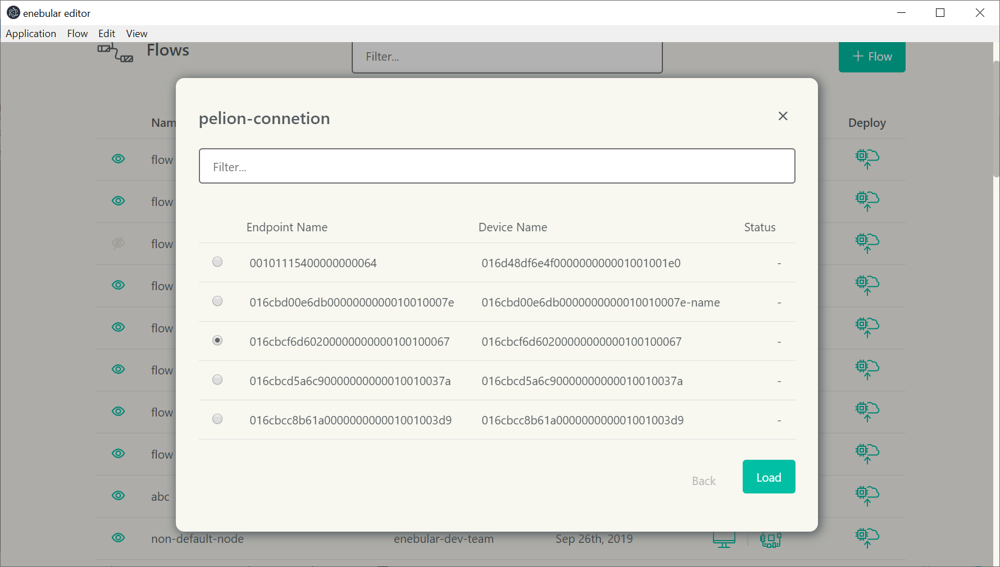
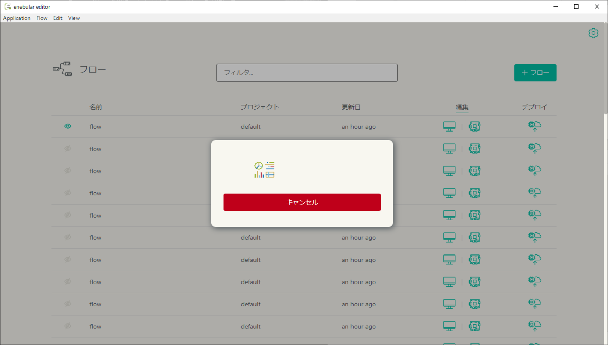

# Loading a Flow in Remote Mode {#Loading a Flow in Remote Mode}

It's possible to use enebular editor's remote mode to edit a flow on a device with enebular-agent installed in developer mode.

- Please use enebular-agent version 2.3.0 or later.
- For details on installing enebular-agent, please see [enebular-agent installation](../EnebularAgent/Installation.md).

The steps to use enebular editor's remote mode to edit a flow are as follows.

1. Ensure that both the PC running enebular editor and the device are connected to the same local network.
2. Start enebular-agent. Note that enebular-agent may have already been configured as a startup program.

3. Open the flow in remote mode from **enebular editor** on the PC.

    

4. Select enebular editor IP Address (If previously you have checked `Remember IP Address` when you selected an IP Address, this step can be skipped).

- Selected IP Address can be changed by pressing `Change IP` button in connection selection form.

    

5. Select the AWS or Pelion Device Management connection.

    

6. Select the Thing or Device.

    

7. Click load.

    

Press the cancel button to cancel loading. If the cancelation is successful, the flow would be reverted to the previous state.

## Notes {#Notes}

- Ensure that enebular editor's network communications haven't been blocked by a firewall.
- In order to use remote mode to load a flow on a device with enebular-agent installed in normal mode, enebular-agent will need to be restarted in developer mode.
- If you edit and deploy a flow in the enebular editor's remote mode, the flow will be in a running state. In this case, the flow status on the Devices screen and the flow execution status of the enebular-agent may be different due to the enebular itself cannot detect the flow execution status. In such case, please restart the enebular-agent after the flow editing in remote mode is finished.
- The cancellation feature is available only for enebular-agent version 2.14.0 or higher.
- If project contains [Private nodes](../PrivateNodes/index.md) the enebular-agent version 2.15.0 or higher is required for Private nodes to be displayed in the pallette.
