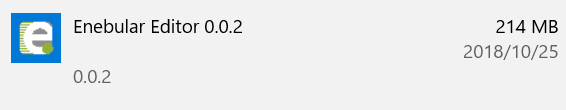

# enebular editor

## Overview

The enebular editor is a tool for your PC(Win/Mac) to edit and deploy flows to: `AWS IoT`, `Pelion Device Management`, `AWS Lambda`, `Heroku`
Since it is restricted release, please contact **support@enebular.com** to use.

## Modes

The enebular editor has 2 modes: `Desktop`, `Remote`.

### Desktop

For editing flows where node support is limited to nodes that can interact with PC/Browser APIs.
enebular editor loads the flow from the app itself

### Remote

For editing flows on linux devices (i.e. Raspberry Pi) with **enebular-runtime-agent 2.3.0** and above installed.
Certain nodes such as Raspberry Pi sensor nodes only work on devices. Since Desktop mode does not support such nodes, Remote mode is required to correctly load such nodes.
A valid AwS IoT / Pelion Device Management connection is required
For Pelion Device Management, **enebular-runtime-agent-cloud-connector 2.3.0** is required
**enebular editor** loads the flow editor from **enebular-runtime-agent** remotely

## Requirements

- An available enebular account
- Your PC must be connected to network
- See [Supported environment](./../Other/Support.md)

## How to install

### For Windows

1. Download [installer](https://s3-ap-northeast-1.amazonaws.com/enebular-editor/win/enebular+editor+Setup+0.9.0.exe).

1. Run the installer

1. Program have been installed like bellow:  
   

### For Mac

1. Download [installer](https://s3-ap-northeast-1.amazonaws.com/enebular-editor/mac/enebular+editor-0.9.0.dmg).

1. Run the installer

1. Run **enebular editor**.
