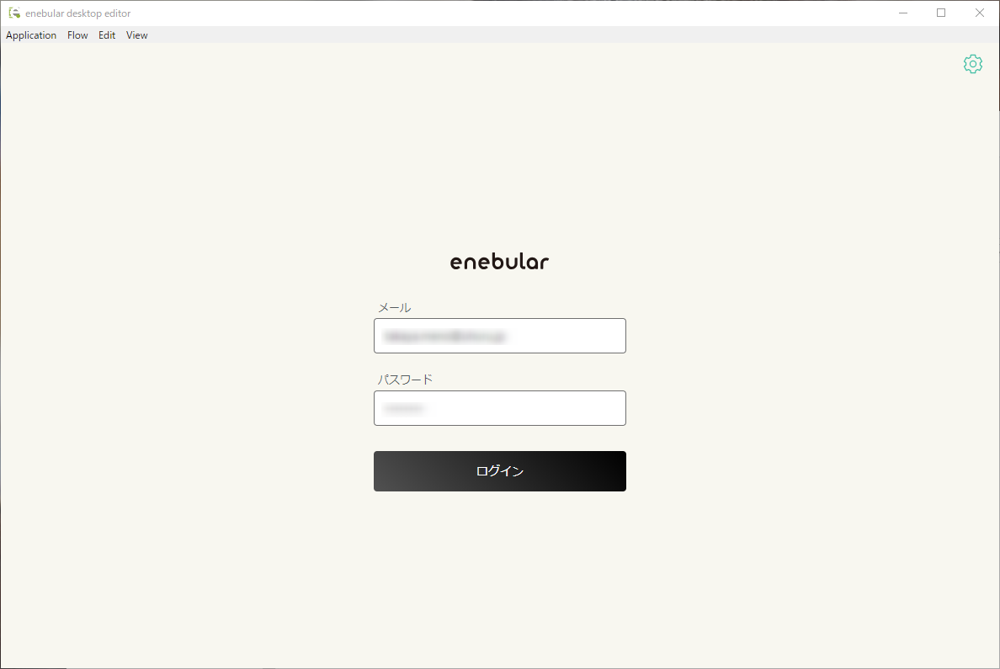
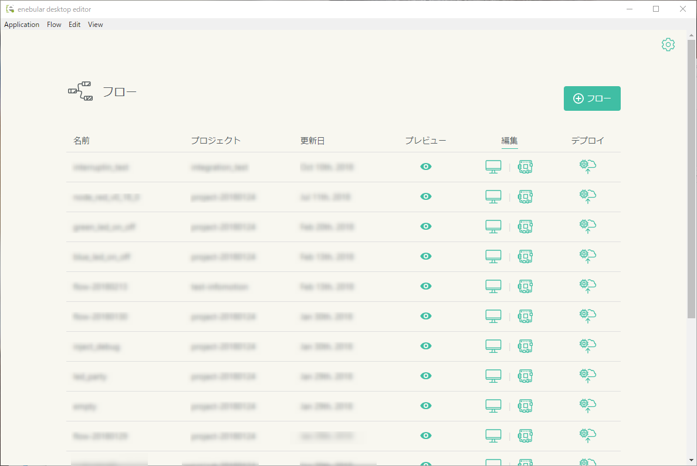

# desktop editor

## Overview

The enebular editor is a tool for your PC(Win/Mac) to edit and deploy flows to: `AWS IoT`, `Arm Pelion`, `AWS Lambda`, `Heroku`
Since it is restricted release, please contact **support@enebular.com** to use.

## Modes

The enebular editor has 2 modes: `Desktop`, `Remote`.

### Desktop

For editing flows where node support is limited to nodes that can interact with PC/Browser APIs.
enebular editor loads the flow editor from the app itself

### Remote

For editing flows on linux devices (i.e. Raspberry Pi) with enebular-runtime-agent v2.3.0 and above installed.
Certain nodes such as Raspberry Pi sensor nodes only work on devices. Since Desktop mode does not support such nodes, Remote mode is required to correctly load such nodes.
A valid AwS IoT / Arm Pelion connection is required
For Arm Pelion, `enebular-runtime-agent-cloud-connector` is required
enebular editor loads the flow editor from `enebular-runtime-agent` remotely

## Requirements

- An available enebular account
- Your PC must be connected to network
- See [Supported environment](./Support.md)

## How to install

### For Windows

1. Download [zip file](https://uhuru.box.com/s/j4b634xhj0460fkmimq2rma137nvebr9) which includes installer.

1. Unzip it and run `Enebular Editor Setup 0.0.2.exe` file.

1. Program have been installed like bellow:  
    

1. The desktop editor will run automatically.

### For Mac

1. Download [installer](https://uhuru.box.com/s/ol939ir446f4eingquqjwde2zdpv2sr1).

1. Run `Enebular Editor-0.0.2.dmg`.

1. Run `Enebular Editor`.

## Log in

Fill out `email` and `password`of enebular account then log in. 

The dashboard is displayed.

