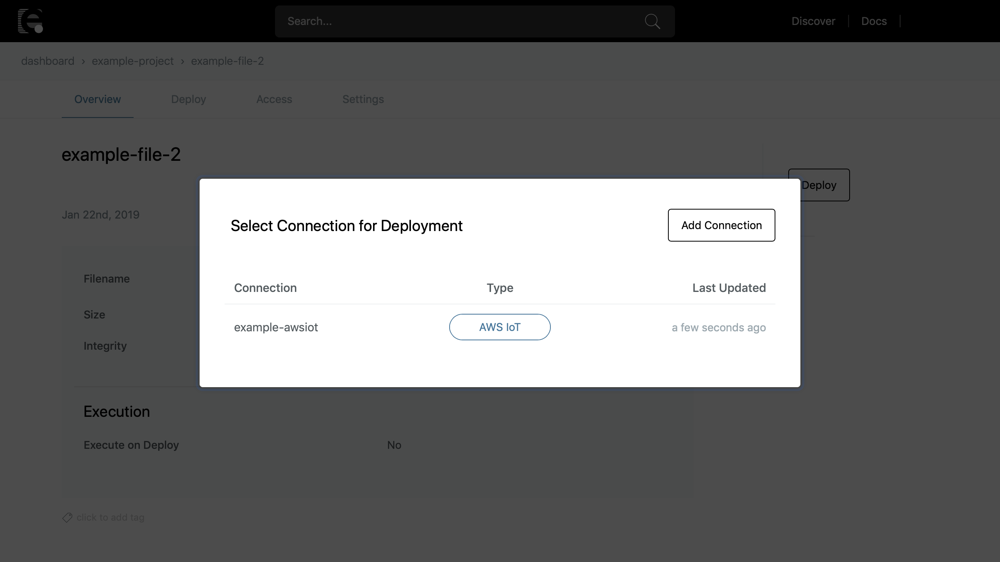

# Deploying Files {#Deploying Files}

Files that have been registered as assets on enebular can be deployed to 'paid' devices. The following explains how to go about that deployment.

## Supported Devices {#Supported Devices}

Files can be deployed to devices that meet the following conditions.

- The device is a 'paid' device
- The device is currently connected
- The device has version 2.3.0 or later of enebular-agent installed

## Deployment Steps {#Deployment Steps}

First, select **Files** from the project menu to display the registered file asset list.

Select the file to deploy from the list and the file's **Overview** will be displayed.

In the **Overview** click the ** Deploy ** button and a device connection list will be displayed. Select the connection of the devices to deploy to from the list. If the connection hasn't been registered yet, add it by referring to the explanation in [flow deploys](../Deploy/index.md).

After choosing a connection from the list, a list of the connection's devices will be displayed. Select the devices to deploy to and click the ** Deploy ** button.

The deploy process then starts and the file's **Deployment History** is displayed. The status of the deployment to the devices can be checked here.

Once the deploy process completes successfully ** Deployed ** is displayed in the ** Deploy Status ** column.
