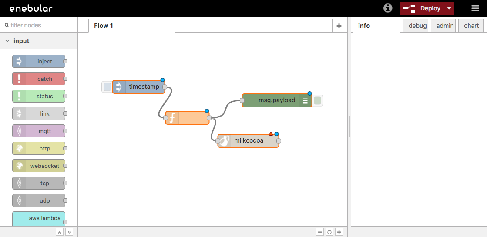
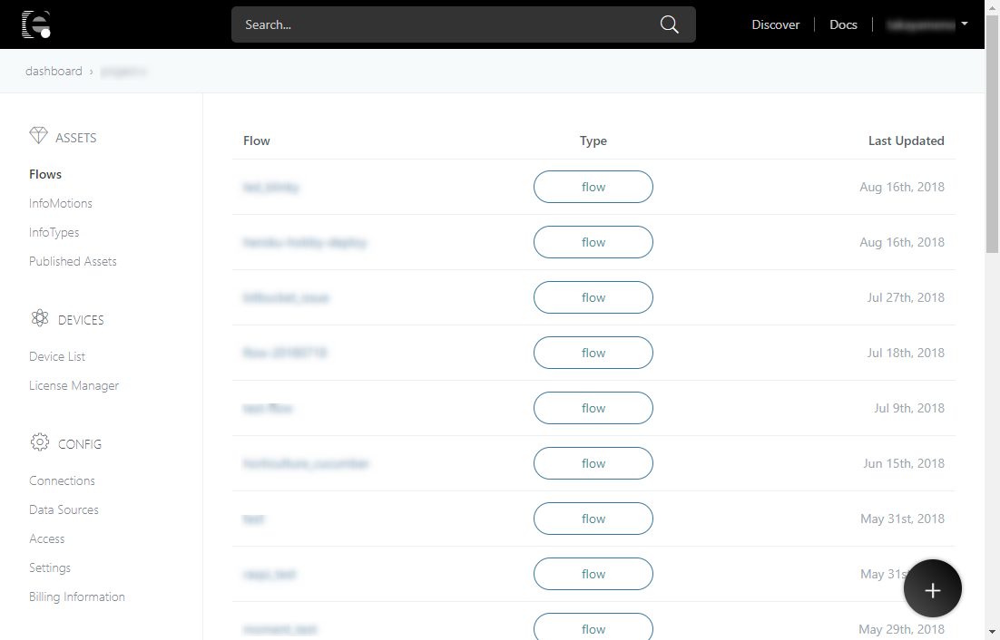
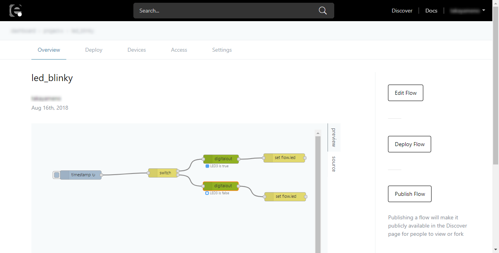
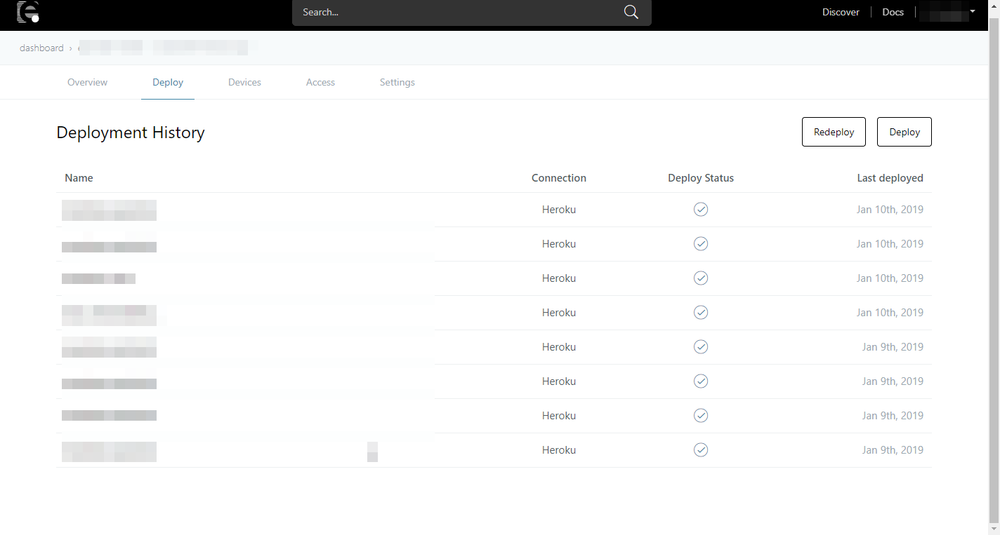
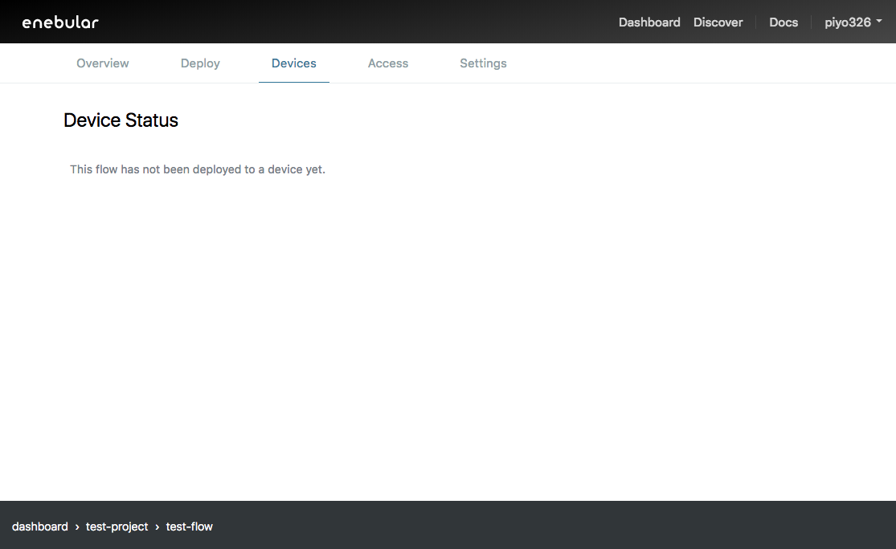
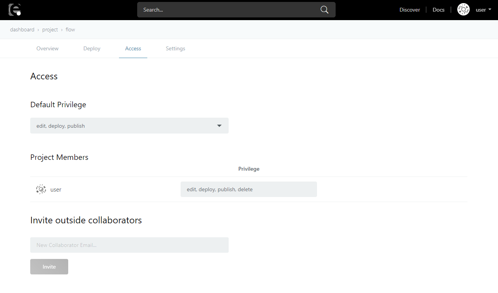
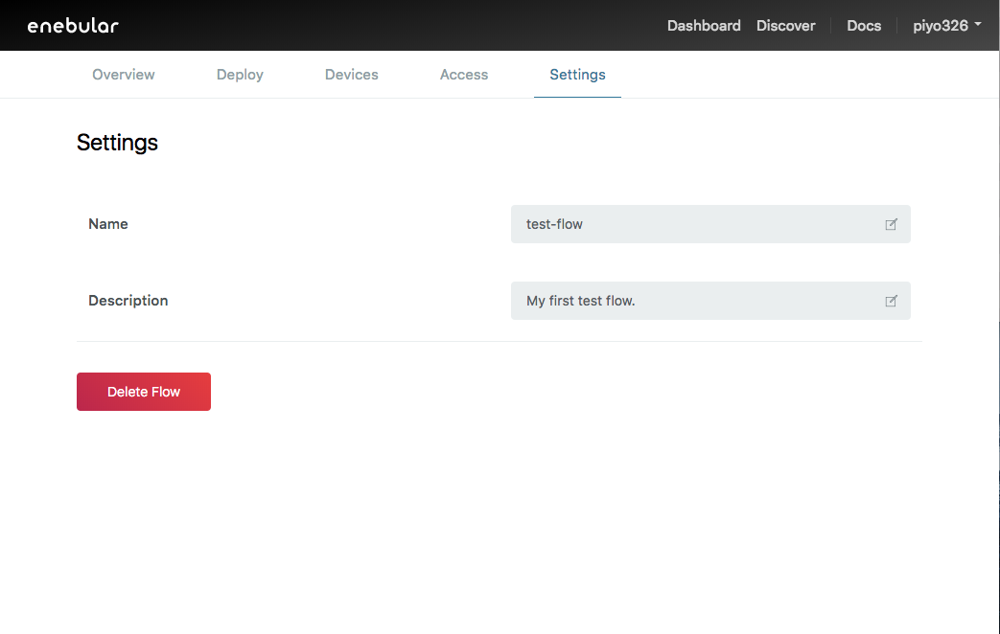

# Flows

A Flow is an asset of enebular where you use the flow editor based on the <a href="https://nodered.jp/" target="_blank">Node-RED</a> tool (which is designed to connect hardware, APIs and online services) to process data.

Note that as shown in the image below, while it is possible to deploy flows within Node-RED, here the purpose of this is to just save the flow, and when doing this **the flow execution will stop after a few minutes**.

To have the data flow run for an extended period of time, it must be [deployed to another service](../Deploy/index.md).

[Created flows](./CreateFlow.md) can be checked on enebular.

Selecting a flow will take you to the flow details screen.

## Overview

You can edit, deploy and publish the flows from the overview. 

Descriptions are as shown below:

| No. | Item | description |
| --- | --- | --- |
| 1 | preview | The screen shots of the flows you created are displayed. |
| 2 | source | The JSON string of the flows you created are displayed. |
| 3 | Edit Flow | You can edit the flows. |
| 4 | Deploy Flow | You can deploy the flows to other services. See Deploy section for more information. |
| 5 | Publish Flow | You can publish the flows. See [Publish Flow](./PublishFlow.md) for more information. |

## Deploy

You can deploy flows to specific services here.

Please see [Deploying](../Deploy/index.md) for detailed information on deploying.

## Devices

You can see a listing of the status of devices that have been deployed to with external services here.

Please see [Device List](../Device/DeviceList.md) for more details.

## Access

You can edit flow access permissions here.

Please see [Access Control](../Access/index.md) for more details.

## Settings

You can change the name and description of the flow and delete the flow here.

