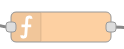
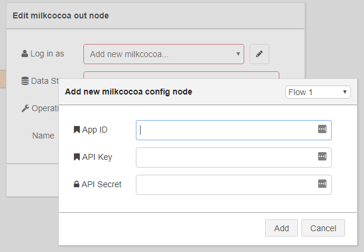
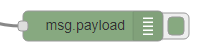
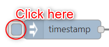

# A Milkcocoa Flow

Here we create a flow to save data to Milkcocoa. The stored data can be used as a Milkcocoa DataSource.

## Check the DataSource

First, confirm the details of the DataSource that will be used. Before creating the flow, refer to the Milkcocoa tutorial page [Preparing to use Milkcocoa](https://mlkcca.com/tutorial/page2.html), create an app and make note of the `app_id`, and then also the `API Key` and `API Secret` from the  authentication tab in the Milkcocoa management screen.


Here, we'll use a Milkcocoa data store called `mbed` for the DataSource.


## Starting the Data Flow

Here we prepare the data flow to process and input the data into the DataSource.


Click the "Edit Flow" button.


The Flow Editor opens in a new window.

## An Example of Processing Data into a DataSource

### The Structure

The example of processing data into a DataSource is structured as described below.

### Flow

The flow is configured in the order: inject node → function node → milkcocoa node → debug node.


### inject Node Settings


The inject node settings are OK as they are when the node is added.

### function Node Settings



The following settings are used for the function node.


This script creates a random value between 0 and 9 to Milkcocoa,
a country 'JP','USA' or 'CN'and a created date. 

```javascript
var data = {
    country:['JP','USA','CN'][Math.floor(Math.random()*3)],
    value: Math.floor(Math.random()*10),
    created:Date.now()
}

msg.payload = data; 
return msg;
```

### Milkcocoa Output Node Settings


A Milkcocoa output node is used to to send data to the Milkcocoa DataSource.


Place a Milkcocoa output node from the pallet.


Show the properties, press the pencil button and set the Milkcocoa app information.



Enter all of the app information noted earlier.

* App ID
    * The Milkcocoa APP ID for the DataSource
* API Key
    * The API Key for the DataSource
* API Secret
    * The API Secret for the DataSource


Press the Add button to register the settings.


Returning to the Milkcocoa output node settings, also set the DataSource name.


### debug Node Settings



The debug node settings are OK as they are when the node is added.

### Deploying

Deploy and close the window. This completes all configuration using the Flow Editor.


The new flow is shown in the flow list.

### Running It


Data will be stored when you click the trigger on the left of the inject node. The stored data can be confirmed in the Milkcocoa management screen.


