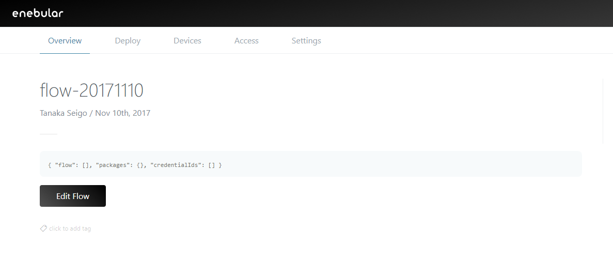

# Create Flows

The following covers how to create flows.

First, select a project from the project list and you'll be taken to the project management screen.

Open the dialog box with the "+" button on the bottom right.

Select "flow" for the asset type in the dialog box.

After selecting "flow", you'll be able to set the icon, title and access permissions.

* Title
    * An appropriate title for the flow
* Description
    * This can be left blank
* Access Permissions
    * superdev
* Category
    * An appropriate category for the flow

Once you've completed the settings, click the "Continue" button.

The flow has now been created.

From here, the flow is edited by starting up the flow editor. Please refer to the following example.

- [Milkcocoa Flow](./FlowExampleMilkcocoa.md)

## Restrictions

Web Flow Editor is not an execution environment but a development environment.

There are the following restrictions.

* A hardware dependent node cannot be used
* A node that depends on the development environment cannot be used
* A large size node can not be imported and used
    *  Reloading may be repeated
* The generated URL is temporary
* Some native Node-RED keyboard shortcuts do not function properly
