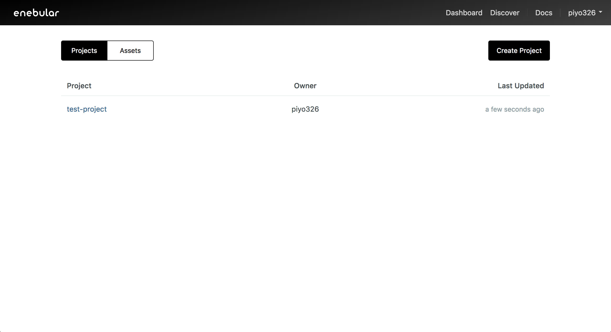
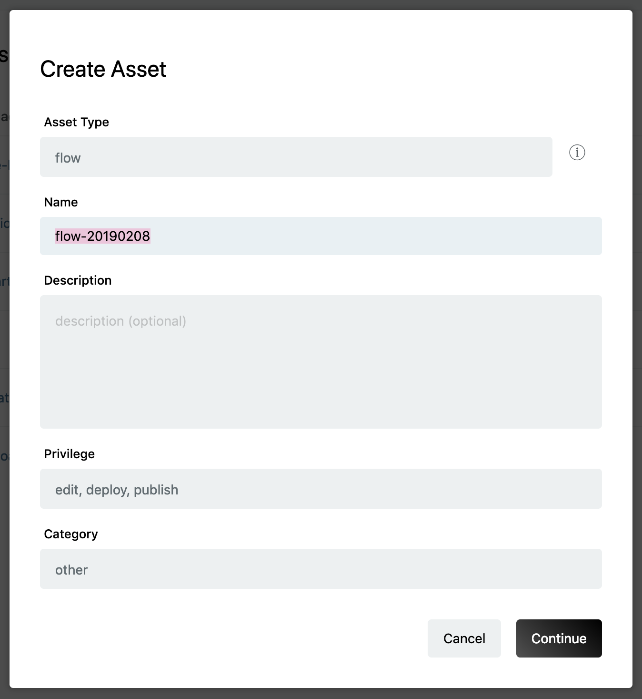

# Create Flows {#Create Flows}

The following covers how to create flows.

First, select a project from the project list and you'll be taken to the project management screen.

Open the dialog box with the "+" button on the bottom right.

Select "flow" for the asset type in the dialog box.

After selecting "flow", you'll be able to set the icon, title, privileges and category.

- Title
  - An appropriate title for the flow
- Description
  - This can be left blank
- Access Privileges
  - edit, deploy, publish
- Category
  - An appropriate category for the flow

Once you've completed the settings, click the "Continue" button.

The flow has now been created.

Node-RED on enebular and enebular-agent does not support all nodes. Nodes developed by the open source community should be used at your own risk.  
There is a particular restriction on available nodes for the enebular-edge-agent.For more details, [enebular-edge-agent > Nodes](./../EnebularEdgeAgent/Nodes.md).

## Restrictions

Web Flow Editor is not an execution environment but a development environment.

The following are restrictions pertained to Web Flow Editor.

- A hardware dependent node cannot be used
- A node that depends on the development environment cannot be used
- A large size node cannot be imported and used
  - Reloading may be repeated
- The generated URL is temporary
- Some native Node-RED keyboard shortcuts do not function properly

## Node-RED Compatibility {#NoteNodeREDCompatibility}

### Enabling or disabling a node

enebular v2.25.0 or higher is using Node-RED v1. It brings Node-RED [Enabling or disabling a node](https://nodered.org/docs/user-guide/editor/workspace/nodes#enabling-or-disabling-a-node) feature.
This feature can be used when deploying the flow to the following:

- Web Flow Editor (Node-RED 1.0.5 is used)
- enebular editor: 1.0.0 or higher

Please refer to [Deploys](../Deploy/index.md#NodeEnabledDisabled) for more information.
