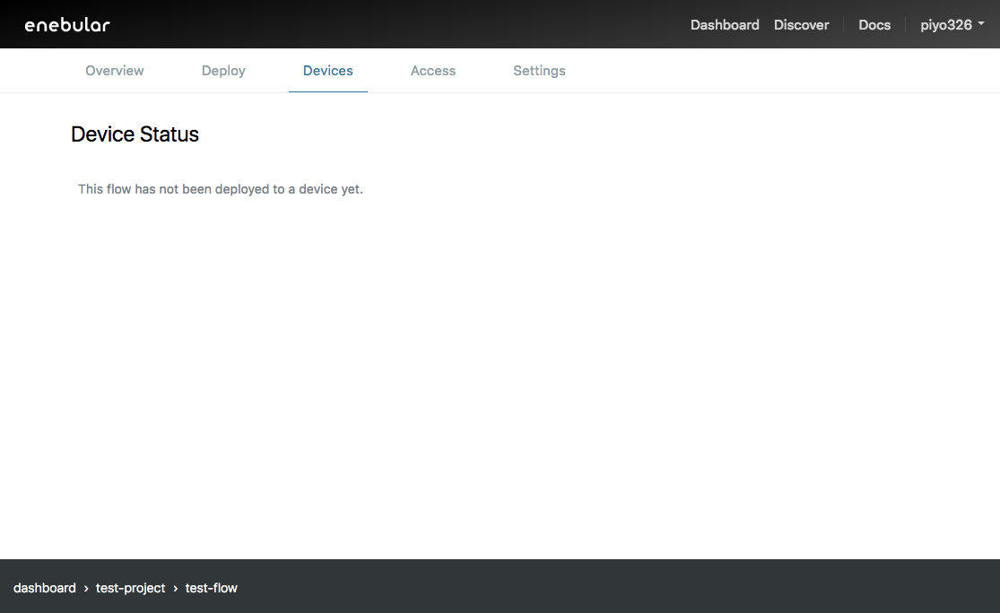
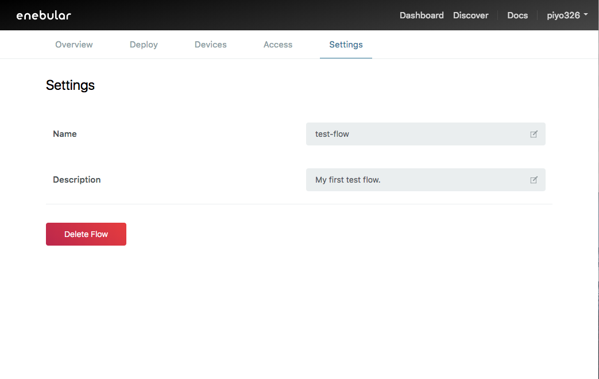

# Flows {#Flows}

Flows are a feature of enebular where you use the flow editor based on the <a href="https://nodered.jp/" target="_blank">Node-RED</a> tool (which is designed to connect hardware, APIs and online services) to process data.

Note that as shown in the image below, while it is possible to deploy flows within Node-RED, here the purpose of this is to just save the flow, and when doing this **the flow execution will stop after a few minutes**.

To have the data flow run for an extended period of time, it must be [deployed to another service](../Deploy/index.md).

[Created flows](./CreateFlow.md) can be checked on enebular.

Selecting a flow will take you to the flow details screen.

## Overview {#Overview}

You can edit the flow information and publish flows from the overview. The flow information is useful as an aid for users to understand what kind of flow it is once it has been published, so we recommend providing as much information as possible.

Please see [Publish Flow](./PublishFlow.md) for details on publishing flows.

## Deploy {#Deploy}

You can deploy flows to specific services here.

You can also repeat your last deploy using Redeploy button.

Please see [Deploying](../Deploy/index.md) for detailed information on deploying.

## Devices {#Devices}

You can see a listing of the status of devices that have been deployed to with external services here. This is a paid feature, which will be implemented soon.

## Access {#Access}

You can edit flow access permissions here.

Please see [Access Control](../Config/Access.md) for more details.

## Settings {#Settings}

You can change the name and description of the flow and delete the flow here.

