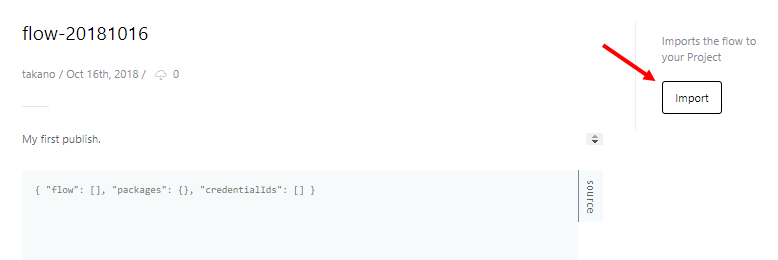

# Publishing Flows

Flows can be published with "Publish" on the flow overview page. Flows that have been published can be imported and used by other users.

You can confirm and alter the name and description, and then publish the flow.

## Importing Published Flows

Published flows can be found in "Discover" on the top navigation bar.

Importing a published flow can be done with "Import" on the flow information page.

To import the flow, select the project to import to and the default access permissions, and then press "Import".

