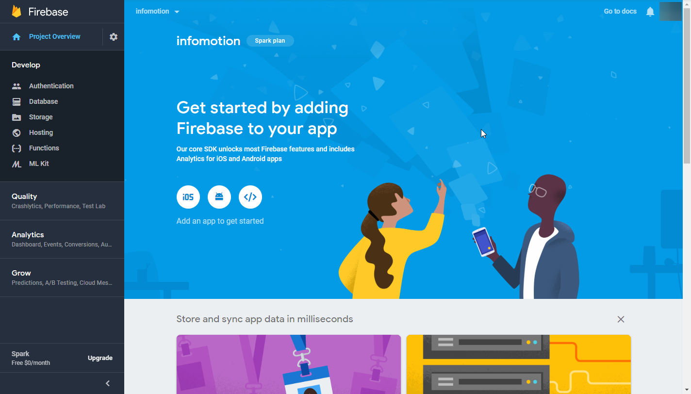
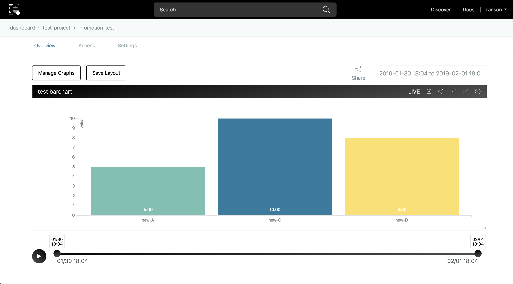

# Data Visualization {#Data Visualization}

Using InfoMotion to visualize data.

This tutorial will do 'Import assets and visualise Flow data in an InfoMotion'.(Time required 50 minutes)

1. [Import a Flow](#ImportaFlow)
1. [Creating a Datasource](#CreatingaDatasource)
1. [Editing and Deploying the Flow](#EditingandDeployingtheFlow)
1. [Registering a DataSource for InfoMotion](#RegisteringaDataSourceforInfoMotion)
1．[Import an InfoType](#ImportanInfoType)
1. [Creating an InfoMotion](#CreatinganInfoMotion)

## Import a Flow {#Import a Flow}

Enebular allows users to publish and import Assets. At the right top part of the window click on `Discover`.

Select Flow and search `getting-started`.

Click Import(marked by enebular) to open the import modal.

Select the project to import to and the Default asset role. (For now select superdev)

Go back to your project dashboard to see the new asset you just imported.

The imported Flow should look like this.

The flow is set up in a way that all the user needs to
edit in the flow is datasource credentials. before we deploy the flow lets register a datasource.

## Creating a Datasource {#Creating a Datasource}

Below are the current real time databases used in InfoMotion.
See documentation for simple registration and and set up configurations.

- [Milkcocoa-v2 DataSource](./../InfoMotion/DataSource/Milkcocoa/CreateDataSource.md)
- [Firebase DataSource](./../InfoMotion/DataSource/Firebase/CreateDataSource.md)
- [Pubnub DataSource](./../InfoMotion/DataSource/Pubnub/CreateDataSource.md)

This tutorial uses Firebase.
Before proceed to the next step, you have to register and create dataStore. Please refer to [Firebase](./../InfoMotion/DataSource/Firebase/Setup.md).

\*The following configurations are for testing usage only and not recommended for production.

## Editing and Deploying the Flow {#Editing and Deploying the Flow}

Set credentials to Node and deploy flow.
This tutorial only set uo Firebase Node.

### Credentials needed for Firebase. {#Credentials needed for Firebase.}

At the overview page click on `</>`. Opend mordal(`Add firebase to your web app`).

databaseURL will be used in the Flow.

### Inputs in Flow {#Inputs in Flow}

Double click the firebase node and click on the pencil icon to edit a new firebase.

Insert your databaseURL, click update and done to set node.
Leave authtype to none just for this example.

Once the correct credentials are inserted click the `Deploy` button. To check if data is being pushed click the `debug` tag.
The debug log should be updated every 10 seconds (intervals set by the inject node).

Image of debug log

With data being pushed to a database we can create an datasource (endpoint) for infomotion to use.

**\*Note 1**: The free version of enebular automatically sleeps if there is no access for 30 minutes. At present only the free version is available.

**\*Note 2**: If the flow editor is left open and unused for an extended period of time, an attempt to deploy may result with it failing with "Unauthorized". If this happens please reload.

## Registering a DataSource for InfoMotion {#Registering a DataSource for InfoMotion}

We will next add datasources to our project for InfoMotion to visualise. At your project dashboard select `Data Source` on the left tab then click on the plus button to open the datasource modal.

Give the datasource a name and correct credentials.
Click on save to save. Now the datasource is ready for InfoMotion to use.

## Import an InfoType {#Import an InfoType}

Enebular allows users to publish and import Assets. At the right top part of the window click on `Discover`.

Select InfoType and search `barchart`.

Click import (marked by enebular) to open the import modal.

Select the project to import to.

Go back to your project dashboard to see the new asset you just imported.

## Creating an InfoMotion {#Creating an InfoMotion}

Here we'll create an InfoMotion using a DataSource and an InfoType. Press the "+" at the bottom right to open the dialog box.

Give the InfoMotion a title. For the InfoMotion's default access permissions, just set it to `developer` this time. Select whatever you like for the "category" at the bottom.

Once you've created it you'll be taken to the InfoMotion dashboard screen.

Open the sidebar with "Add Graph". A list of the graphs shown on the dashboard is shown in the sidebar. In this procjet no graphs have been added yet.

Click on `New Graph` to open the the creation modal.
By default the Type will be set to `barchart` and DATASOURCE to `test-datasource`.
The Label corresponds to x axis set as `category` and Value to the y axis `value`. These are set by default.
Edit the name as you like then `create graph`.

"test-graph" will now be added to the list.

If you click the plus icon to the left of test-graph it will be added to the dashboard. If data is not displayed you may have no data being stored. Select a daterange to a date when data was stored.

To resize the graph drag its bottom right corner then press "Save" to save the save layout.

## Well Done! {#Well Done!}

With that, we've been able to go from creating a data flow right through to displaying a graph that uses the data.

While in this tutorial we displayed a simple pre-made bar graph, you can also create, upload and use your own InfoMotion Type. For details, please refer to the [InfoMotion Type Creation Tutorial](./../InfoMotion/InfoMotionTool.md).
