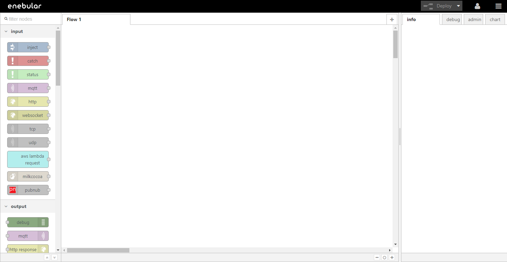
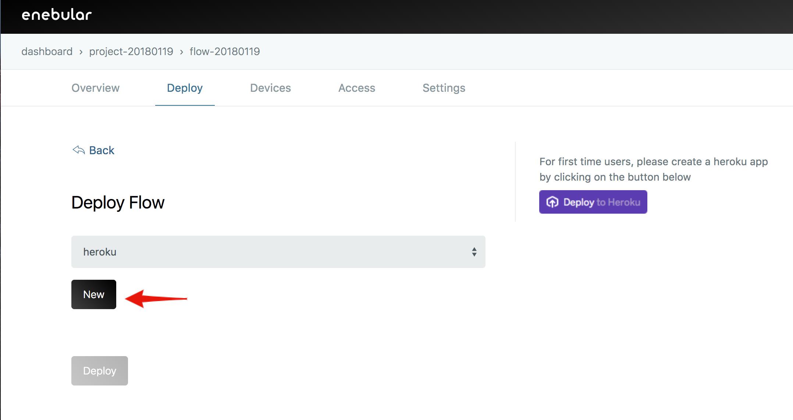

# Flow Deployment

A one of features of enebular, deploying the created flow to various environments and operating it. 

This tutorial covers the following. 

- Deploying flow to Heroku

Incidentally, this tutorial assumes that you understand how to create Asset(Flow) in [Create Projects and Assets](./CreateProjetcs.md)

## Ready to deploy flow to Heroku

Create flow (If flow has already created, alos it can be used).

Push "Deploy" botton and save the flow.

## Deploy Settings

Following that we configure the deploy.
Once the flow has been created, move to the "Deploy" page from the menu at the top.

Select "Heroku" for "Select Connection Type".

After selecting "Heroku", we create a Heroku app from the "Deploy to Heroku" that appears in the right column.

## Creating an app with the Heroku Button

Use the Heroku button to create the app. This step can be skipped for those who have already created one.
After pressing the Heroku button, log in with the Heroku login screen that appears if you weren't already logged in.

Heroku The Heroku app settings will be displayed.

Set an easy to understand name for the App name.

Set the USERNAME and PASSWORD to be used for login after the enebular Node-RED has been created.

After confirming the settings press the "Deploy" button. 

If you haven't added your credit card information to heroku before, the following modal will show up. Please don't worry, you can use this enebular app for free so enter your information.

After registering the credit card, heroku will start setting up the app.

The app is being created...
Once it has been created press the "View" button to check it.

You'll be asked to provide the USERNAME and PASSWORD to log into the enebular Node-RED, so enter those that you set above.

## Deploy Settings

Once the Heroku app has been created we configure the deploy settings. Return to the previous screen and continue on with the configuration.

Press "New".

Assign an easy to understand name to the "Connection Name". The "Heroku API Token" can be seen on the Heroku settings screen.

Press "Account Settings".

Go to "Account" on the "Manage Account" page.

Go to the API Key section and display the API Key with "Reveal".

Copy the API Key into "Heroku API Token" and press "Save".

## Deploying

With the connection saved and Heroku selected for the "Select Connection Type", a list of the apps on the Heroku account will be displayed.

From here, select the Heroku application you just created and press "Deploy".

After wating for some time "Deploy Added" will be displayed once the deploy has finished.

If you check the Heroku app you will be able to see that the flow has been deployed.

Check deployed flow.

## Well Done!

You can enable deploying flow to other service with enebular's function.