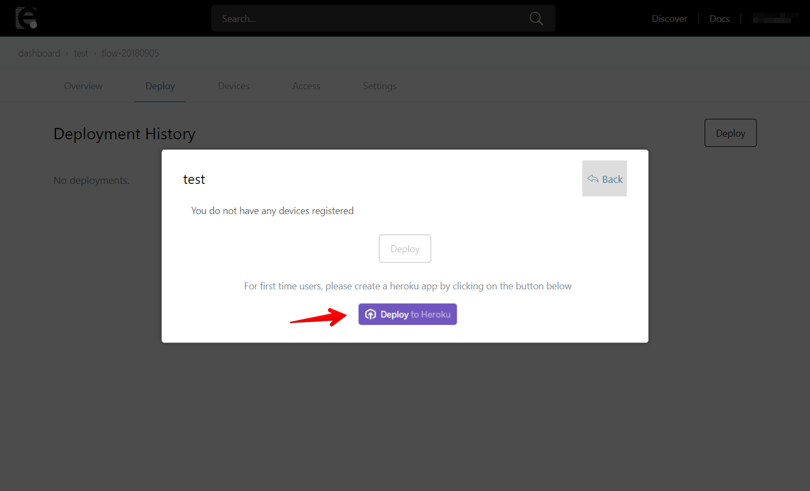
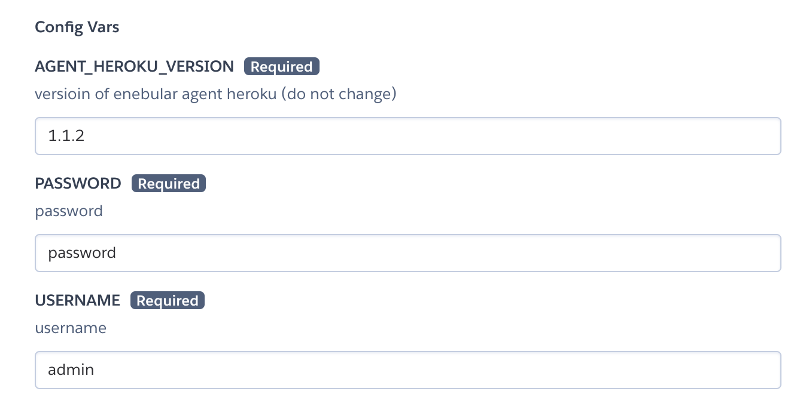
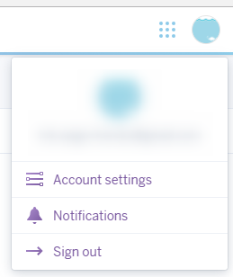
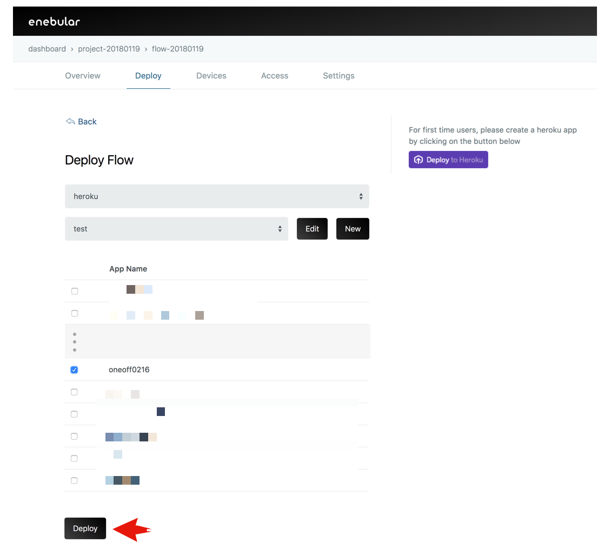

# Flow Deployment

Deploying flows to various environments and operating systems is a feature of Enebular.
In this tutorial we will be deploying a flow to Heroku.

To complete this tutorial you will need to understand how to create an [Asset(Flow)](./Introduction.md).

## Ready to deploy flow to Heroku

Create flow (If flow has already been created, it can also be used).

Click on the "Deploy" botton to save the flow.

## Deploy Settings

Configure your flow deployment by clicking on Deploy.

Select "Heroku" for "Select Connection Type".

After selecting "Heroku", we can create a Heroku app from the "Deploy to Heroku" button on the right.

## Creating an app with the Heroku Button

Use the Heroku button to create the app. This step can be skipped for those who have already created one.

After clicking on the Heroku button, if not logged in, log in with the Heroku login screen that appears.

Heroku The Heroku app settings will be displayed.

Set the App name.

Set the USERNAME and PASSWORD to be used for login after the enebular Node-RED has been created.

After confirming the settings press the "Deploy" button. ¥

After confirming the settings click the "Deploy" button. If you haven't added your credit card information to heroku before, the following modal will show up.
Using the Enebular app is free so one needs to not worry about Enebular charging.

After registering the credit card, heroku will start setting up the app.

The app is being created...

Once it has been created click the "View" button to check it.

You'll be asked to provide the USERNAME and PASSWORD to log into the enebular Node-RED, so enter those that you set above.

## Deploy Settings

Once the Heroku app has been created we configure the deploy settings. Return to the previous screen and continue on with the configuration.

Click "New".

Input a "Connection Name". Get the "Heroku API Token" from the Heroku settings screen.

Click "Account Settings".

Go to "Account" on the "Manage Account" page.

Go to the API Key section and display the API Key with "Reveal".

Copy the API Key into "Heroku API Token" and click "Save".

## Deploying

With the connection saved and Heroku selected as a "Connection Type", a list of the apps on the Heroku account should be displayed. From here, select the Heroku application you just created and press "Deploy".

Wait a moment for the "Deploy Added" to be displayed to confirm the app has been deployed.

If you check the Heroku app you will be able to see that the flow has been deployed.

Check the Heroku app to see if the flow has been deployed.

## Well Done!

You can now deploy flows to other services with enebular.
