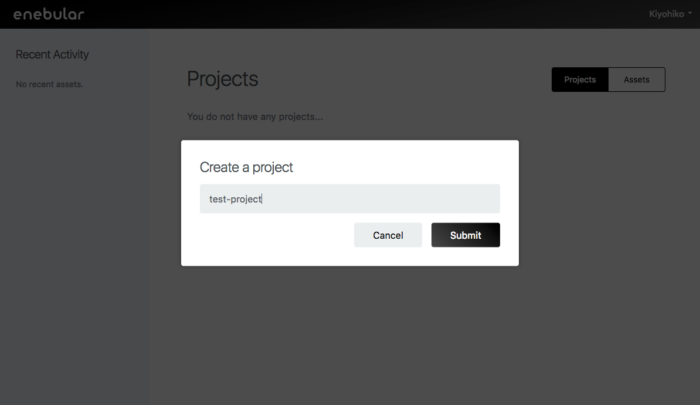
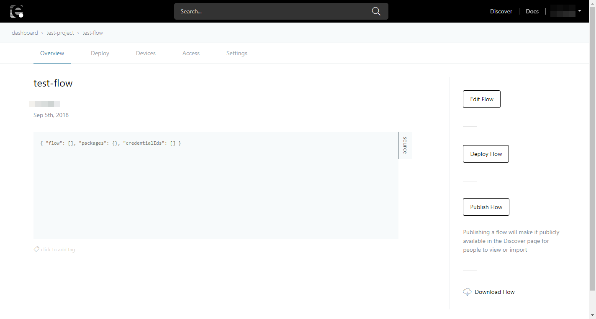

# Introduction

This tutorial covers the following.

- Signing up
- Creating a project
- Creating an asset
- Editing a flow

## Signing up

** Notice : enebular v1 accounts are no longer supported, please sign-up to an enebular v2 account. **

Go to https://enebular.com/en and click `SIGN UP`.

Fill out the form and agree with the privacy policy and terms of service then click on `sign up`.

A verification mail will be sent to your registered email address. This may take a few minutes.

Once verified , you can sign in to enebular.com.
Click on `Go To Dashboard` then create a project.

### Didn't you get verification mail?

Please check the following.

1. Did you give the correct email account?
1. Did you set a filter for enebular.com?
1. If you have not received an verification mail please contact ** support@enebular.com **.

## Creating a Project

To start using enebular we first create a project. In the screen after signing in, create a project with "Create Project".

Enter an appropriate title and create the project.

Confirm created project in this list.

## Creating an Asset

With the project added let's now create a flow. Select the project to go to the project management screen.
Press the "+" at the bottom right to open the asset creation dialog box.

Select `flow` for the asset type and give the flow a title. For the flow's default access permissions, this time just set it to `superdev`. The category at the bottom can be set to anything appropriate.
Press "Continue" to complete the creation.

Once created you'll be taken to the flow details page.
Press "Edit Flow".

 Open the Node-RED editor.

## Editing a flow

This section explains how to create a simple flow that logs `Hello World !` to the debug tab.

In flow editor, drag and drop nodes from the left pallet to the canvas and connect the nodes to create a flow.

Firstly, let's deploy Inject Node onto workspace. The Inject Node is classified as an "input" node in the node pallet.
Inject Node triggers the flow to start.

Next, deploy Debug Node. Debug Node is classified as an "output" on the node pallet.
Debug Node is the node that displays debug messages on the right hand side tab. 

Connect Inject Node and Debug Node. 
Save the flow by clicking on the `Deploy` button at the top right. 
You can start the flow by clicking the left end of the Inject Node. The debug tab should be logging timestamps. 

Now you have a flow working. Let's next log `Hello World !` instead of timestamps. By default Debug Node exports `msg.payload` as the logging value. We will have to change this value to `Hello World !`. To do this a Change Node can help. 

Change Node is classified as a "function" node on the pallet.

Double click the Change Node and set up the node input to `Hello World!` and click `Done`.

Save flow by clicking on the `Deploy` button and start the flow. The debug tab should now be displaying `Hello World !`

## Well Done!

You can now create a project, an asset and edit a simple flow on Enebular. 