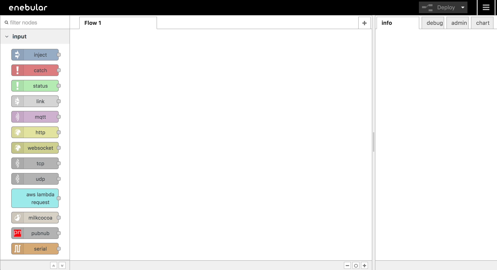
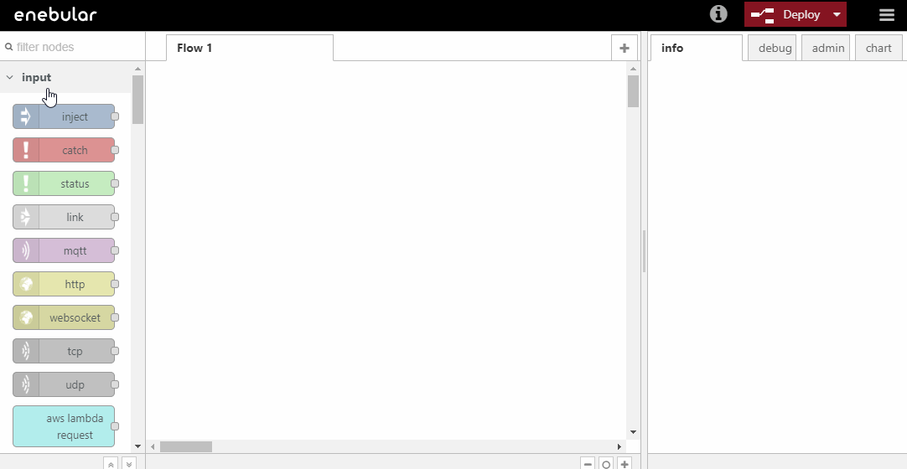
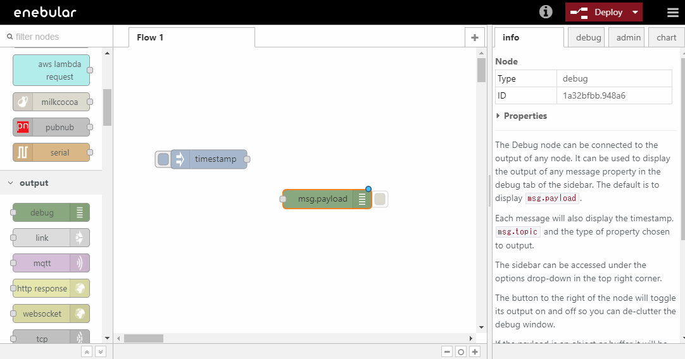
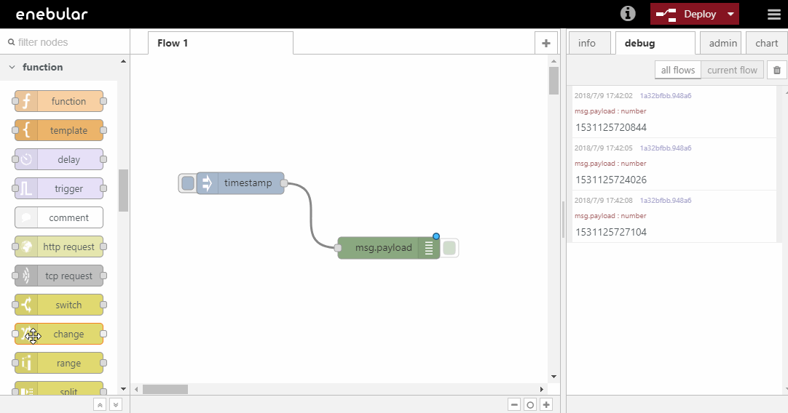

# Introduction

This tutorial covers the following.

- Creating a project
- Creating an asset
- Editing a flow

## Creating a Project

To start using enebular we first create a project. In the screen after logging in, create a project with "Create Project".

Enter an appropriate title and create the project.

Confirm created project in this list.

## Creating an Asset

With the project added let's now create a flow. Select the project to go to the project management screen.
Press the "+" at the bottom right to open the asset creation dialog box.

Select `flow` for the asset type and give the flow a title. For the flow's default access permissions, this time just set it to `superdev`. The category at the bottom can be set to anything appropriate.
Press "Continue" to complete the creation.

Once created you'll be taken to the flow details page.
Press "Edit Flow".

 Open the Node-RED editor.

## Editing a flow

Next, Edit flow.
This section is creating simple flow that is to export `Hello World !` to console tab.

In flow editor, drag-and drop-nodes in left pallet and connect the nodes to create a flow.

At first, deploy Inject Node onto workspace. Inject Node is classified "input" on pallet.
Inject Node is trigger of starting flow.

Next, deploy Debug Node. Debug Node is classiffied "output" on pallet.
Debug Node is the node that is to display message to debag tab on right menu.

Connect Inject Node and Debug Node.
Save flow to push `Deploy` button of right top. And select debug tab on right menu.
Finally, start flow to click botton of Inject Node's left side and display timestamp on debug tab.

This is the first time for you that create flow.

Next, display not timestamp but `Hello World !`. Should edit this flow.

Debug Node of default setting exports `msg.payload`'s value. 
So have to change this value to `Hello World !`. Change Node helps this.

Deploy Change Node between Inject Node and Debug Node. Change Node is classified "function" on pallet.

Double click this Change Node and set up the node. Input `Hello World!` and push `Done`.

Save flow to push `Deploy` button of right top and start this flow. In debug tab, to be displayed `Hello World !`

## Well Done!

You can enable creating a Project and an Asset and editing simple flow on enebular.