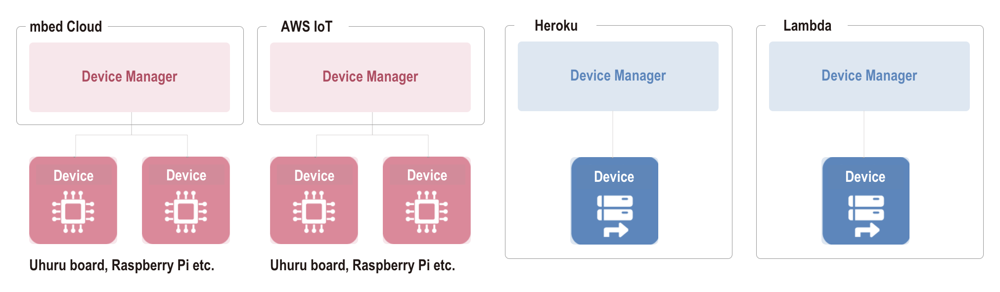

# Introduction

enebular is a development and operating service that comprehensively supports the creation of IoT products and services.

In general terms there are three things handled in enebular.

- **Assets**: These are various types of assets held within projects. This includes things like logic / data flows, dashboards for data visualization and control, and also things such as machine learning models.
- **Devices**: These are devices to which assets can be deployed. This incorporates instances on both the edge side (microcontrollers and so on) and the cloud side (like serverless environments and VMs).
- **Other Configuration**: This refers to any configuration needed for development and operation like the data sources of the data to be visualized and access permissions.

The primary way of using enebular is likely to be along the lines of **developing the assets on enebular.com and then once each asset is complete deploying and operating it on devices.**

## Assets

The currently available assets are as follows (there are also other assets, like machine learning models, planned to be supported).

- [Flows](Flows/Introduction.md): These are data flows created with Node-RED
- [InfoMotion](InfoMotion/Introduction.md): These are dashboards for doing graph visualization and controlling devices.
- [InfoType](InfoMotion/InfoTypeIntroduction.md): Graphs and controller types used with InfoMotion.

Details on each of these is shown below.

|  | Overview | Entity | Deployment (Operating) Location |
| --- | --- | --- | --- |
| **Flow** | Node-RED flow | JSON and credential information | Runtime environments in which Node-RED can run |
| **InfoMotion** | Dashboard | Data source, InfoType and panel placement information | Websites (iframe copy-paste) |
| **InfoType** | Plug-in file |  JavaScript, CSS | Used in InfoMotion (InfoType are not used by themselves) |

## Devices

Developed assets can be deployed to devices via third-party services. Currently the following services can be used.

- [mbed Cloud](https://cloud.mbed.com/)
- [AWS IoT](https://aws.amazon.com/iot/)
- [AWS Lambda](https://aws.amazon.com/lambda/)
- [Heroku](https://www.heroku.com/home)

While these services are utilized to deploy assets to devices, when doing a deploy there are two concepts that should be kept in mind.

- **Device**: The device that will be the execution environment of the asset.
- **Device Master**: The managing role that accepts deploy requests from enebular and then deploys to the device, monitors the device and sends logs on to enebular.

Let's look at an example of an actual service.

For cloud services that deploy to edge devices like AWS IoT and mbed Cloud, the edge device is the **device** and the cloud service is the **device master**.

If the execution environment exists in the cloud as with Heroku and AWS Lambda, then the cloud service takes on both the **device** and **device master** roles.

The services to be used can be selected by the intended function of the assets being deployed. For example, AWS IoT and mbed Cloud can be used for deploying assets that require information from physical devices like sensors, and Heroku and AWS Lambda can be used and for deploying assets designed for other management processes.
