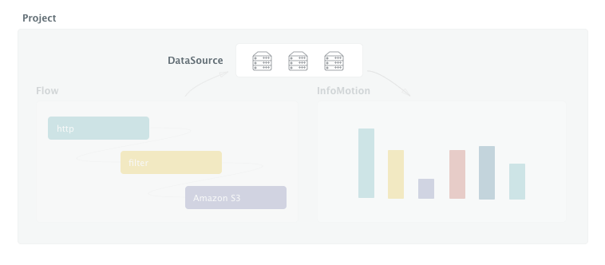
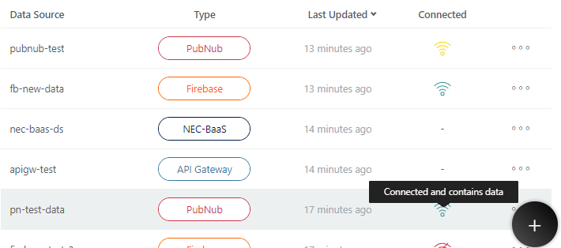

# Connecting DataSource {#Connecting DataSource}

A DataSource is a data connection used by an InfoMotion (Graph). 
Registering a DataSource is necessary to use InfoMotion. 
A Flow can save data to a DataSource. 

 

In enebular, you can create & edit DataSource. 

 

Available datasources for InfoMotion:
- [Milkcocoa](./DataSource/Milkcocoa/CreateDataSource.md)
- [Pubnub](./DataSource/Pubnub/CreateDataSource.md)
- [Firebase](./DataSource/Firebase/CreateDataSource.md)
- [API Gateway](./DataSource/APIGateway/CreateDataSource.md)
