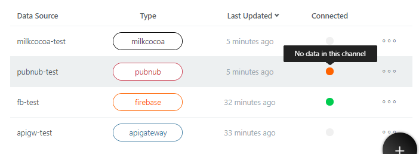

# Connecting DataSource {#Connecting DataSource}

A DataSource is a data connection used by an InfoMotion (Graph). 
Registering a DataSource is necessary to use InfoMotion. 
A Flow can save data to a DataSource. 

 

In enebular, you can create & edit DataSource. 

 

Available datasources for InfoMotion:
- [Milkcocoa](./DataSource/Milkcocoa/CreateDataSource.md)
- [Pubnub](./DataSource/Pubnub/CreateDataSource.md)
- [Firebase](./DataSource/Firebase/CreateDataSource.md)
- [API Gateway](./DataSource/APIGateway/CreateDataSource.md)

#※TODO: must translate to english below

DataSource タブでは、DataSource に入力した値を使って実際に DataSource に接続できるかどうかを確認し、結果を Connected 列に表示します。確認できる DataSource の種類は Firebase と PubNub です。

確認結果は4色のアイコンで表します。4色の意味は下記の通りです。

* 灰色: 確認不可であることを示します(API Gateway と Milkcocoa の場合は灰色となります)。
* 緑色: DataSource に接続でき、DataSource からデータを取得できたことを表します。
* オレンジ色: DataSource に接続できたが、データの取得を実施した結果データが取れなかったことを表します。DataSource のデータが空であればデータを入れてから確認し、それでもオレンジ色であれば DataSource の入力値が間違っている可能性があります。
* 赤色: DataSource に接続できなかったことを表します。

確認結果を表すアイコンにマウスを載せることで、より詳しい情報を表示します。

 
