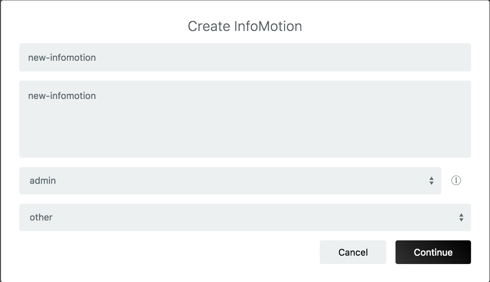

# Infomotion Dashboard {#Infomotion Dashboard}

With dataSource created and an InfoType uploaded select「Create InfoMotion」to create a dashboard.

A Dashboard requires

- `name`
- `description`
- `default previllege`：See [Access](../Config/Access.md) for more details.
- `category`

Click 「Manage Graphs」to display the side bar where InfoMotions are created. Click 「Create Graph」 and specify below fields:

- `name`
- `type`
- `datasource`
- Graph settings

Once settings is filed out, save the settings by clicking Save button and clicking the Add button to display the infomotion on the dashboard.

Multiple graphs can be stored on the side bar.

Graphs can be resize by dragging the right bottom corner. 

Data passed though InfoMotions can be controlled with daterange, timeline and play button. 

- Daterange - calendar with start and end date. 

 

- Timeline - toggle to select subset dates/times. 

- Play - plays subsets of timeline 

InfoMotion Dashboards can be customizable for specific needs.
Please see [infomotion share](./InfoMotionTool.md) for more details. 

## Dashboard options {#Dashboard options}

- `Manage Graphs` - add and remove graphs.
- `Save Layout` - saves dashboard positions.
- `Share` - share dashboard source code.

## InfoMotion options {#InfoMotion options}

*Order left to right.*

- `LIVE` - change LIVE mode. LIVE mode shown as Red letters, Not LIVE mode shown as white letters. On LIVE mode the graph is automaticaly update when DataSource gets new data. LIVE mode is available for Firebase and PubNub.
- `download data` - download a json file of InfoMotion data. Data can be download upto 10 MB.
- `share infomotion` - share single InfoMotion.
- `filter` - filter InfoMotion.
- `edit` - open sidebar to edit InfoMotion.
- `remove` - remove Infomotion from dashboard.

##Example of Filter {#Example of Filter}

フィルターを利用していないグラフを以下に示します。
このグラフでは、`category` の値が `A`・`B`・`C`・`D` であるデータを使ってグラフを描画しています。

グラフ上部のフィルターボタンからフィルターを設定できます。フィルターを行うには key と values のペアを設定する必要があります。

以下の画像のフィルターでは、`category` key に割当てられた values が、 `A`・`B`・`C`・`D` の何れの場合にグラフに表示するかを設定できます。

フィルターを設定したら、グラフでそのフィルターを使うことができます。

例えば、以下のように`A`・`C`のデータのみを利用してグラフを描くように設定します。

The graph will update with the filterd data displaying only 
datapices with the keys `coutry` and values of `A` and `C`. 

