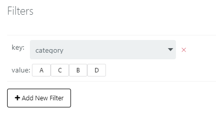
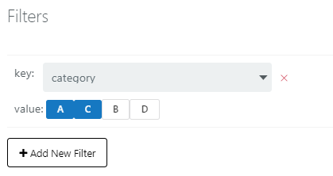

# Infomotion Dashboard {#Infomotion Dashboard}

With dataSource created and an InfoType uploaded select「Create InfoMotion」to create a dashboard.

A Dashboard requires

- `name`
- `description`
- `default previllege`：See [Access](../Config/Access.md) for more details.
- `category`

Click 「add graph」to display the side bar where InfoMotions
are created.

- `name`
- `type`
- `datasource`
- Graph settings

Once settings is filed out add graph by clicking the plus to display the infomotion on the dashboard.

Multiple graphs can be stored on the side bar.

Graphs can be resize by dragging the right bottom corner. 

In this example we are using two graphs `data logger` and `line chart`

Data passed though InfoMotions can be controlled with daterange, timeline, play and live button. 

- Daterange - calendar with start and end date. 

 

- Timeline - toggle to select subset dates/times. 

- Play - plays subsets of timeline 

- Live - subscribes to a datasources 

InfoMotion Dashboards can be customizable for specific needs.
Please see [infomotion share](./InfoMotionTool.md) for more details. 

## Dashboard options {#Dashboard options}

- `save` - saves dashboard positions.
- `filters` - create filters for InfoMotions.
- `share` - share dashboard source code.

## InfoMotion options {#InfoMotion options}

*Order left to right.*

- `download data` - download a json file of InfoMotion data
- `share infomotion` - share single InfoMotion
- `filter` - filter InfoMotion
- `edit` - open sidebar to edit InfoMotion
- `remove` - remove Infomotion from dashboard

##Example of Filter {#Example of Filter}

Infomotion without a filter. 

Setting dashboard filters. 
A filter requires one key and values. 
The entered key is `country` and values of `Japan`, `China` and `USA`. 

Once the filter is set it can be used by the InfoMotion.
To set the InfoMotion filter click on `Add new Filter`
and select the values you would like to filter. 
In this case we filter `country` tags with with the value of `China` or `USA`. 

The graph will update with the filterd data displaying only 
datapices with the keys `coutry` and values of `USA` and `China`. 

