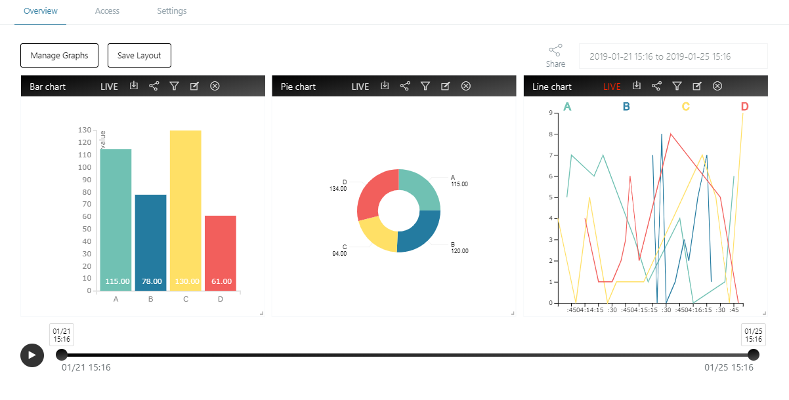

# Infomotion Dashboard {#Infomotion Dashboard}

With dataSource created and an InfoType uploaded select「Create InfoMotion」to create a dashboard.

A Dashboard requires

- `name`
- `description`
- `privilege`：See [Access](../Config/Access.md) for more details.
- `category`

Click 「Manage Graphs」to display the side bar where InfoMotions are created. Click 「Create Graph」 and specify below fields:

- `name`
- `type`
- `datasource`
- Graph settings

Once settings is filed out, save the settings by clicking Save button and clicking the Add button to display the infomotion on the dashboard.

Multiple graphs can be stored on the side bar.

Graphs can be resize by dragging the right bottom corner.

Data passed though InfoMotions can be controlled with daterange, timeline and play button.

- Daterange - calendar with start and end date.

- Timeline - toggle to select subset dates/times.

- Play - plays subsets of timeline

InfoMotion Dashboards can be customizable for specific needs.
Please see [infomotion share](./InfoMotionTool.md) for more details.

## Dashboard options {#Dashboard options}

- `Manage Graphs` - add and remove graphs.
- `Save Layout` - saves dashboard positions.
- `Share` - share dashboard source code.

## InfoMotion options {#InfoMotion options}

_Order left to right._

- `LIVE` - Colored Red LIVE mode indicates the graph is in live mode.
  Colored white indicates it is not in live mode.
  LIVE mode listenes to new data being pushed into the DataSource.
  Available for only Firebase and PubNub.

- `download data` - download a json file of InfoMotion data. Data can be download upto 10 MB.
- `share infomotion` - share single InfoMotion.
- `filter` - filter InfoMotion.
- `edit` - open sidebar to edit InfoMotion.
- `remove` - remove Infomotion from dashboard.

##Example of Filter {#Example of Filter}

The graph below does not use a filter.
The categories `category` shown are `A`・`B`・`C`・`D`

You can set the filter from the filter button at the top of the graph. To set the filter you need to select pair and key values.

The filterd graph below displays the possible the possible filterd key `category` as `A` , `B` ,`C` or `D`.

Once set A filered graph can be viewed.
The example below displays the filtered data as `A` and `C`.

The graph will update with the filterd data displaying only
data pieces with the keys `category` and values of `A` and `C`.

