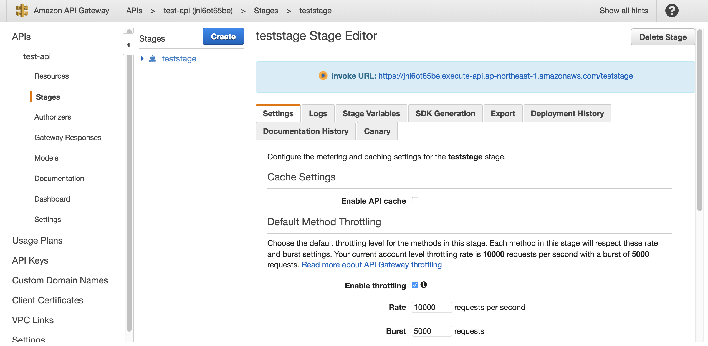
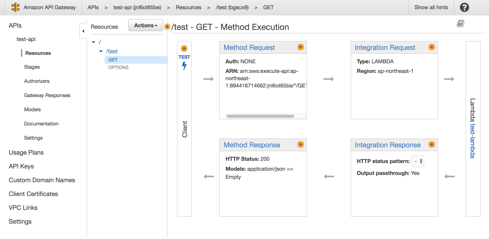
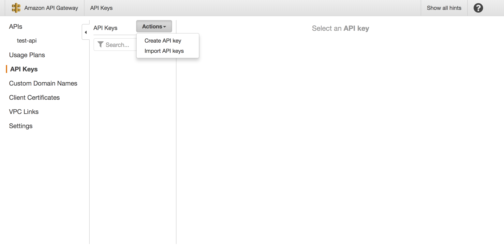
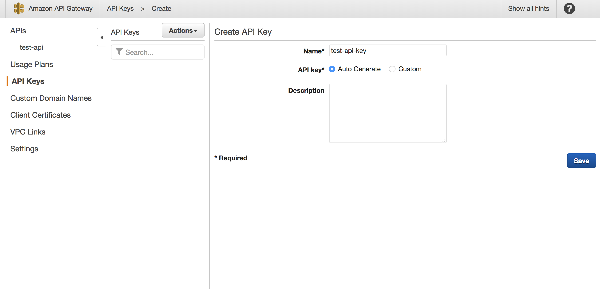
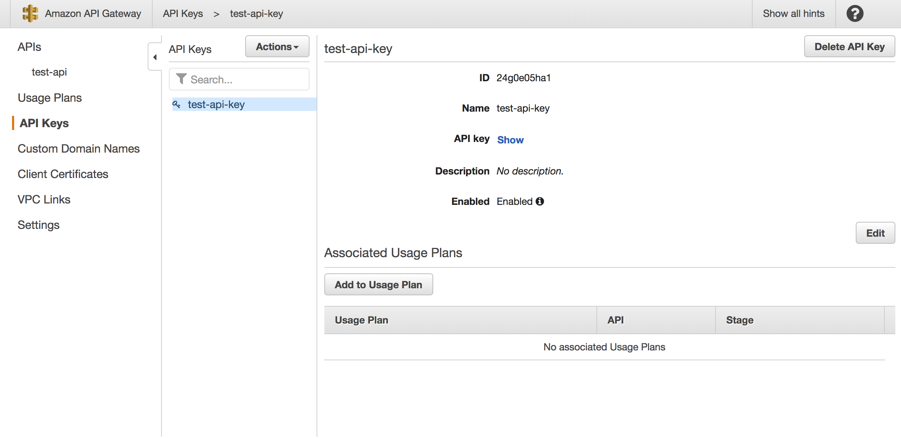

###Create API Gateway Data Source {#Create API Gateway Data Source}

※ Not Applicable with livemode

In the same enebular project click `Data Sources` and the plus button to add a `Data Source`

* Endpoint
	* API Gateway endpoint to set. Please refer to the following.
* API Key
	* API Key for the API Gateway. Please refer to the following.

Click Save to set the Data Source.

You should see a new Data Source created.

## Endpoint {#Endpoint}

Endpoint's format is `https://[id].execute-api.ap-northeast-1.amazonaws.com/[stage]/[method]` 
To take an example of  [Setup & Create Lambda Function](./CreateLambdaFunction.md). Endpoint is `https://*********.execute-api.ap-northeast-1.amazonaws.com/teststage/test` .

See `Stage` for checking `id` and `stage`.

See `Resource`  for checking `method` . 

## APIKey {#APIKey}

Create Amazon API Gateway's API Key.
If you know more, see [official documentation](https://aws.amazon.com/documentation/apigateway/?nc1=h_ls) for details.

Click left menu's `API Key`.

Click `Action`  and `Create API Key`.

Create a name for the key.

Now it becomes a registered apikey to be used for a Data Source.

## Create InfoMotion {#Create InfoMotion}

Now your Data Source is ready to be used on an InfoType see 
[Sample InfoTypes](./../../SampleInfoTypes.md) to downoad a graph, 
[Upload an InfoType](./../../UploadInfoType.md) to upload a graph to enebular, 
and [Create InfoMotion](./../../CreateInfoMotion.md) to create an InfoMotion dashboard.
