## Using Lambda to return data {#Using Lambda to return data}

Getting started with Lambda.

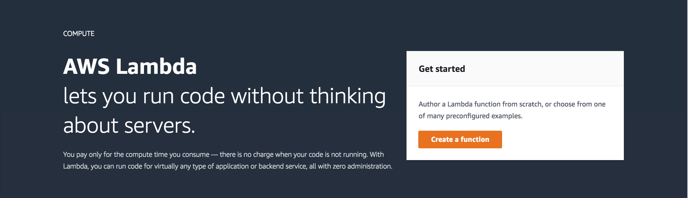

Create author from scratch using Node.js version 6.

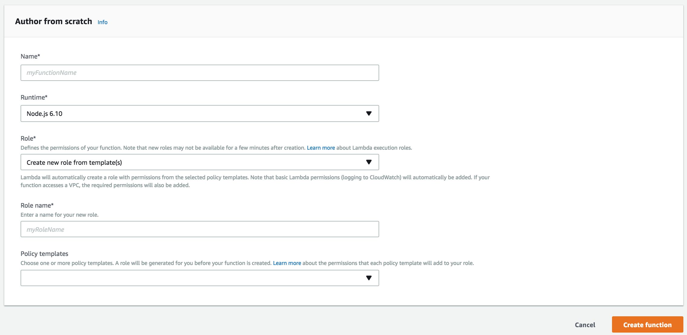

Daterange picker passes `start` and `end` parameters.
The following code returns data based on the parameters.

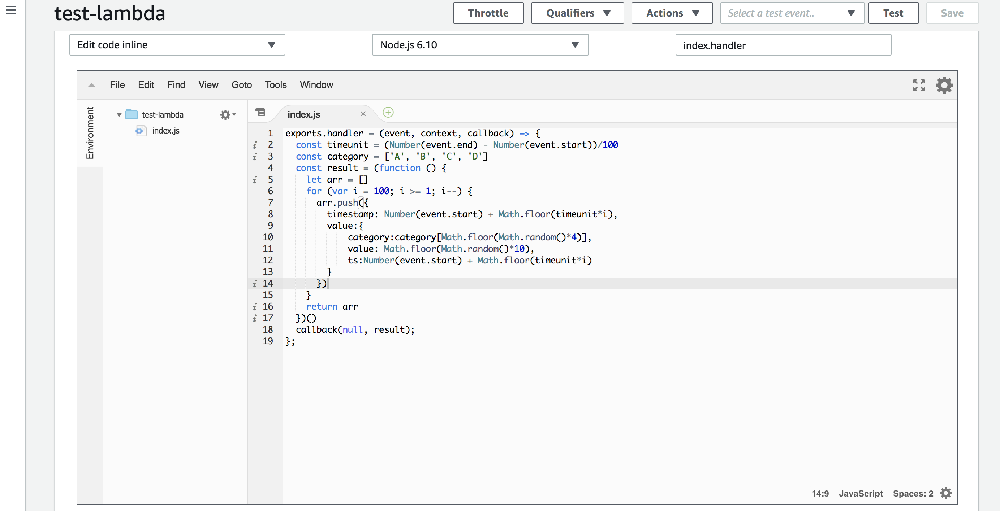

```javascript
exports.handler = (event, context, callback) => {
  const timeunit = (Number(event.end) - Number(event.start))/100
  const category = ['A', 'B', 'C', 'D']
  const result = (function () {
    let arr = []
    for (var i = 100; i >= 1; i--) {
      arr.push({
        ts: Number(event.start) + Math.floor(timeunit*i),
            category:category[Math.floor(Math.random()*4)],
            value: Math.floor(Math.random()*10)
      })
    }
    return arr
  })()
  callback(null, result);
};
```

Creating an API Gateway that connects to the Lambda function.

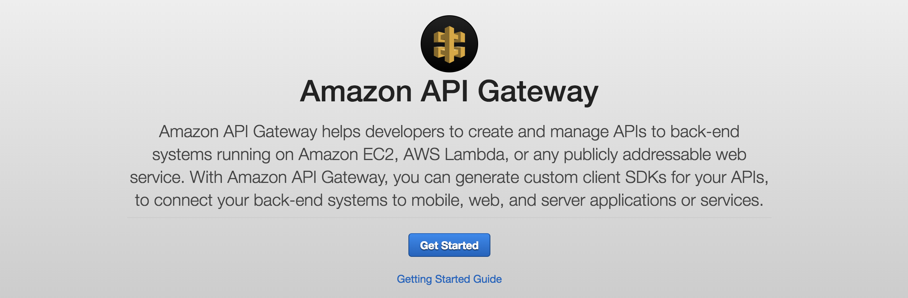

Creating a new API.

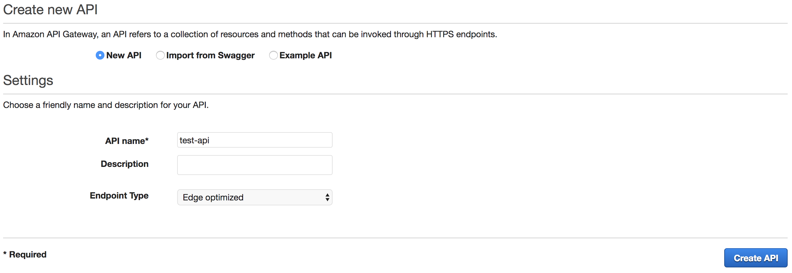

Creating a new resource.

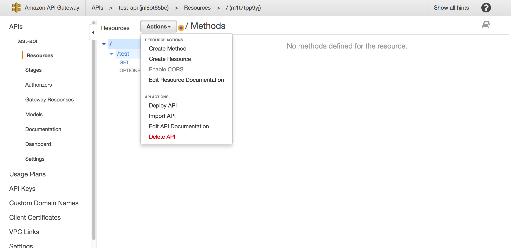

Enter the path name and check "Enable API Gateway CORS".

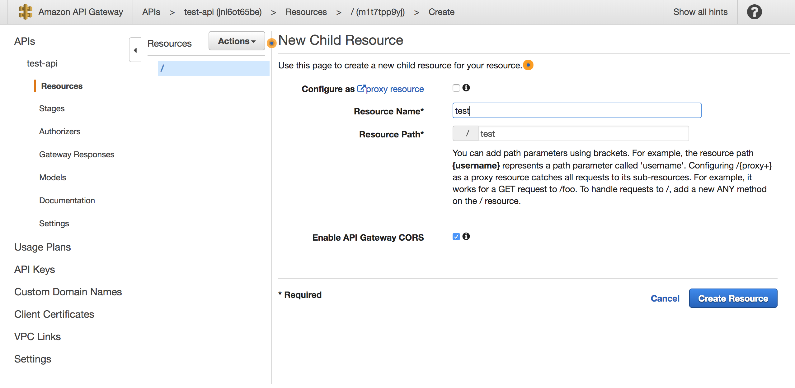

With resource completed create a GET method.

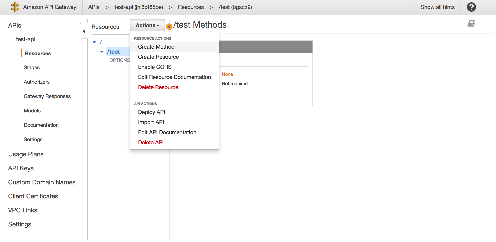

Setting a method.
Select the Lamnda function created (It will not appear unless you select the region where you created Lamdba).

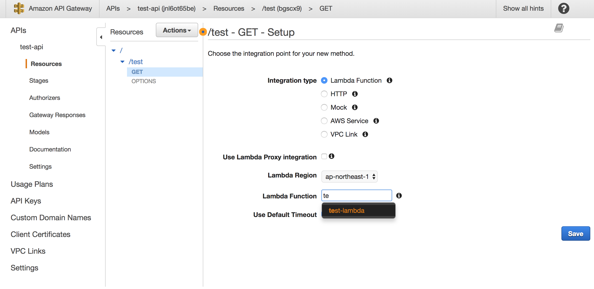

Once a method is created edit the method response.

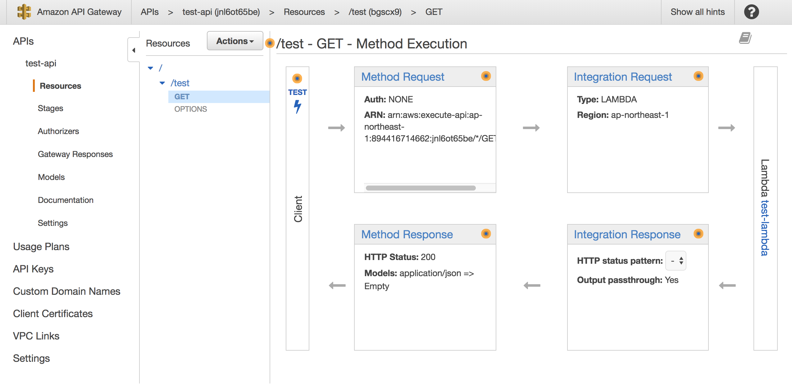

Create the 200 hedder as "Access-Control-Allow-Origin".

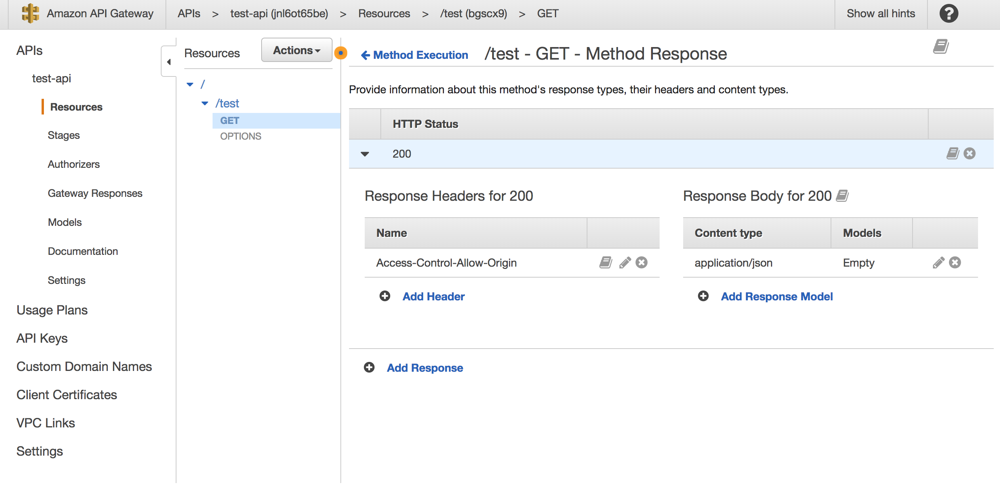

Create an intergration response.

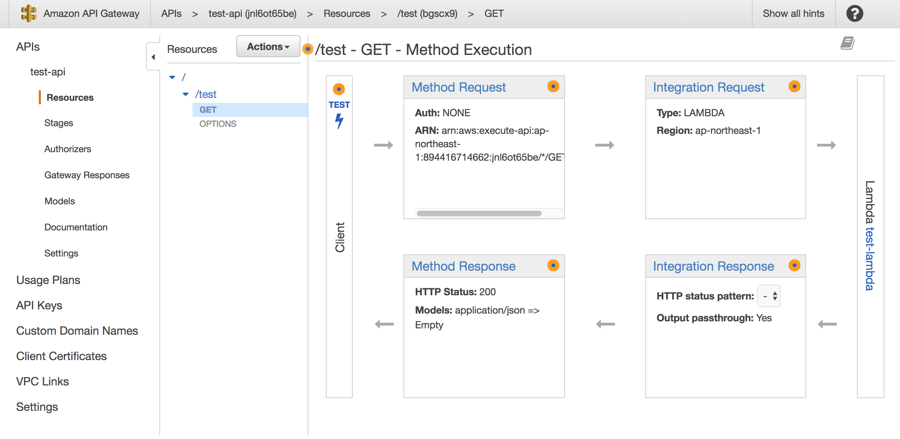

Set「Access-Control-Allow-Origin」」 as`'*'`.

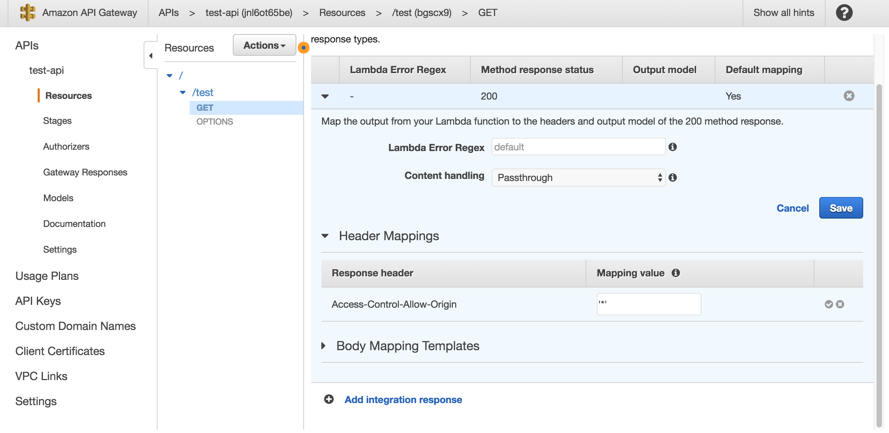

Lastly, change "Intergration Request".


Create the following mapping of "body mapping template" with "application / json" as shown below

```json
{
  "start": "$input.params('start')",
  "end": "$input.params('end')"
}
```

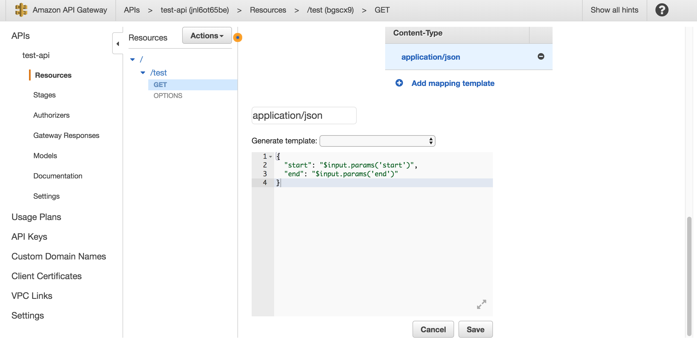
Next create a "deploy api".

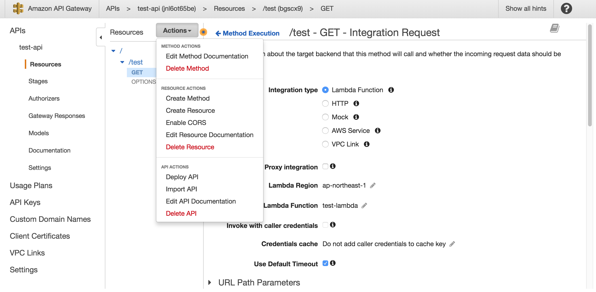

Input a deploy name.

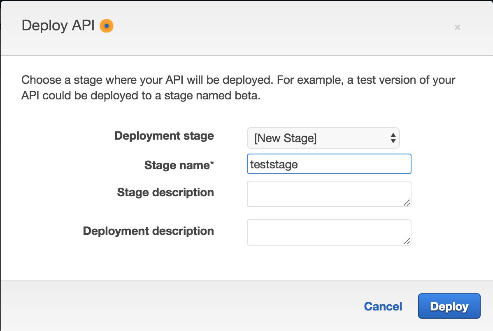

The resource named `/ test` becomes the endpoint to be registered with DataSource.

```
*example endpoint.
https://*********.execute-api.ap-northeast-1.amazonaws.com/teststage/test
```


