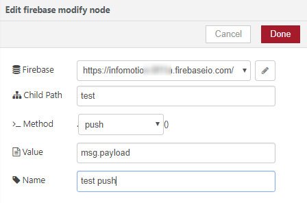

# Create Data Source 

In the same enebular project click `Data Source` and the plus button to add a 
`Data Source`. 

The keys for the settings can be found in your firebase web settings. 

Check adding new one.

## Input Items

Get the fllowing items by snipet.

* Api Key
* Auth Domain
* `Database URL
* Project Id
* Storage Bucket
* Messaging Sender Id

Click `Project Overview` and `Add Firebase to your web app`.

The `Ref` is the child path you set in the flow editor. 
The ref can also be seen in your firebase database as the collection name. The `Ref` must also include a `/`, for this example we have set the `Ref` as `/test`.

## Create InfoMotion

Now your DataSource is ready to be used on an infotype see 
[Sample infotypes](./../../SampleInfoTypes.md)to downoad a graph, 
[Upload an InfoType](./../../UploadInfoType.md) to upload a graph to enebular, 
and [Create InfoMotion](./../../CreateInfoMotion.md) to create an InfoMotion dashboard
