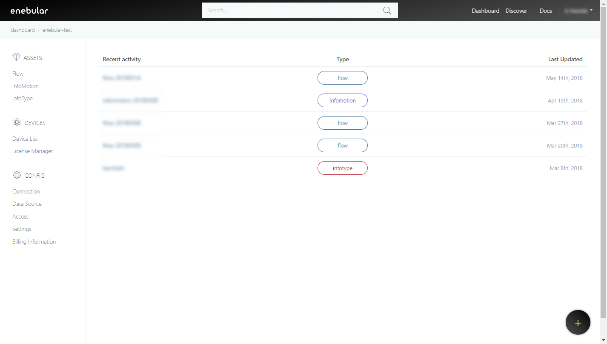
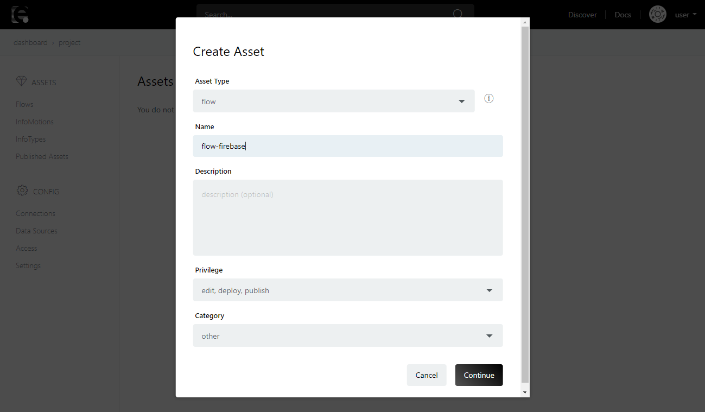
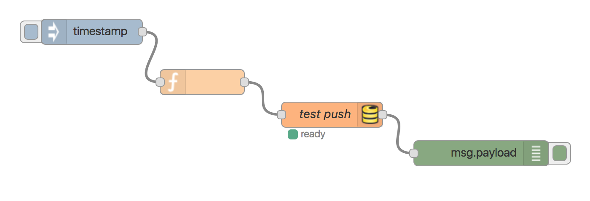
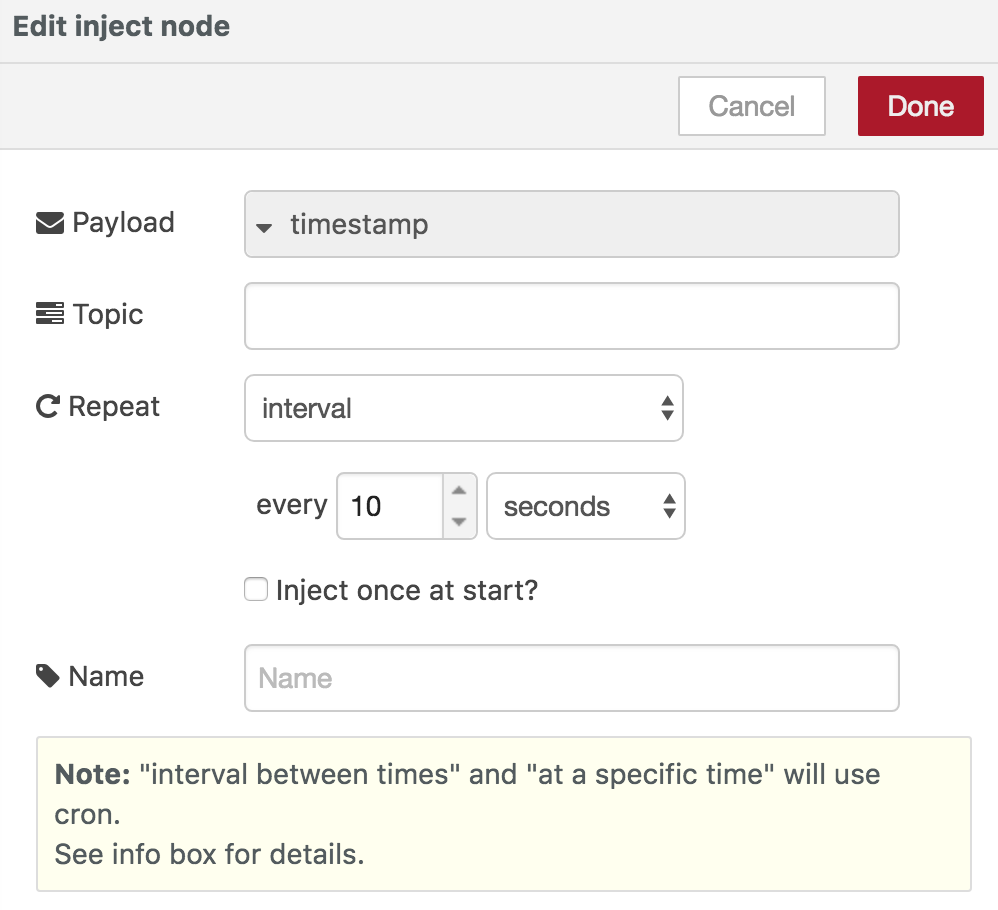
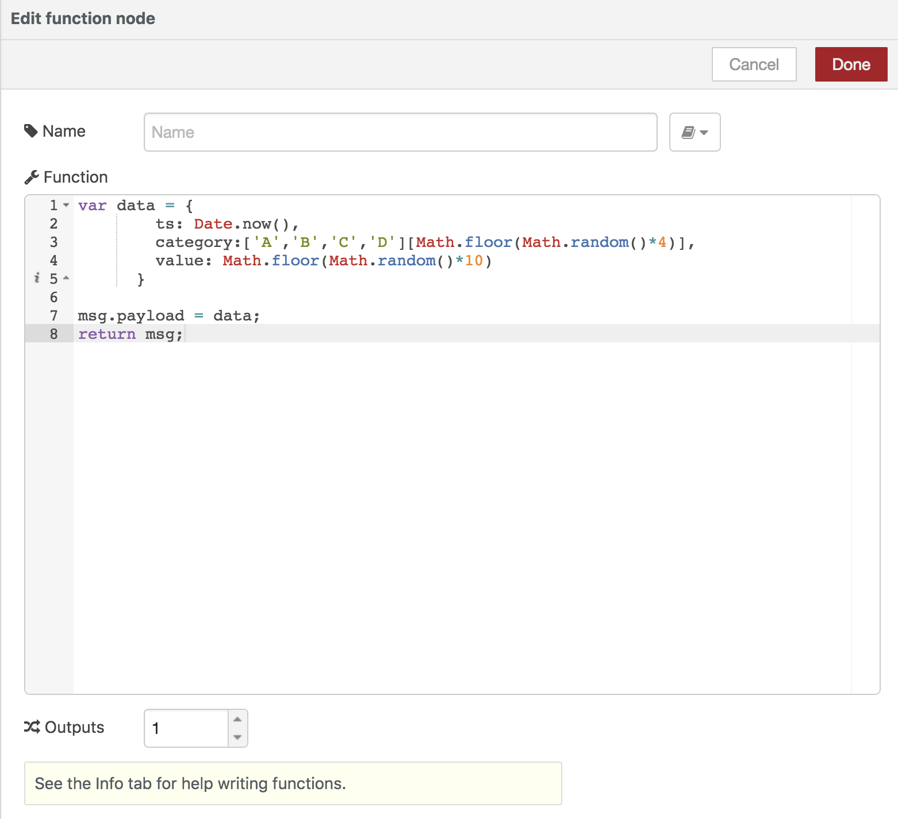
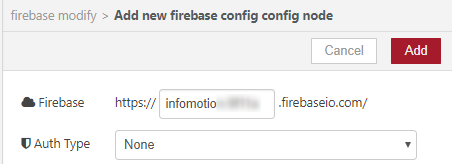
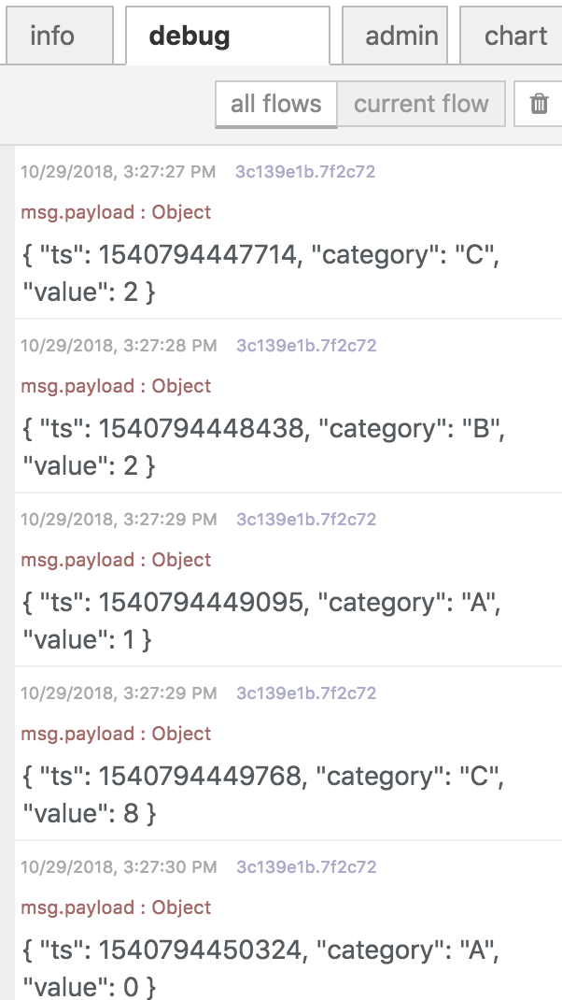
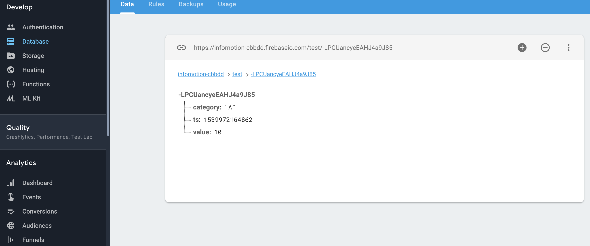

###Create Flow 

Now with firebase ready lets create a flow to push data. 
In an enebular project go to flows and click on the add button at the bottom right side of the screen. 




Enter a name and decription then click continue. 




Click on `Edit Flow` to open the flow editor. 


(If firebase is not installed please install `node-red-contrib-firebase`.)

Create the following flow. 
inject -> function -> firebase modify -> debug 



Double click the inject node and set the interval to 10 seconds. 
Click done when finished. 




Double click the function node and set the function as below. 




```javascript
var data = {
        timestamp: Date.now(),
        value:{
            category:['A','B','C','D'][Math.floor(Math.random()*4)],
            value: Math.floor(Math.random()*10),
            created:Date.now()
        }
      }
      
msg.payload = data;
return msg;
```

Double click the firebase node and set the inputs as follows. 

Click on the pencil to edit the firebase url and auth type then update. 
Firebase:
	firebase: `YOUR FIREBASE PROJECT ID`
	auth type: `none` 




Child path : `test`
Method : `Push`
value : `msg.payload`
name : (any name you want)


Now with all nodes set you can now click deploy. 
Check your debug log tab to see if data is being pushed correctly. 




You can also check your firebase project database to see the data being saved.


