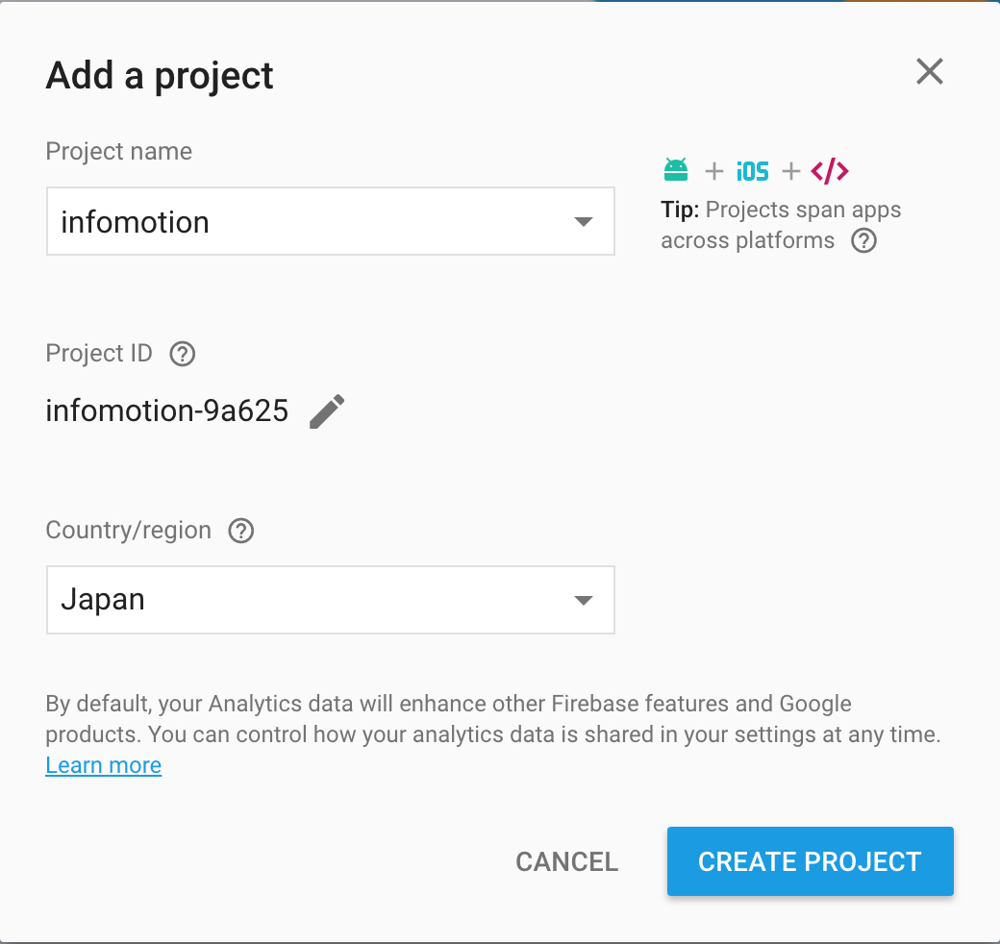
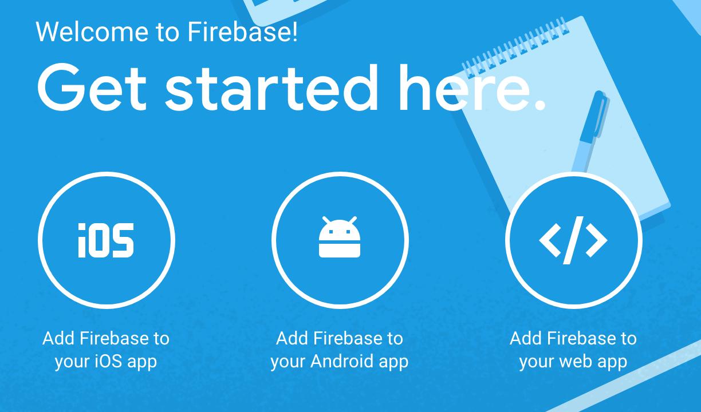
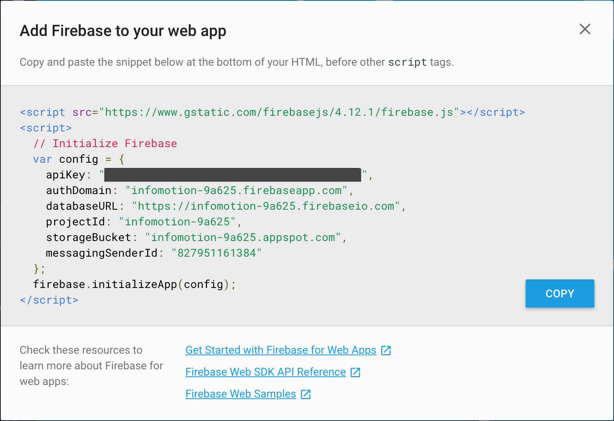
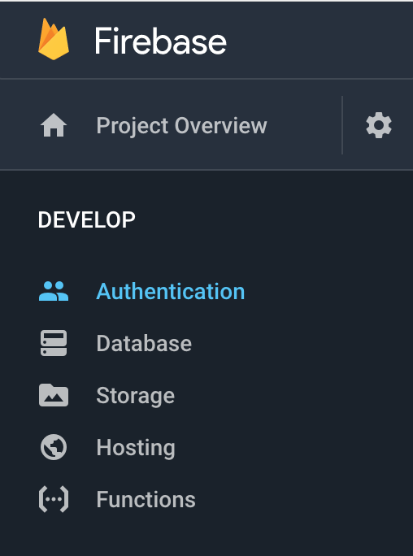
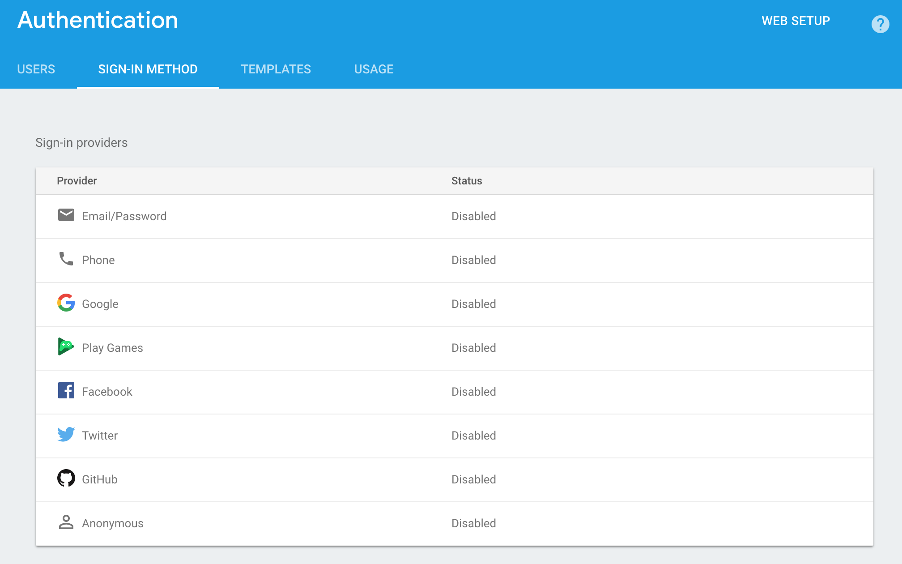
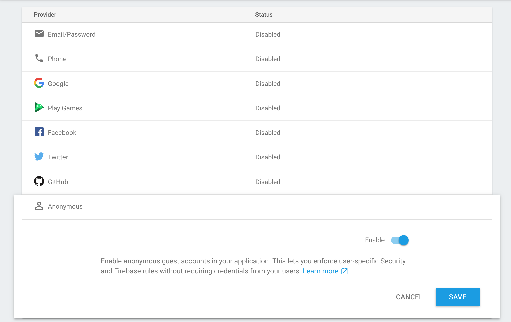
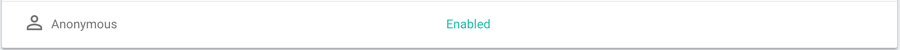
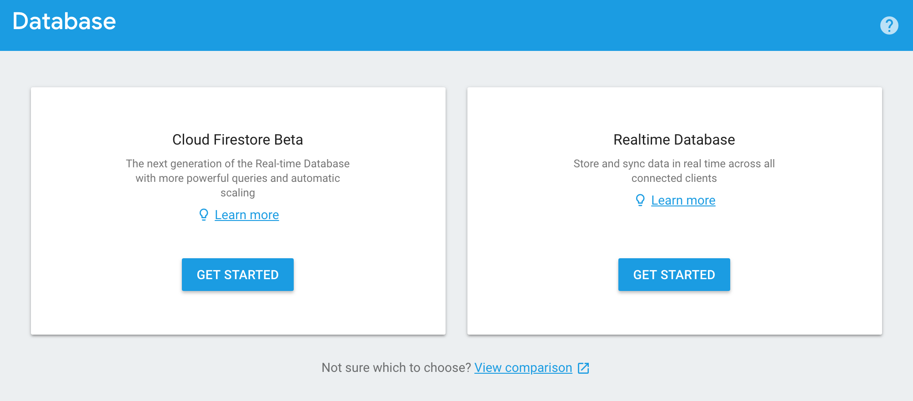
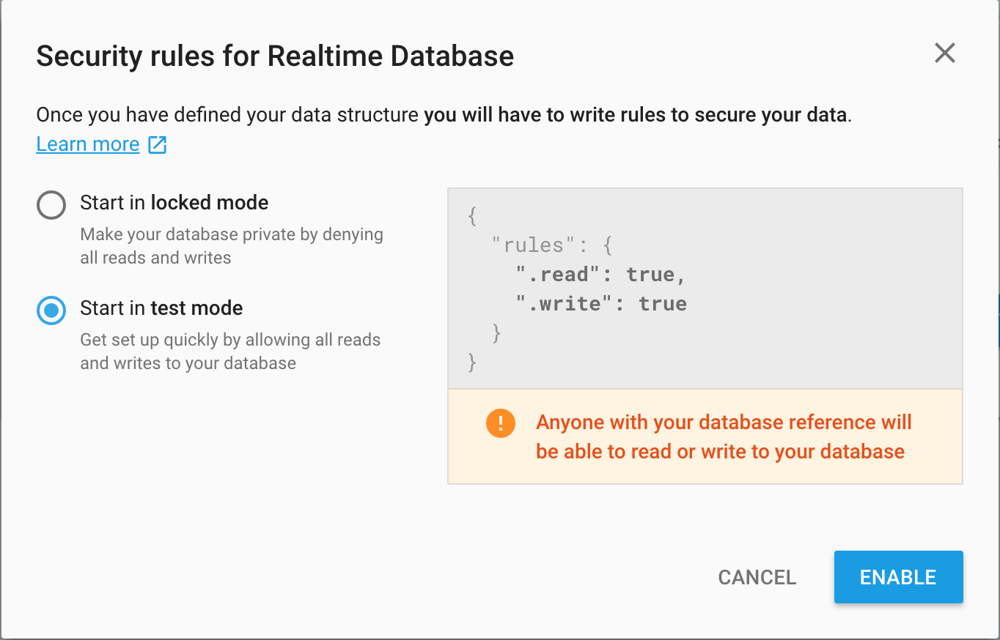

###Set-up  

Register at https://firebase.google.com/.
Once you are registerd and logged in click on add project. 

Input a name for the project and your country/region then click CREATE PROJECT. 
When the new project is ready click CONTINUE. 

You will be directed to the project overview. Where at the top of the screen you will see
a "Get started here". Click on "Add firebase to your web app". 

A modal will pop up with configuration keys. These keys will be used later on with creating a flow and creating a data source. 

###Authentication

Before we create a Flow we will need to set up authentications. 
In this example we will keep it simple with an Anonymous authentication. 

On your project sidebar click on authentication. 

At the authentication screen click on SIGN-IN METHOD.

Select Anonymous, turn the enable switch on and click save. 

Anonymous should now be enabled.

###Set up DataBase 

To set up a database click database on the side bar. 

Click get started on Realtime Database. 

Select "Start in test mode" (This allows anyone to read or write to the database). Click enable to continue. 

