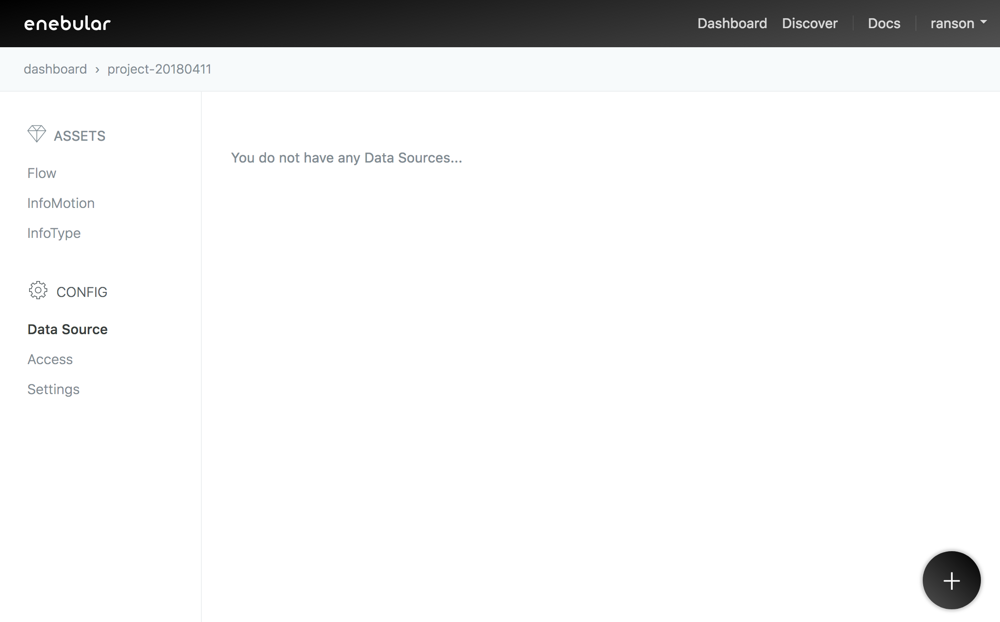
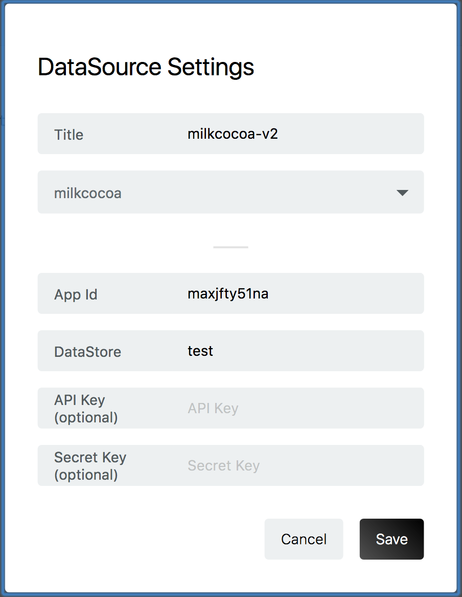

###Create a Data Source 

In the same enebular project click `Data Source` and the plus button to add a 
`Data Source`. 

Set the `title` as you like. The `app_id` and `DataStore` are required fields.

Click save to continue. 

## Input Items

Get `App Id` from App top page.

The `DataStore` is you set in the flow editor.

 `API Key` and `Secret Key`  are able to confirm in 「認証」 page.

## Create InfoMotion

Now your DataSource is ready to be used on an infotype see 
[Sample infotypes](./../../SampleInfoTypes.md)to downoad a graph, 
[Upload an InfoType](./../../UploadInfoType.md) to upload a graph to enebular, 
and [Create InfoMotion](./../../CreateInfoMotion.md) to create an InfoMotion dashboard